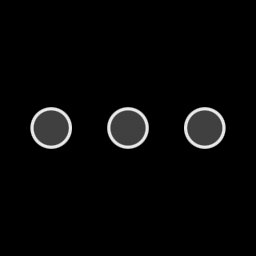

# `wisp` — stories

Every shipped renderable feature has a story. Each is a deterministic
construction of a stage that exercises the feature in isolation; the same
story drives the interactive `just storybook` gallery, the integration tests
(`tests/story_smoke.rs`, `tests/story_fingerprints.rs`), and these screenshots.

Regenerate with `just snapshots-wisp`.

## Renderer foundation

### Hello quad — M0.5

The smallest possible end-to-end render: one solid-coloured quad through the
quad pipeline. Proves the application + renderer + render-to-texture path.

### Sprite batcher — M0.10

Many sprites issued as a single instanced draw call. Demonstrates the batching
discipline that keeps draw counts low even as the scene grows.

### Transform nesting — M0.7

Parent/child transform composition. Children inherit the parent matrix; nested
rotations / scales compose correctly.

### Text — M0.13

Embedded ASCII bitmap font (font8x8). No external font files; just a glyph
sprite atlas built at startup.

## Graphics primitives (SDF-based)

### Rounded rect — M0.16

Signed-distance-field rounded rectangle with `fwidth`-based AA. Crisp edges
at any scale.

### Ellipse — M0.16

SDF ellipse with the same AA path. Replaces a pre-tessellated mesh.

### Gradients — M0.16

Linear and radial gradient fills. Same `Graphics` node, different fill rules.

## Filters (multi-pass post-process)

### Blur — M0.17

Separable Gaussian (9-tap horizontal + vertical). Two render-target ping-pongs
per filter application.

### Drop shadow — M0.17

Multi-pass: extract → blur h → blur v → composite. Becomes the recorder's
recording-quad shadow.

### Motion blur — M0.18

Velocity-vector blur. Catches a sense of motion on the cursor and zoom.

### Color matrix — M0.18

Three copies of the same source — identity, grayscale, brightness — through a
4×5 RGBA matrix. The building block for any "look" preset.

## Mesh

### Perspective — M0.19

3D Y-axis rotation in WGSL. Foundation for the recorder's "tilt" preset.
