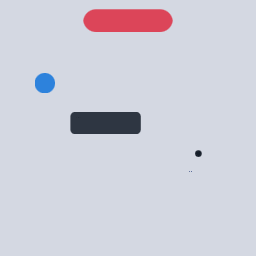
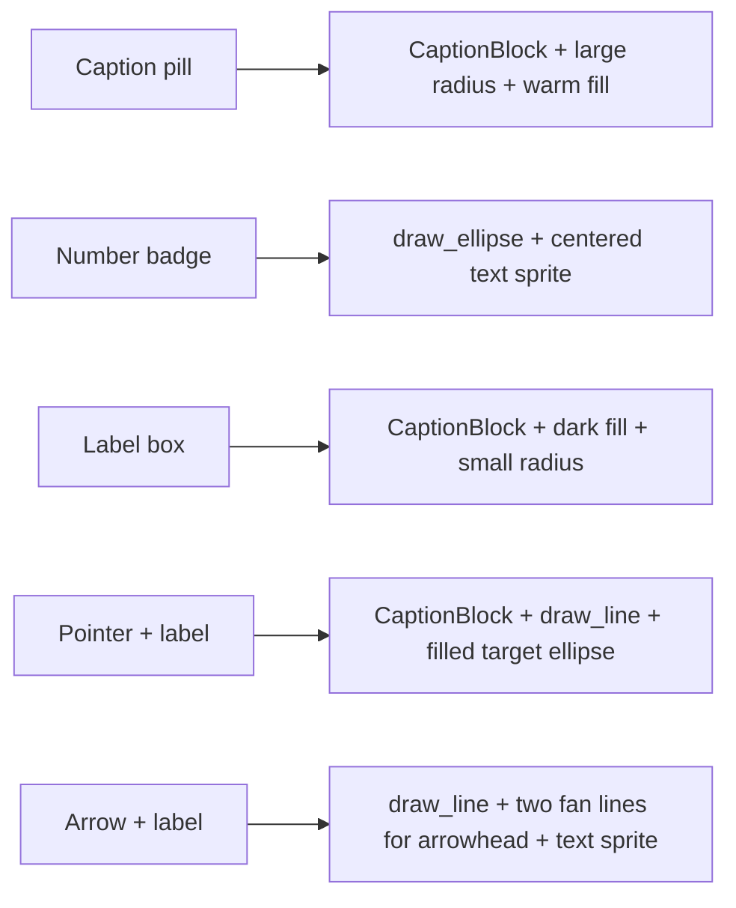

# Callouts, badges, arrows

[Linear: AUT-84](https://linear.app/harwood/issue/AUT-84)

Five callout shapes — composed from existing `Graphics` primitives
+ `CaptionBlock` + text sprites. No new wisp types; the vocabulary
is `draw_rounded_rect`, `draw_ellipse`, `draw_line`, plus the
text-texture pipeline.



*Caption pill (top), number badge (left), label box (center),
pointer + target dot (right), arrow + "click" label (bottom).*

[api](../../api/wisp/text/index.html)

## Recipes



## Caption pill

```rust
let pill = CaptionBlock::from_text(
        WispText::new("Now recording")
            .with_style(TextPreset::Caption.style()),
    )
    .with_width(0.7).with_padding(0.04).with_radius(0.10)
    .with_background(Color::rgba_u8(220, 60, 80, 240));
```

```admonish tip title="Pill vs label"
Large corner radius (≥ half height) on a `CaptionBlock` reads as a
pill. Small radius (≤ 0.04) reads as a card. Same primitive, two
silhouettes.
```

## Number badge

```rust
let mut bg = Graphics::new();
bg.fill(Fill::Solid(Color::rgba_u8(45, 130, 220, 255)));
bg.draw_ellipse(center, Vec2::splat(0.08));
// Text on top, anchor at center.
let rt = pipeline.render(app, &n_text, 192, 192);
let mut sprite = Sprite::from_texture(rt.as_texture()).with_anchor(Vec2::splat(0.5));
sprite.container.transform.position = center;
sprite.container.transform.scale = Vec2::new(0.12, -0.12);
```

## Arrow + label

```admonish note title="No general path primitive yet"
Wisp's `Graphics` exposes `draw_rect`, `draw_rounded_rect`,
`draw_ellipse`, and `draw_line` — but no general `draw_path`. An
arrowhead approximates with three short `draw_line` calls fanning
from the tip. For richer geometry — bezier curves, complex
arrowheads — see [M-VEC.13 SVG path import](../../media/architecture.md)
or wait for a future `Graphics::draw_path`.
```

## Blend + opacity

Every callout's `Container::blend_mode` and `Container::alpha` work
unchanged — set them on the callout's container and the entire
composition (background + text + arrow) participates. A faded
callout (`alpha = 0.6`) reads as "hint" vs "primary".

## What this unlocks

Callouts are the recording-overlay vocabulary — the artifacts the
editor adds on top of captured video to teach what to look at. The
recorder will use these shapes for cursor click pulses, keyboard
chips, redaction labels, and step-by-step instructions.
