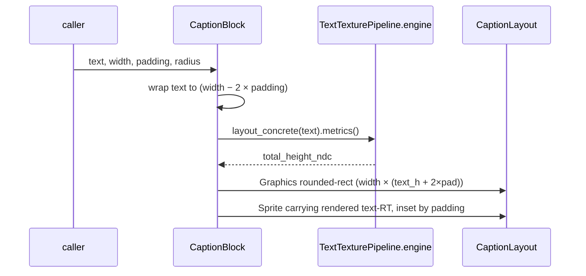

# Word-wrapped caption block

[Linear: AUT-83](https://linear.app/harwood/issue/AUT-83)

A composed scene fragment — wrapped text on top of a rounded
background. The block measures the wrapped text at layout time and
sizes the background to fit, so a one-line "Recording" and a
three-line description both produce a clean rectangle with the same
padding.


[api](../../api/wisp/text/caption/index.html)

## How the layout works



```admonish important title="Composition over inheritance"
`CaptionBlock` isn't a new node type — it returns a `Graphics` +
`Sprite` pair that the caller attaches to a `Container`. Position
the container, and both background + text move together. Apply a
`Container::clip` and the whole caption clips. No special-case code
in the renderer.
```

## API

```rust
use wisp::text::{CaptionBlock, TextPreset, TextTexturePipeline, WispText};
use wisp::Container;

let pipeline = TextTexturePipeline::new(app, format);

let block = CaptionBlock::from_text(
    WispText::new("Wraps inside a fixed width and pads cleanly.")
        .with_style(TextPreset::Caption.style()),
)
.with_width(0.85)
.with_padding(0.05)
.with_radius(0.06);

let layout = block.layout(app, &pipeline);

let mut container = Container::new();
container.transform.position = Vec2::new(-0.425, 0.4);
let id = stage.add_child(stage.root(), container).unwrap();
stage.add_child(id, layout.background);
stage.add_child(id, layout.text_sprite);
```

`layout.height_ndc` gives the actual block height so the caller can
stack multiple blocks without overlapping.

## Wrap behavior

```admonish note title="Caller-set wrap wins"
If the `WispText` already has `.with_wrap(...)` set, the block
respects that width instead of `width − 2×padding`. Useful for cases
where the caller wants the text to wrap tighter than the block's
visual width (e.g., a tooltip with extra horizontal padding).
```

## Alignment

`WispTextStyle::align` flows through unchanged — `Center` produces a
centered caption, `Left` is left-aligned within the padded box. The
[text presets](presets.md) chapter has examples of each.

## Snapshot determinism

Captions are pure data + cosmic-text layout + sprite render, with no
randomness. The story is covered by `story_smoke` (no validation
errors + visible pixels) and `story_fingerprints` (quadrant snapshot).
Headless export reproduces the on-screen layout byte-for-byte at the
same target format.
