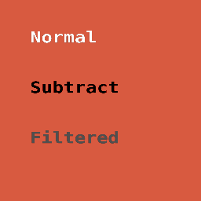

# Text composition — mask, filter, blend, export

[Linear: AUT-80](https://linear.app/harwood/issue/AUT-80)

With M-TEXT.5's `TextTexturePipeline` in hand, text becomes a
`RenderTexture` — and that means it inherits the full composition
surface of every other texture in the renderer.

Three text sprites over a warm backdrop:

- **Normal** — baseline alpha composition through `render_stage`.
- **Subtract** — `Container::blend_mode = BlendMode::Subtract`. The
  glyphs punch the backdrop out toward black.
- **Filtered** — orange source text routed through
  `ColorMatrixFilter::grayscale` via `Renderer::apply_filter` before
  being attached as a sprite. The hue is gone in the output.

[api](../../api/wisp/text/struct.TextTexturePipeline.html)

## Composition surfaces

| Surface | Path | Test |
|---|---|---|
| `render_stage` participation | Sprite-of-text is a regular sprite. | `text_renders_through_render_stage` |
| Offscreen rendering | `pipeline.render(app, &text, w, h)` writes into a `RenderTexture`. | (every test boots through this) |
| Non-Normal blend modes | `sprite.container.blend_mode = …`. | `text_with_multiply_blend_differs_from_normal` |
| Filter chains | `renderer.apply_filter(&filter, &input_rt, &output_rt)`. | `text_filtered_through_color_matrix_grayscale_produces_gray_pixels` |
| Headless / copy-frame export | `render_stage` → `RenderTexture::read_pixels`. | `text_present_in_headless_export_pixels` |
| Mask clipping | `Renderer::apply_clip` consumes a `RenderTexture` source — the text RT plugs in. | (covered by M-MASK suite at the RT level) |

The integration tests live in
[`crates/wisp/tests/text_composition.rs`](../../api/wisp/index.html).

## What's *not* in this chunk

- Glyph-level filter authoring (per-glyph blur radius, per-glyph
  stroke). That's M-TEXT.7 (stroke / outline) and M-TEXT.8 (drop
  shadow / glow). Both will reuse the texture-then-filter pattern
  shown here.
- Advanced blend modes (Overlay, HardLight, SoftLight, …) that need
  the offscreen-pass slow path. Those work for sprites today; text
  sprites participate the same way. No new wiring needed.
- Animated text reveal. M-TEXT.16 territory — orthogonal to the
  composition path.

## Cache interaction

`TextTexturePipeline::render` caches by content + style + dims, so
when a caption is unchanged across frames the GPU work for the text
layer collapses to a single sprite draw + filter dispatch. The cache
key picks up `font_family` so swapping a face invalidates correctly.

## Done when

- [x] Text renders through normal `render_stage`.
- [x] Text can be rendered offscreen (`TextTexturePipeline::render`
  returns a `RenderTexture`).
- [x] Text composites with Normal and Subtract (one non-Normal blend
  mode).
- [x] Text can be filtered via `Renderer::apply_filter`.
- [x] Headless output (`read_pixels` after `render_stage`) contains
  the text.
- [x] Pixel/snapshot tests cover text + blend + filter + export.
- [x] mdBook chapter (this one).
- [x] `just gate` green.
