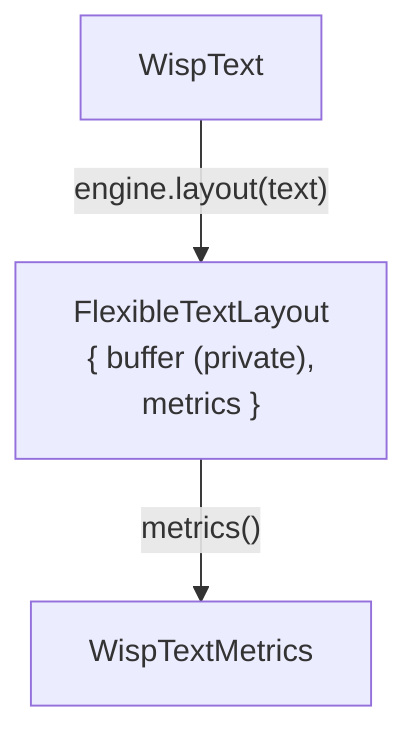

# FlexibleText — Cosmic Text layout

[Linear: AUT-76](https://linear.app/harwood/issue/AUT-76)

`FlexibleText` is the styled / wrapped / shaped text path. It uses
[`cosmic_text`] for layout (line breaking, BiDi, font fallback,
shaping). The **rasterization** half lands in M-TEXT.3 / AUT-77
(`glyphon`) — this chapter covers the layout half only.

[`cosmic_text`]: https://github.com/pop-os/cosmic-text

## Trait surface

`FlexibleTextEngine` implements [`WispTextEngine`]; the layout it
produces is a `FlexibleTextLayout` (which implements
[`WispTextLayout`]). The cosmic-text `Buffer` is held inside
`FlexibleTextLayout` as a **crate-private field** — it never leaves
the wisp crate as a public type.

[`WispTextEngine`]: ../../api/wisp/text/trait.WispTextEngine.html
[`WispTextLayout`]: ../../api/wisp/text/trait.WispTextLayout.html



The renderer (M-TEXT.3 glyphon) is a sibling crate-internal module —
it reads `buffer` directly without a `dyn` downcast.

## NDC ↔ pixels — reference basis

Cosmic Text is pixel-based; wisp is NDC-based. The engine adopts a
**reference height** of `REFERENCE_PX = 1000` pixels:

```text
font_size_px   = style.size_ndc * REFERENCE_PX
line_height_px = font_size_px * style.line_height
glyph_x_ndc    = glyph_x_px / REFERENCE_PX
```

Picking 1000 px as the basis:

- keeps numbers within f32 precision,
- gives sub-pixel positioning headroom for `size_ndc = 0.06`
  (= 60 px ≈ caption type),
- matches what glyphon's atlas cache expects for typical desktop UIs.

The renderer (M-TEXT.3) re-scales to the actual target dimensions at
draw time. This means the **same `FlexibleTextLayout` can be drawn
into any-size target without re-shaping** — important for the
RT cache (M-DYN.2-style) we'll layer in.

## Style mapping

| `WispTextStyle` field | cosmic-text translation |
|---|---|
| `size_ndc` | `Metrics::font_size = size_ndc * REFERENCE_PX` |
| `line_height` | `Metrics::line_height = font_size * line_height` |
| `weight` | `Attrs::weight = Weight(weight.value())` |
| `style` (Normal/Italic) | `Attrs::style = Style::Normal/Italic` |
| `color` | not consumed at layout time — applied per-glyph in M-TEXT.3 |
| `letter_spacing_ndc` | not yet — cosmic-text doesn't expose tracking; glyph-level adjust in M-TEXT.3 |
| `align` | layered on at render time once line widths are known |

## Wrap behavior

| `text.max_width_ndc` | `Buffer::set_wrap` | Effect |
|---|---|---|
| `None` | `Wrap::None` | single line, only `\n` hard-breaks |
| `Some(w)` | `Wrap::Word` | word-wrap at `w * REFERENCE_PX` pixels |

Hard `\n` always breaks regardless. CJK / no-space scripts fall back
to `Wrap::WordOrGlyph`-style behavior in cosmic-text — that's the
engine's call, not ours.

## FontSystem ownership

`cosmic_text::FontSystem` is `!Sync`. The engine wraps it in a
`Mutex` so:

- the engine itself is `Send + Sync` (verified by a compile-time
  `assert_send/assert_sync` test),
- caches and the renderer can hold an `Arc<FlexibleTextEngine>`,
- multiple threads can layout concurrently (one at a time, but
  without `&mut`-only borrow contention).

`FlexibleTextEngine::new()` calls `FontSystem::new()` which loads
**system fonts**. Tests that don't want system-font dependence can
use `FlexibleTextEngine::with_font_system(custom)` to inject a
hand-curated `Database`.

## Done when

- [x] `cosmic-text` dep added (license-clean — `MIT OR Apache-2.0`).
- [x] `FlexibleTextEngine` + `FlexibleTextLayout` exist behind the
  M-TEXT.1 trait surface.
- [x] No `cosmic_text::*` types leak through public wisp API.
- [x] Tests cover empty content, single line, multi-line via `\n`,
  word-wrap behavior, weight/italic style passthrough, and
  `Send + Sync` engine contract.
- [x] mdBook chapter (this one).
- [x] `just gate` green.

## Up next — M-TEXT.3

The glyphon renderer half: `FlexibleTextRenderer` with a wgpu
pipeline that consumes `FlexibleTextLayout::buffer` and rasterizes
into the target's color attachment. With the layout fixed here, the
renderer can be developed without re-shaping every frame.
