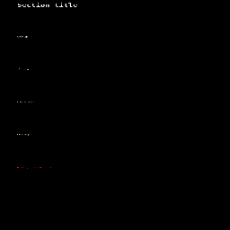

# Text style presets

[Linear: AUT-86](https://linear.app/harwood/issue/AUT-86)

Seven curated `WispTextStyle` values for the recurring captions in a
screen recording — picked once here so the editor, renderer, and
export pipeline never argue about what a caption "is".



[api](../../api/wisp/text/presets/index.html)

```admonish info title="Preset reading order"
Top to bottom: Section title, Caption, Callout, Keyboard shortcut,
Step badge, Warning / privacy label, Watermark. Each row shows the
preset's own style applied to its own name.
```

## The seven presets

| Preset | When to use | Notable knobs |
| --- | --- | --- |
| `SectionTitle` | Hero / chapter heading | size 0.18, Bold, centered |
| `Caption` | Body copy under a clip | size 0.075, line-height 1.30 |
| `Callout` | Pull quote / aside | size 0.085, Medium, italic |
| `KeyboardShortcut` | Inline ⌘C / ⌃-space chip | size 0.055, slight letter-spacing |
| `StepBadge` | "Step 3 of 7" label | size 0.05, Bold, wide letter-spacing |
| `WarningPrivacyLabel` | Mask + redaction overlays | signal-red, Bold |
| `Watermark` | Export footer | size 0.04, italic, alpha 0.63 |

## API

```rust
use wisp::text::{TextPreset, WispText};

let style = TextPreset::Caption.style(); // -> WispTextStyle
let text  = WispText::new("Hello").with_style(style);
```

Or call a named accessor directly:

```rust
use wisp::text::presets;

let warning = presets::warning_privacy_label();
```

`TextPreset::all()` returns every preset in display order — used by
the storybook gallery + tests so adding a new preset automatically
shows up.

## Why they're pure data

```admonish important title="No allocation, no GPU dep"
Each preset is a `pub fn -> WispTextStyle` — a `Copy` value-type with
no runtime cost. The editor uses them to apply styles in O(1); the
renderer reads the same struct for layout + rasterization. There's
no "presets-as-strings" detour through a config file.
```

## Test invariants

The test module enforces a few non-obvious contracts:

- Every preset has positive `size_ndc` and `line_height`.
- No two presets are byte-identical (every row in the gallery looks
  visibly different).
- `WarningPrivacyLabel` has a red-dominant color (R > 0.8, G/B < 0.5)
  so a future tweak doesn't quietly desaturate the privacy signal.
- `Watermark` carries alpha < 1.0 so an export accidentally rendering
  it at full opacity stays visible as a test failure.
