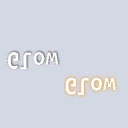
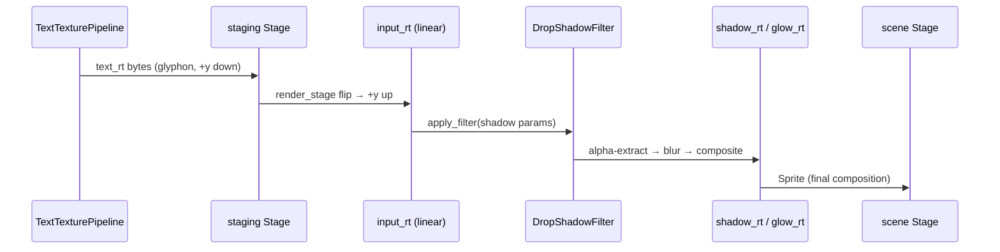

# Drop shadow + glow on text

[Linear: AUT-82](https://linear.app/harwood/issue/AUT-82)

Text rendered to a `RenderTexture`, then run through wisp's existing
[`DropShadowFilter`](../../api/wisp/filter/struct.DropShadowFilter.html).
A glow is a drop shadow with `offset = (0, 0)` and a bright color —
same pipeline, two parameter sets.



*Left: drop shadow (offset 6 px, blur 5, dark 60% alpha). Right: glow
(zero offset, blur 8, warm amber). The paper-white backdrop is a
sprite so the shadow + halo are visible.*

## Pipeline



The intermediate staging step exists because the text texture
pipeline returns `Rgba8UnormSrgb` (display gamma), but the filter
math is correct in linear (`Rgba8Unorm`) space. Rendering the
glyph-RT into a linear `input_rt` once handles both the format
swap and the +y flip cosmic-text needs.

```admonish important title="Glow is just shadow with offset = 0"
The DropShadowFilter does alpha-extract → blur → offset →
composite-under. With `offset = (0, 0)`, the blurred alpha falls
*directly under* the source, producing a halo. Pick the color (a
warm amber for highlight; a saturated red for danger; bright cyan
for cyberpunk vibes), pick the blur, done. No second filter.
```

## API

```rust
use wisp::DropShadowFilter;
use glam::Vec2;
use wisp::Color;

let shadow = DropShadowFilter {
    offset: Vec2::new(6.0, 6.0),
    blur: 5.0,
    color: Color::rgba(0.0, 0.0, 0.0, 0.6),
};
renderer.apply_filter(app, &shadow, &text_input_rt, &shadow_output_rt);

let glow = DropShadowFilter {
    offset: Vec2::new(0.0, 0.0),
    blur: 8.0,
    color: Color::rgba(1.0, 0.80, 0.30, 1.0),
};
renderer.apply_filter(app, &glow, &text_input_rt, &glow_output_rt);
```

Both output RTs become sprites; the caller composes them into the
final scene.

```admonish warning title="Backdrop must be a sprite"
The story renders the paper-white backdrop into its own RT and
attaches it as a `Sprite`. A direct `Graphics::draw_rect` for the
backdrop in the same stage would paint **after** the sprite text +
shadow (Graphics renders after Sprites in `render_stage`),
overwriting the entire shadow effect. The CLAUDE.md "Renderer
batching / draw order" entry captures the rule.
```

## When to use which

| Look | `offset` | `blur` | `color` |
| --- | --- | --- | --- |
| Subtle drop shadow | `(2, 2)..(4, 4)` | 2–4 | `Color::rgba(0, 0, 0, 0.4)` |
| Heavy drop shadow | `(6, 6)..(10, 10)` | 5–10 | `Color::rgba(0, 0, 0, 0.7)` |
| Soft glow | `(0, 0)` | 6–10 | warm bright RGB, alpha 1.0 |
| Hard glow / outline-feel | `(0, 0)` | 1–3 | saturated RGB, alpha 1.0 |
| Privacy / danger pulse | `(0, 0)` | 5–8 | red RGB, alpha 0.9 |

Drop shadow + glow combine: run two filter passes, attach both
output sprites under a common Container with the shadow's sprite
inserted first (so it renders below).
