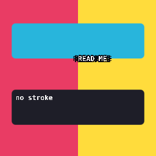

# Stroked / outlined text

[Linear: AUT-81](https://linear.app/harwood/issue/AUT-81)

Text in a screen recorder lives over whatever the user is recording —
chaotic gradients, colored windows, video. A solid-color glyph
disappears against any patch that's the same brightness. Stroking
the text rescues it.



*The "READ ME" caption stays readable across the pink + yellow split;
the unstyled "no stroke" line below is only legible because the
backdrop is dark.*

[api](../../api/wisp/text/stroke/index.html)

## How it works

```mermaid
sequenceDiagram
    participant Pipe as TextTexturePipeline
    participant Tex as Arc&lt;RenderTexture&gt;
    participant Stroke as stroked_text_sprites
    participant Scene as Stage

    Pipe->>Tex: render(text, w_px, h_px) → cached RT
    Stroke->>Scene: 8 sprites, tinted stroke color, offset on a ring
    Stroke->>Scene: 1 sprite, tinted fill color, centered
    Scene->>Scene: render_stage draws sprite by sprite (scene order)
```

A single rendered text texture is stamped eight times in the stroke
color at small offsets, then once more in the fill color at the
center. No new shader, no glyph-outline path — the technique is the
same one CSS uses for `text-stroke`.

```admonish important title="Local NDC, not screen pixels"
`stroke_width_ndc` is in the **container's local NDC**, before the
container's transform applies. A 0.04 stroke radius inside a
container scaled by `(1.6, -0.4)` reads as roughly `0.064 × 0.016`
NDC at the viewport — small but visible at storybook export size.
This is how typography work usually wants it: stroke thickness
follows the text size.
```

## API

```rust
use wisp::text::{stroked_text_sprites, StrokedTextLayer,
                 TextTexturePipeline, WispText, WispTextStyle};
use wisp::{Color, Container, WispFontWeight};

let pipeline = TextTexturePipeline::new(app, format);
let text = WispText::new("READ ME").with_style(
    WispTextStyle::default()
        .with_size(0.22)
        .with_weight(WispFontWeight::Bold)
        .with_color(Color::WHITE),
);
let rt = pipeline.render(app, &text, 1024, 256);

let layer = StrokedTextLayer {
    fill: Color::WHITE,
    stroke: Color::rgba_u8(10, 10, 18, 255),
    stroke_width_ndc: 0.04,
};

let mut container = Container::new();
container.transform.scale = glam::Vec2::new(1.6, -0.4);
let parent = stage.add_child(stage.root(), container).unwrap();
for sprite in stroked_text_sprites(&rt, &layer) {
    stage.add_child(parent, sprite);
}
```

A `stroke_width_ndc` of `0.0` skips the stroke and returns a single
fill sprite — same call site for "no stroke" and "with stroke".

## Geometry

```admonish note title="Eight offsets, √2/2 increments"
The stroke ring uses 8 offsets at 45° spacing — `(1,0)`, `(√2/2,
√2/2)`, `(0,1)`, …. At large stroke widths the ring's discreteness
shows as faint corners; raise the offset count (e.g. 12 directions)
or render at higher resolution to smooth it. For most caption /
overlay use the 8-direction default is invisible.
```

## Sprite/scene gotcha

```admonish bug title="Graphics renders after Sprites"
The backdrop in the story PNG is a `Graphics` pipeline call, which
the renderer batches **after** the sprite pipeline. A bare
`Graphics`-only backdrop in the same stage will paint over the text.
The story works around this by pre-rendering the backdrop into its
own `RenderTexture` and attaching that as a `Sprite` — sprites
respect scene-tree order, so the backdrop sprite (added first) stays
under the text.
```
