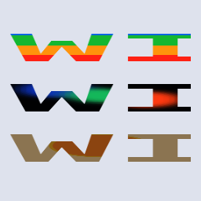
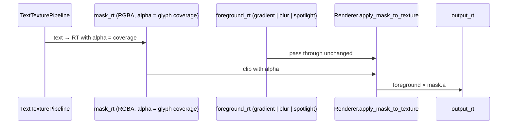

# Text as mask — fill, blur, spotlight

[Linear: AUT-85](https://linear.app/harwood/issue/AUT-85)

Text becomes a stencil: render glyphs to an alpha-coverage texture,
feed any other render-texture as the foreground, and
`Renderer::apply_mask_to_texture` clips the foreground to the
glyph shape. The story below shows the same "WISP" mask with three
foregrounds — a saturated color-band fill, a blurred backdrop, and
a warm spotlight.



*Top: gradient fill through text. Middle: blurred circles. Bottom:
warm spotlight. One mask, three foregrounds.*

## Composition



```admonish important title="apply_mask_to_texture is the load-bearing primitive"
This is the same function M-VEC.4..6 (privacy blur / redaction /
spotlight composition) and M-MASK.2..4 (clip + path mask + mask
combine) call. Text joins the list of valid coverage sources alongside
analytic SDFs (RoundedRect, Ellipse), vector paths, and procedural
masks. The renderer doesn't care where the alpha came from.
```

## API

```rust
use wisp::text::{TextTexturePipeline, WispText, WispTextStyle};
use wisp::{RenderTexture, Texture, Color};

// 1. Render text to a coverage texture.
let text = WispText::new("WISP").with_style(
    WispTextStyle::default().with_size(0.95).with_color(Color::WHITE),
);
let text_rt = pipeline.render(app, &text, 256, 256);

// 2. Stage the text-RT into the renderer's format (linear, +y up).
let mask_rt = RenderTexture::with_format(app, 256, 256, format);
// (render text_rt onto mask_rt via a sprite with scale.y = -1)

// 3. Apply the mask to any foreground RT.
let output = RenderTexture::with_format(app, 256, 256, format);
renderer.apply_mask_to_texture(app, &foreground_rt, &mask_rt, &output);
```

## Three pre-made foregrounds

```admonish tip title="Pattern: separable foreground + universal mask"
The three foregrounds in the story are independent of the mask. Swap
the gradient for a screen-grab, the blur for a stock photo, the
spotlight for a vignette — and the same `apply_mask_to_texture` call
just works. Caching the mask RT across frames (text is rarely
re-rendered per frame) and only regenerating the foreground keeps
the GPU cost in line with a regular textured sprite.
```

- **Fill** — A `Graphics` of horizontal color bands rendered into a
  plain RT. Punchy, poster-style.
- **Blur** — Three overlapping `draw_ellipse` circles in saturated
  colors, run through `BlurFilter::new(radius: 8.0)`. Soft-focus
  reveal.
- **Spotlight** — Solid warm field + a yellow ellipse + a slight
  dimming layer, finished with a zero-offset `DropShadowFilter` to
  soften. Glowy halo through the glyphs.

## Lavapipe / CI guard

```admonish warning title="Blur filter loses the device on lavapipe"
The blur + drop-shadow paths use the multi-bind-group filter
pipeline that lavapipe (Linux CI's software Vulkan) loses the device
on. The story checks `WISP_SKIP_GPU_FILTER_TESTS` and substitutes a
sharp / no-filter foreground when it's set, so the smoke + snapshot
tests still pass on the Ubuntu runner. macOS runners exercise the
real filter path.
```

## Pixel tests

Inside-/outside-glyph alpha is enforced upstream by the mask-compose
pipeline's own tests
([`crates/wisp/tests/mask_compose_*.rs`](../../api/wisp/index.html)).
This chunk verifies that text-driven masks reach the same primitive
unchanged, by way of the storybook story's `story_smoke` (no wgpu
validation errors, visible pixels) and `story_fingerprints` (quadrant
snapshot — text shape must be stable per frame).
