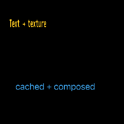

# Text render-to-texture path

[Linear: AUT-79](https://linear.app/harwood/issue/AUT-79)

`TextTexturePipeline` packages
[`FlexibleTextEngine`](../../api/wisp/text/flexible/struct.FlexibleTextEngine.html)
(layout, M-TEXT.2),
[`FlexibleTextRenderer`](../../api/wisp/text/flexible_renderer/struct.FlexibleTextRenderer.html)
(rasterization, M-TEXT.3), and a FIFO-bounded `TextTextureCache` into
one type that turns `WispText` into a sampled `RenderTexture`.



The story above is at
[`crates/wisp-storybook/src/stories/s_text_texture.rs`](../../api/wisp_storybook/index.html).
It renders two pieces of text into separate `RenderTexture`s and
attaches each as a `Sprite` to the scene graph — the standard sprite
pipeline batches the draws.

[api](../../api/wisp/text/texture/struct.TextTexturePipeline.html)

## Why this chunk exists

M-TEXT.3 deferred *container transform + alpha inheritance* and
*`render_stage` participation* to M-TEXT.5. With text now a sampled
texture, those concerns become "what every other sprite already
does":

| Concern (deferred from M-TEXT.3) | M-TEXT.5 resolution |
|---|---|
| Container transform | `Sprite` already inherits `Container::transform` |
| Alpha inheritance | `Sprite` already multiplies tint × container alpha |
| `render_stage` participation | `Sprite` is part of the sprite pipeline, which `render_stage` already drives |
| Blend modes beyond Normal | Sprite-side blend modes apply to the text texture verbatim |

Text-as-texture is also the prerequisite for M-TEXT.6 (text composes
through masks, filters, blends, and export) — every primitive that
accepts a `RenderTexture` (filter, mask, blend, export-frame) now
accepts text.

## Cache shape

`TextTextureKey` hashes everything that affects the rendered output:

- `content` (the literal string)
- `font_family` (`Option<String>`)
- Style: `size_ndc`, `color` (per-channel bits), `line_height`,
  `letter_spacing_ndc`, `weight`, `italic`, `align`
- `wrap_width_ndc` (`Option<f32>`)
- Output dimensions: `width_px`, `height_px`

`f32` fields hash by `to_bits()` so equality is exact. Cache is FIFO
at `MAX_ENTRIES = 64` entries — `64 × 512 × 256 × 4 bytes ≈ 32 MB`
upper bound. `clear_cache()` drops all entries; `stats()` reports
`(hits, misses)` since construction.

## NDC-coordinate vs sprite-UV conventions

```admonish bug title="Gotcha — +y flip"
Glyphon writes the texture with `+y` down (top of the texture is
row 0). The wisp sprite pipeline samples with `+y` up (NDC
convention). To display a text texture upright through a sprite,
**set `scale.y` negative** — standard render-target-as-texture
idiom. Without this, the text renders upside-down.
```

```rust
let mut sprite = Sprite::from_texture(rt.as_texture());
sprite.container.transform.scale = Vec2::new(width_ndc, -height_ndc);
```

## API surface

| Type | Purpose |
|---|---|
| `TextTexturePipeline::new(app, format)` | system-fonts pipeline |
| `TextTexturePipeline::from_font_paths(app, format, paths)` | deterministic-fonts pipeline |
| `pipeline.render(app, &text, w_px, h_px) -> Arc<RenderTexture>` | render-or-fetch-cached |
| `pipeline.stats() -> (hits, misses)` | cache instrumentation |
| `pipeline.cache_len() -> usize` | resident entries |
| `pipeline.clear_cache()` | drop all entries |
| `RenderTexture::as_texture() -> Texture` | wrap as sprite-friendly view |

## Tests

| Test | Asserts |
|---|---|
| `first_render_records_a_miss_and_a_cache_entry` | cache miss + 1 entry |
| `second_render_with_same_inputs_is_a_cache_hit` | same Arc returned |
| `changing_content_invalidates_cache` | new entry |
| `changing_style_invalidates_cache` | new entry |
| `changing_color_invalidates_cache` | new entry |
| `changing_wrap_width_invalidates_cache` | new entry |
| `changing_dimensions_invalidates_cache` | new entry |
| `changing_font_family_invalidates_cache` | new entry |
| `cache_evicts_at_capacity` | FIFO eviction at MAX_ENTRIES |
| `clear_cache_drops_entries_and_refills_on_next_render` | clear + recount |
| `rendered_texture_has_non_zero_glyph_pixels` | smoke: pixels exist |

Eleven tests in `crates/wisp/src/text/texture.rs`.
