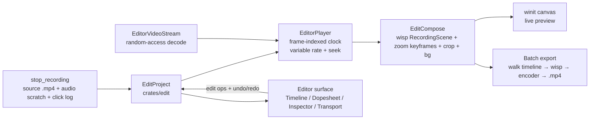

# Milestone 3: Video Editor — Record → Edit → Export (M-EDIT)

> **Goal:** after `stop_recording`, the finished clip opens in a non-destructive **Editor** surface. The user can **scrub/play** with full transport, **trim/split/ripple-delete** clips, **change clip speed**, **crop / reframe**, and add **zoom regions** (auto from clicks + manual) on a **layer/dopesheet timeline** — then **Export** the edited result back to an `.mp4`. End-to-end Record → Edit → Export.
>
> **Why now:** M-RECORD-EXPORT (Milestone 2) ships a coordinated capture → wisp compose → GStreamer encode → file-on-disk happy path. The recorder produces an artifact but there is no way to *shape* it. Every competitor in this lineage (Screen Studio, Cap, Descript) is an *editor* first; the recording is raw material. This milestone turns the artifact into a project.
>
> **Architecture keystone — adopt Cap's segment-list project model.** Cap (cap.so, Rust+Tauri, source-readable) encodes the entire edit as `Vec<TimelineSegment{start,end,timescale,clip}>` + `Vec<ZoomSegment{start,end,amount,mode}>` + one `BackgroundConfiguration`/`CursorConfiguration`/`Crop`, serialized as the project file and **re-rendered through a GPU compositor at export**. That shape maps 1:1 onto our stack: the compositor is `wisp` (already composes screen + bubble + background + padding + shadow + corner-radius in `RecordingScene`), and the animation engine is `wisp-animation` (`Driver` clock with `time_scale`, `Track<V>` keyframes with easing, `Animatable for Transform`). Trim/split/speed are list operations; zoom is a keyframed `Transform` (scale + translate) applied to the screen sprite.
>
> **The real net-new work is the media layer.** Today: decode is **forward-only** (no seek — `crates/decode/src/gstreamer_pipe.rs`), playback is **wallclock-paced 1× only** (`crates/playback/src/lib.rs`), the encoder is **live-only** (`LiveGstreamerEncoder`, `crates/media/src/encode.rs`). The editor needs random-access seek, a frame-indexed variable-rate clock, and a deferred batch re-encode that walks the timeline. ~40% of the effort is here.
>
> **What already exists (≈30% scaffolded).** `?surface=editor` already routes to `AppSection::Editor` (`crates/app-ui/src/routing.rs:81`) but `SurfacePane` never dispatches to it. The editor UI is built as SSR-snapshot-tested **presentational** components in `crates/ui-storybook/src/components/editor/` — `EditorShell`, `WispCanvasHost`, `TimelineSkeleton`, `DopeSheet`, `InspectorPanel`, `PlayerControls` — none wired to real data. This milestone makes them live.
>
> **macOS-first.** Every chunk must *compile* on Windows + Linux (cfg-gated stubs); only macOS must *work*. Reuse the M-QUAL `fit_within_encoder_limits` 4K clamp on export.

---

## Acceptance criteria (end-to-end, macOS)

- ✅ Stop a recording → a "Open in Editor" handoff loads the clip into the Editor surface (or open any clip from the Library).
- ✅ **Playback:** Space toggles play/pause; the wisp canvas shows the frame-accurate frame under the playhead; `←/→` step one frame; `I`/`O` set in/out; a speed dropdown (0.5×/1×/2×) drives *preview* rate; timecode reads `MM:SS.ff`.
- ✅ **Timeline:** a multi-lane timeline (Video filmstrip, Audio waveform, Zoom lane) with a frame-accurate ruler; time-axis zoom (`+`/`-`) + pan; snapping to playhead/clip-edges with a visible snap guide.
- ✅ **Trim/Split/Snip:** drag clip edges to trim; `S` splits at the playhead; ripple-delete (`Shift+Delete`) closes the gap, lift-delete (`Delete`) leaves it.
- ✅ **Speed:** select a segment → set `timescale` (e.g. 2×) → preview re-times and the exported segment is correspondingly shorter, audio pitch-corrected and glitch-free across the boundary.
- ✅ **Crop / reframe:** a crop rect with 16:9 / 9:16 / 1:1 aspect presets + grid guides; preview reflects it; export is cropped.
- ✅ **Zoom:** add a zoom region on the Zoom lane (manual target + amount), drag its edges; it eases in to the held scale and back out; auto-zoom regions are generated from click telemetry on import. The Dopesheet shows the zoom's keyframes; Easy Ease smooths them.
- ✅ **Inspector:** the Style tab edits background/wallpaper, padding, aspect, shadow, corner radius (mirrors the design); changes are live in the preview.
- ✅ **Export:** the edited project renders frame-by-frame through wisp → `.mp4` (H.264/AAC) at a chosen resolution, with a progress bar + cancel; preview and export are pixel-consistent.
- ✅ **Persistence:** the edit survives close/reopen as a `.screenproj` project file.
- ✅ `just gate` green on macOS / Ubuntu / Windows.

---

## Architecture

**Crate boundaries (keep these explicit):**

- **`crates/edit` (new)** — pure domain: `EditProject`, `TimelineSegment`, `ZoomSegment`, configs, project-time↔source-time mapping, edit-operation command stack + undo/redo. **No wgpu, no GStreamer, no Leptos** — serde + math + tests only. This is the testable spine.
- **`crates/decode` + `crates/playback`** — gain random-access seek + a frame-indexed variable-rate clock (`EditorVideoStream`, `EditorPlayer`).
- **`crates/media`** — gains a deferred/batch export path (re-encode from composed frames) + audio re-timing (rubato resample) + crop.
- **`crates/wisp` + `crates/wisp-animation`** — `EditCompose` applies the project config + zoom `Track<Transform>` per project-frame. Mostly reuse.
- **`crates/app` + `crates/app-ui`** — activate the editor surface, wire the presentational components to `EditProject` + `EditorPlayer`, add Tauri commands.

---

## Tech notes

- **Time model.** Project-time is frame-indexed at a fixed project FPS (default 30). `EditProject::source_time(project_frame)` walks the segment list applying each `timescale` (Cap's `interpolate_time`). Everything frame-accurate; no float drift in the editor's authority over time.
- **Seek.** First impl: re-spawn the `gst-launch` decode pipe with `-ss`/segment seek to the target keyframe (GOP) + skip forward to the exact frame, backed by a small decoded-frame LRU cache for scrubbing. Honest about cost: H.264 random access is GOP-bounded; cache hides it for scrubbing. A later swap to `gstreamer-rs` `gst::Seek` is behind the `EditorVideoStream` trait.
- **Variable-rate playback.** `EditorPlayer` is frame-indexed (not wallclock): `tick(dt)` advances `project_frame` by `dt * fps * rate`. Built on `wisp_animation::Driver` (already has `time_scale` + play/pause + `Fixed` mode for deterministic export).
- **Zoom = keyframed Transform.** A `ZoomSegment` compiles to a `Track<Transform>` on the screen sprite: key at start (scale 1.0), key at hold (scale = `amount`, position = focus point), key at end (scale 1.0), with `Ease::InOutCubic` (Easy-Ease equivalent). Follow-cursor = a gentle position track keeping the cursor within a margin. Reuses `wisp-animation` wholesale.
- **Crop.** Preview via wisp clip mask / transform (screen-space); export via GStreamer `videocrop` (or pre-crop the composed texture). Aspect presets drive the canvas `w:h`.
- **Export = deferred re-encode.** A frame generator iterates project-frames 0..N: for each, `EditorVideoStream::seek` the source frame, `EditCompose` renders the wisp scene (zoom/crop/bg applied) to BGRA, push to the encoder. Audio: load the source audio, apply per-segment trim + `timescale` resample (rubato), mux at finalize. Reuse `LiveGstreamerEncoder` driven by the generator, or a thin batch wrapper. Reuse `fit_within_encoder_limits` for the 4K clamp.
- **Audio across speed boundaries.** Cap explicitly fixed audio glitches at speed-segment boundaries — design for it: resample each segment independently to the project rate, crossfade ~2ms at joins.
- **Linear MCP gotcha.** Do not put literal `script` HTML tags in issue bodies — Cloudflare blocks the POST. Describe inline JS in prose.

---

## Chunks (25: ED.0 epic + ED.1–ED.24)

Phases map to the team's `phase:P0/P1/P2` labels. ED numbering communicates build order; "Depends on" lists hard prerequisites.

### Phase A — Domain model & foundations (P0)

**ED.1 — `crates/edit`: `EditProject` data model + time mapping.** New crate. `EditProject { source: ClipRef, segments: Vec<TimelineSegment>, zooms: Vec<ZoomSegment>, background: BackgroundConfig, cursor: CursorConfig, crop: Option<CropRect>, aspect: AspectRatio, project_fps }`; `TimelineSegment { source_start, source_end, timescale }`; `ZoomSegment { start, end, amount, mode: Auto|Manual{x,y}, ease }`. serde round-trip. `source_time(project_frame)` + `project_duration()` walking the segment list. *Done when:* model serializes/deserializes; project↔source time mapping is unit-tested incl. a speed segment; `cargo machete`/gate clean. *Depends on:* none.

**ED.2 — Edit-operation command stack + undo/redo.** `EditOp` enum (Split(t), Trim(seg, edge, t), RippleDelete(range), Lift(range), SetSpeed(seg, ts), MoveZoom/AddZoom/RemoveZoom). Each applies to `EditProject` and is invertible; a bounded undo/redo history. *Done when:* property tests prove split-then-undo == identity, ripple-delete closes gaps, segment invariants (non-overlap, ordered, total duration) hold after every op. *Depends on:* ED.1.

### Phase B — Media random access (P0, the blocker)

**ED.3 — Random-access decode (`EditorVideoStream`).** Wrap `crates/decode` with `seek_to_frame(u64)` / `seek_to_time(Duration)` (re-spawn pipe with segment seek + skip-to-frame) + a decoded-frame LRU cache. *Done when:* seeking to frame N returns the same bytes as forward-decoding to N (fixture mp4, gst skip-guarded); cache hit avoids re-spawn; out-of-range clamps. *Depends on:* none (parallel with A).

**ED.4 — Frame-indexed variable-rate clock (`EditorPlayer`).** play/pause, `seek(frame)`, `step(±1)`, `set_rate(f32)`, loop, in/out, on `wisp_animation::Driver`. `current_frame()` is the editor's time authority. *Done when:* `tick(dt)` at rate R advances frame by `dt*fps*R`; pause holds; seek is exact; unit-tested deterministically with `Driver::Fixed`. *Depends on:* ED.3.

### Phase C — Editor surface activation & preview (P0)

**ED.5 — Activate the editor surface + Record→Edit handoff.** `SurfacePane` dispatches `AppSection::Editor` → real `EditorShell`; `open_in_editor(path)` Tauri command builds an `EditProject` from a finished recording; `stop_recording` flow offers "Open in Editor". *Done when:* finishing a recording (or clicking a Library clip) lands in a populated editor; SSR story + snapshot for the loaded shell. *Depends on:* ED.1.

**ED.6 — Native wgpu editor preview canvas.** `WispCanvasHost` ↔ a winit sibling window rendered by wisp (the stack's "editor preview" surface) showing the `EditCompose` frame at `EditorPlayer::current_frame()`. *Done when:* the preview shows the correct source frame at the playhead and updates on seek; validation-error-scope clean. *Depends on:* ED.4, ED.5.

**ED.7 — Playback transport UI.** Wire `PlayerControls` to `EditorPlayer`: play/pause (Space), frame-step, in/out (I/O), speed dropdown, `MM:SS.ff` timecode, jump-to-start/end. *Done when:* every transport control drives the clock and preview; story for paused/playing/near-end states. *Depends on:* ED.6.

### Phase D — Timeline & dopesheet UI (P0/P1)

**ED.8 — Timeline ruler + frame↔pixel mapping + zoom/pan.** Frame-accurate ruler, playhead synced to `EditorPlayer`, click-to-seek + drag-scrub, time-axis zoom (`+`/`-`) + horizontal pan, global progress bar decoupled from zoom. Reuse `wisp-chart` frozen-pane + `wisp-interaction` kinetic pan. *Done when:* ruler labels are frame-correct at every zoom; scrubbing seeks the clock; playhead stays put on zoom-in. *Depends on:* ED.7. *(P0)*

**ED.9 — Video track filmstrip + clip selection.** Render a thumbnail strip per `TimelineSegment` (sampled frames) with clip boundaries; click selects, marquee multi-selects. *Done when:* segments render as a filmstrip reflecting splits/trims; selection drives the inspector. *Depends on:* ED.8, ED.3. *(P0)*

**ED.10 — Audio track waveform.** Render a waveform lane from the source audio (`.f32` scratch / decoded audio). *Done when:* waveform aligns to the time axis and zoom; downsampled peaks cached. *Depends on:* ED.8. *(P1, `area:media`)*

**ED.11 — Timeline editing interactions.** Split-at-playhead (`S`), edge-trim with px-threshold snapping + snap guide, ripple-vs-lift delete, in/out range. Wire to the ED.2 command stack (undoable). *Done when:* split/trim/ripple manipulate segments and the preview reflects them; snapping is zoom-independent; undo/redo works. *Depends on:* ED.9, ED.2. *(P0)*

**ED.12 — Zoom lane (purple blocks).** Render `ZoomSegment`s as draggable blocks on the Zoom lane (per the design's "1.6× / 2.2× / 1.4×" row); add-at-playhead, drag edges to set duration, select to edit `amount`/target. *Done when:* zoom blocks render with their amount label, are draggable/resizable, and edits persist to the project. *Depends on:* ED.8. *(P1, `area:automation`)*

**ED.13 — Dopesheet keyframe track + Easy Ease.** A keyframe lane for a selected animatable (zoom transform): place/move/delete keyframes (snap to playhead/frame), per-segment easing, one-click Easy Ease (`Ease::InOutCubic`). *Done when:* keyframes on the dopesheet drive a `Track<Transform>`; Easy Ease smooths a zoom; story rendered. *Depends on:* ED.12, ED.4. *(P1, `area:animation`)*

### Phase E — Editing operations & effects (P0/P1)

**ED.14 — Per-segment speed (`timescale`).** Inspector control sets a segment's `timescale`; preview re-times via `EditorPlayer`; export re-times video + resamples audio. *Done when:* a 2× segment previews and exports at half its source duration, audio pitch-corrected, no boundary glitch. *Depends on:* ED.11, ED.4. *(P0, `area:media`)*

**ED.15 — Crop & aspect reframe.** Crop rect + 16:9/9:16/1:1 presets with 25/50/75% grid guides; preview via wisp clip/transform; export via `videocrop`. *Done when:* cropping reframes preview and export; aspect presets change the canvas; numeric entry works. *Depends on:* ED.6. *(P1, `area:mask`)*

**ED.16 — Zoom animation engine (marquee).** Compile each `ZoomSegment` → `Track<Transform>` (scale+position keyframes, ease-in/hold/ease-out) applied to the screen sprite in `EditCompose`; follow-cursor pan keeps the focus in margin; "instant" option. *Done when:* a manual zoom region eases into the held scale at its target and back out, in both preview and export, deterministically. *Depends on:* ED.6, ED.12. *(P0, `area:animation`)*

**ED.17 — Auto-zoom from click telemetry.** Capture cursor-move + click + active-window events during recording into a click log alongside the recording; on import, generate `ZoomSegment{mode:Auto}` blocks around click clusters. *Done when:* a recording with clicks yields editable auto-zoom blocks on import; thresholds (min duration, merge gap) tuned; telemetry capture is cfg-gated per OS. *Depends on:* ED.16, ED.5. *(P1, `area:automation`)*

### Phase F — Inspector / style (P1/P2)

**ED.18 — Inspector Style tab → compose config.** Background (wallpaper/gradient/color), padding, aspect, shadow, corner radius drive `BackgroundConfig` → `EditCompose` (the design's right panel). Live preview. *Done when:* every Style control mutates the project and updates the preview; story per control group. *Depends on:* ED.6. *(P1, `area:editor-ui`)*

**ED.19 — Inspector Cursor tab + cursor overlay.** Cursor size, smoothing (spring), click ripples, hide-when-static, composited as a wisp overlay driven by the cursor track from telemetry. *Done when:* cursor size/smoothing/ripples render in preview and export. *Depends on:* ED.17, ED.18. *(P2, `area:animation`)*

### Phase G — Export (P0)

**ED.20 — Deferred export frame generator.** Walk project-frames 0..N: seek source, `EditCompose` render (zoom/crop/bg/speed applied) → BGRA. The engine that turns an `EditProject` into a frame stream. *Done when:* the generator emits the correct composed frame for any project-frame, deterministically (golden-frame test). *Depends on:* ED.16, ED.15, ED.3. *(P0, `area:export`)*

**ED.21 — End-to-end edited export.** ED.20 frames → encoder; audio per-segment trim + resample + mux; resolution/format options; reuse `fit_within_encoder_limits`. *Done when:* an edited project (trim+split+speed+zoom+crop+bg) exports a playable `.mp4` matching the preview; gst-guarded integration test. *Depends on:* ED.20, ED.14. *(P0, `area:export`)*

**ED.22 — Export progress + cancel UI.** The Export button → modal/progress (frames encoded / ETA) + cancel; reveal-in-Finder on done. *Done when:* progress reflects real encode progress; cancel aborts cleanly; success reveals the file. *Depends on:* ED.21. *(P1, `area:editor-ui`)*

### Phase H — Persistence & library (P1/P2)

**ED.23 — Project persistence (`.screenproj`).** Save/load the `EditProject` next to the recording; autosave on edit; reopen restores exact state. *Done when:* close+reopen round-trips every edit; schema-versioned; migration-safe. *Depends on:* ED.1. *(P1, `area:editor-ui`)*

**ED.24 — Recordings library + open-in-editor.** Persistent index of past recordings (the Library nav section); thumbnails; click → open in editor. *Done when:* finished recordings appear in the Library and open into the editor; index survives restart. *Depends on:* ED.5, ED.23. *(P2, `area:editor-ui`)*

---

## Testing strategy

- **`crates/edit` is the testable spine** — property tests for segment invariants + undo/redo + time mapping (no GPU/media needed). Most correctness lives here.
- **Media:** gst-skip-guarded integration tests (seek-equals-forward-decode, round-trip export). Reuse the `gstreamer_available()` guard pattern.
- **Renderer:** wisp story + quadrant-fingerprint snapshots for `EditCompose` (zoom, crop, background); golden-frame test for export determinism.
- **UI:** SSR snapshot stories for every editor component state (already the pattern in `ui-storybook`).
- **Determinism:** export uses `Driver::Fixed` → bit-stable frames; preview/export parity is asserted on a golden frame.

## Risks / open questions

- **Seek cost** — GOP-bounded H.264 random access. Mitigation: decoded-frame LRU + (later) `gstreamer-rs` `gst::Seek`. If scrubbing is too slow, pre-extract a proxy/thumbnail track.
- **Preview/export parity** — the preview (realtime winit) and export (`Driver::Fixed`) must composite identically. Single `EditCompose` code path used by both; golden-frame gate.
- **Audio re-timing quality** — rubato resampling + boundary crossfades; validate lipsync after speed edits.
- **Click telemetry capture** is new per-OS capture surface (macOS first); ED.17 may spill into a capture follow-up.
