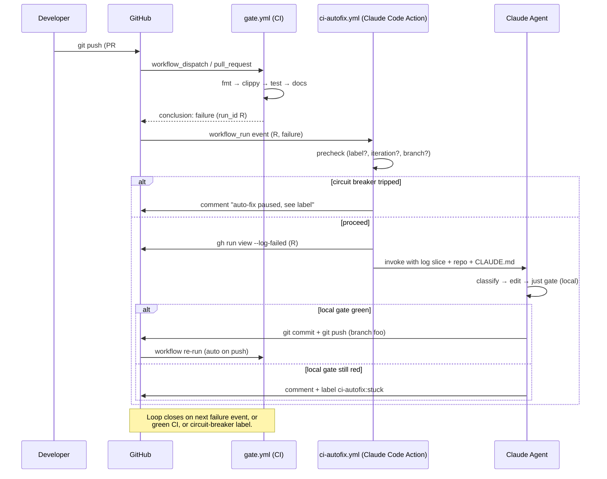

# Spec — CI auto-fix loop

> *"On PR build failure, ping Claude Code, have it read the failed
> log, apply the fix, push a new commit, and repeat until green."*

**Status:** draft / not implemented
**Filed:** 2026-05-14
**Owner:** TBD
**Linear:** TBD

---

## 1. Goal & non-goals

### Goal

When `just gate` (or any required CI workflow) fails on an open PR,
spawn a Claude Code agent that:

1. Reads the failed step's log.
2. Classifies the failure (compile / lint / test / dep / infra-flake).
3. If actionable, edits the working tree, runs the relevant local
   checks, commits, and pushes to **the same PR branch**.
4. Re-arms itself on the next CI run for the same PR — until the
   gate is green, a circuit breaker trips, or a human intervenes.

### Non-goals

- **Opening new PRs.** The loop stays on the existing PR branch.
  The user's prompt said "push up another PR" but new PRs would
  fragment review context and CODEOWNERS approval; a series of
  commits on the same branch is strictly better. (Spec'd below.)
- **Force-pushing.** Auto-fix never rewrites history. New commits
  only.
- **Pushing to `main`.** Even if a `main` build is red, the loop
  ignores it. (Optional v2: open a fix PR from a bot branch.)
- **Suppressing failures.** The agent inherits CLAUDE.md's
  "recursive-fix loop" discipline: no `#[allow(clippy::*)]` without
  `reason`, no `#[ignore]`, no commented-out asserts, no skipped
  hooks.
- **Fixing flaky tests by retrying.** Flakes get classified as
  "infra/flake" → human notified, no commit attempted.

---

## 2. Big picture



---

## 3. Architecture choice

**Use the official Claude Code Action triggered on `workflow_run`.**
Three alternatives, picking the simplest viable one:

| Option | Infra | Trigger | Recommendation |
|---|---|---|---|
| **Claude Code Action on `workflow_run`** | GitHub-native, no infra | `workflow_run: gate.yml`, `types: [completed]`, filter `conclusion == 'failure'` | ✅ **MVP** |
| External webhook receiver (fly.io / Cloudflare Worker) → Anthropic API | Run a tiny axum/worker service | GitHub webhook → HTTP | v2 if we outgrow GHA limits (job timeout, log access) |
| Scheduled remote agent ("routines") that polls `gh pr list` for failed PRs | Anthropic-hosted; cron-only | Cron every 5 min | Worse than push-driven; defer |

**Why `workflow_run`, not `pull_request`:**

- `workflow_run` runs in the **default branch's** workflow context,
  not the PR's. PR authors can't rewrite the auto-fix workflow to
  exfiltrate secrets or bypass safety rails.
- `workflow_run` already gives you the `run_id` of the failed
  workflow, which is what `gh run view --log-failed` needs.
- Secrets (`ANTHROPIC_API_KEY`, the bot's push token) are scoped
  to `workflow_run` jobs and never exposed to PR-branch code.

```admonish warning title="Bootstrap caveat"
`workflow_run` only fires for workflow files **already merged to
main**. The auto-fix workflow has to ship to main first; only PRs
opened *after* that point benefit. Same caveat as Dependabot.
```

---

## 4. Workflow YAML skeleton

`.github/workflows/ci-autofix.yml` — production-shaped sketch.
Replace `TBD` markers with project values.

```yaml
name: ci-autofix

on:
  workflow_run:
    workflows: ["gate"]   # name of the workflow you want to repair
    types: [completed]

permissions:
  contents: write          # required to push commits to the PR branch
  pull-requests: write     # required to comment + label
  actions: read            # required to fetch failed-run logs

# Serialize attempts per PR so two failures don't race fixes.
concurrency:
  group: ci-autofix-${{ github.event.workflow_run.pull_requests[0].number }}
  cancel-in-progress: false

jobs:
  triage:
    if: github.event.workflow_run.conclusion == 'failure' &&
        github.event.workflow_run.event == 'pull_request' &&
        github.event.workflow_run.head_branch != 'main'
    runs-on: ubuntu-latest
    outputs:
      pr_number: ${{ steps.lookup.outputs.pr }}
      head_branch: ${{ steps.lookup.outputs.branch }}
      iteration: ${{ steps.lookup.outputs.iteration }}
      should_run: ${{ steps.lookup.outputs.should_run }}
      classification: ${{ steps.classify.outputs.kind }}
    steps:
      - uses: actions/checkout@v4
        with:
          ref: ${{ github.event.workflow_run.head_sha }}
          token: ${{ secrets.AUTOFIX_BOT_TOKEN }}
          fetch-depth: 0

      # Pull PR number out of the workflow_run event payload.
      - id: lookup
        env:
          GH_TOKEN: ${{ secrets.AUTOFIX_BOT_TOKEN }}
        run: |
          set -euo pipefail
          pr="${{ github.event.workflow_run.pull_requests[0].number }}"
          branch="${{ github.event.workflow_run.head_branch }}"

          # Read existing autofix iteration count from PR labels.
          # Labels: ci-autofix:iter-N (one at a time)
          iter=$(gh pr view "$pr" --json labels \
            --jq '[.labels[].name | select(startswith("ci-autofix:iter-"))][0] // ""' \
            | sed 's/ci-autofix:iter-//')
          iter=${iter:-0}
          next=$((iter + 1))

          # Circuit breakers.
          disabled=$(gh pr view "$pr" --json labels \
            --jq '[.labels[].name] | any(. == "ci-autofix:disable")')
          stuck=$(gh pr view "$pr" --json labels \
            --jq '[.labels[].name] | any(. == "ci-autofix:stuck")')

          if [[ "$disabled" == "true" ]]; then
            echo "should_run=false" >> "$GITHUB_OUTPUT"
            echo "::notice::ci-autofix:disable label set; skipping."
          elif [[ "$stuck" == "true" ]]; then
            echo "should_run=false" >> "$GITHUB_OUTPUT"
            echo "::notice::ci-autofix:stuck label set; awaiting human."
          elif [[ $next -gt 5 ]]; then
            echo "should_run=false" >> "$GITHUB_OUTPUT"
            gh pr comment "$pr" --body \
              "🛑 ci-autofix: reached max iterations (5). Adding \`ci-autofix:stuck\`."
            gh pr edit "$pr" --add-label "ci-autofix:stuck"
          else
            echo "should_run=true" >> "$GITHUB_OUTPUT"
          fi

          echo "pr=$pr" >> "$GITHUB_OUTPUT"
          echo "branch=$branch" >> "$GITHUB_OUTPUT"
          echo "iteration=$next" >> "$GITHUB_OUTPUT"

      # Fetch only the failed steps' logs, not the full archive.
      - id: classify
        if: steps.lookup.outputs.should_run == 'true'
        env:
          GH_TOKEN: ${{ secrets.AUTOFIX_BOT_TOKEN }}
        run: |
          gh run view ${{ github.event.workflow_run.id }} \
            --log-failed > /tmp/failed.log
          # See §6 — classify into actionable / flake / unknown.
          # tools/ci-triage is a small Rust binary in this repo.
          kind=$(./tools/ci-triage/classify /tmp/failed.log)
          echo "kind=$kind" >> "$GITHUB_OUTPUT"

  fix:
    needs: triage
    if: needs.triage.outputs.should_run == 'true' &&
        needs.triage.outputs.classification == 'actionable'
    runs-on: ubuntu-latest
    timeout-minutes: 30
    steps:
      - uses: actions/checkout@v4
        with:
          ref: ${{ needs.triage.outputs.head_branch }}
          token: ${{ secrets.AUTOFIX_BOT_TOKEN }}
          fetch-depth: 0

      # Same Linux toolchain installs as gate.yml gate-screen job.
      # Keeping these in sync matters — Claude's local `just gate`
      # must reproduce the CI environment.
      - uses: dtolnay/rust-toolchain@nightly
        with: { components: rustfmt, clippy }
      - uses: taiki-e/install-action@v2
        with: { tool: cargo-nextest,just }
      - name: Install Linux/Tauri deps
        run: |
          sudo apt-get update
          sudo apt-get install -y --no-install-recommends \
            pkg-config libglib2.0-dev libgtk-3-dev libwebkit2gtk-4.1-dev \
            libxdo-dev libssl-dev libayatana-appindicator3-dev librsvg2-dev \
            build-essential gstreamer1.0-tools gstreamer1.0-plugins-base \
            gstreamer1.0-plugins-good gstreamer1.0-libav \
            mesa-vulkan-drivers libvulkan1 \
            libx11-dev libxkbcommon-dev libxkbcommon-x11-dev libxcb1-dev \
            libxcursor-dev libxrandr-dev libxi-dev

      # The Claude Code Action does the heavy lifting: spawns a
      # Claude Code agent with the repo checked out, gives it a
      # tool-use harness, and lets it iterate until satisfied.
      - id: claude
        uses: anthropic/claude-code-action@v1
        env:
          # Read by Claude Code's git plumbing.
          GIT_AUTHOR_NAME: "ci-autofix-bot"
          GIT_AUTHOR_EMAIL: "ci-autofix@noreply.users.github.com"
          GIT_COMMITTER_NAME: "ci-autofix-bot"
          GIT_COMMITTER_EMAIL: "ci-autofix@noreply.users.github.com"
        with:
          anthropic-api-key: ${{ secrets.ANTHROPIC_API_KEY }}
          # Hard ceilings — Claude exits if it blows past either.
          max-tokens-per-attempt: 250000
          wall-clock-cap-minutes: 25
          # Prompt template ships in tools/ci-autofix/prompt.md
          # (see §7).
          prompt-path: tools/ci-autofix/prompt.md
          # Mounted into Claude's context: failed log + PR diff.
          additional-context-files: |
            /tmp/failed.log
            tools/ci-autofix/failure-summary.json
          # Defence in depth: even if the prompt asks otherwise,
          # the action refuses these.
          allow-tools: "Read,Edit,Write,Bash"
          deny-files: |
            .github/workflows/**
            Cargo.lock
            deny.toml
            **/secrets/**
            **/.env*
          deny-bash-patterns: |
            git push --force*
            git push * main*
            git reset --hard*
            git rebase*
            git commit --amend*
            cargo install*
            curl * | sh*
            wget * | sh*

      # If Claude made commits, push them. The action returns
      # `commits-made: 'true'` when work was done.
      - name: Push fix
        if: steps.claude.outputs.commits-made == 'true'
        env:
          GH_TOKEN: ${{ secrets.AUTOFIX_BOT_TOKEN }}
        run: |
          git push origin HEAD:${{ needs.triage.outputs.head_branch }}
          pr="${{ needs.triage.outputs.pr_number }}"
          iter="${{ needs.triage.outputs.iteration }}"
          # Replace the prior iter-N label with the new one.
          gh pr edit "$pr" --remove-label "ci-autofix:iter-$((iter-1))" || true
          gh pr edit "$pr" --add-label "ci-autofix:iter-$iter"
          gh pr comment "$pr" --body-file - <<EOF
          🤖 ci-autofix iteration $iter pushed.

          See [run ${{ github.run_id }}](${{ github.server_url }}/${{ github.repository }}/actions/runs/${{ github.run_id }}).
          EOF

      - name: Mark stuck if no commit
        if: steps.claude.outputs.commits-made != 'true'
        env:
          GH_TOKEN: ${{ secrets.AUTOFIX_BOT_TOKEN }}
        run: |
          pr="${{ needs.triage.outputs.pr_number }}"
          gh pr comment "$pr" --body \
            "🛑 ci-autofix iteration ${{ needs.triage.outputs.iteration }} produced no commit. Adding \`ci-autofix:stuck\`."
          gh pr edit "$pr" --add-label "ci-autofix:stuck"

  notify-flake:
    needs: triage
    if: needs.triage.outputs.should_run == 'true' &&
        needs.triage.outputs.classification == 'flake'
    runs-on: ubuntu-latest
    steps:
      - env: { GH_TOKEN: "${{ secrets.AUTOFIX_BOT_TOKEN }}" }
        run: |
          gh pr comment "${{ needs.triage.outputs.pr_number }}" --body \
            "🌫️ Classified as infra/flake; auto-fix not attempted. Re-run the job manually or investigate."
```

---

## 5. Loop control & circuit breakers

| Control | Mechanism | Default |
|---|---|---|
| Max iterations per PR | Label `ci-autofix:iter-N`; triage compares to cap | 5 |
| Wall-clock per attempt | `timeout-minutes: 30` on the `fix` job | 30 min |
| Token cap per attempt | `max-tokens-per-attempt` arg to action | 250 k |
| Manual disable | Label `ci-autofix:disable` | author or reviewer applies |
| Escalation | Label `ci-autofix:stuck` | applied on cap-hit, no-op, or repeat-fix |
| Repeat-fix guard | Compare commit message + diff to last attempt; bail if identical | see §6 |

```admonish important title="Why labels, not a database"
Iteration state on the PR (labels + comments) is the cheapest
sufficient store. Self-documenting (visible to reviewers), survives
runner restarts, no out-of-band state to drift, and reversible by
clicking 'remove label'. Don't over-engineer with a sidecar DB
unless you outgrow it.
```

---

## 6. Failure classification

`tools/ci-triage/` — small Rust binary, ~200 LOC. Input: failed
step log (stdin or path). Output: one of `actionable | flake |
unknown` on stdout.

**Heuristics in priority order:**

1. **Flake** — matches any of:
   - `Error: The operation was canceled.`
   - `Connection reset by peer`
   - `429 Too Many Requests`
   - `ENOSPC`
   - `Resource temporarily unavailable`
   - `tar: write error`
   - `actions-runner: ...lost connection`
2. **Actionable**:
   - `error[E\d+]:` (rustc)
   - `error: linking with `cc` failed` (sometimes flake; require also non-flake context)
   - `clippy::` lint diagnostic
   - `FAIL [` (nextest)
   - `assertion `left ==` failed`
   - `panicked at`
   - cargo-deny / cargo-machete / cargo-audit findings
   - `mdbook` build errors
3. **Unknown** — fallthrough. Treated like flake (no fix attempt)
   but commented differently so humans know to triage.

**Why a Rust binary, not bash:** the
`Shell text-matching is a portability trap. Use a Rust binary.`
rule from CLAUDE.md applies — and we want this exact tool to be
unit-testable. Mirror `tools/doc-gates/` shape (lib + bin + tests,
fixtures under `tools/ci-triage/tests/fixtures/`).

---

## 7. Prompt design

`tools/ci-autofix/prompt.md` — checked into the repo, version-
controlled, code-reviewed. Skeleton:

```markdown
You are running inside a GitHub Action invoked because PR #{{pr}}
on branch `{{branch}}` failed CI. Iteration {{iteration}} of {{max}}.

# Your job

1. Read `/tmp/failed.log` (the failing step's output).
2. Read CLAUDE.md (the project's recursive-fix-loop discipline).
3. Identify the root cause. **Do not paper over it.**
4. Make the minimum fix. No drive-by refactors.
5. Run `just gate` locally and verify green BEFORE committing.
6. Commit with a `fix(ci): <one-line root cause>` subject and a
   body explaining: what the log showed, why this fix, what other
   approaches you ruled out.

# Hard rules — inherited from CLAUDE.md

- Never `#[allow(clippy::*)]` without `reason = "..."`.
- Never `#[ignore]` a failing test.
- Never comment out an assertion.
- Never bypass `cargo deny` / `cargo machete` findings.
- Never modify `.github/workflows/**`, `Cargo.lock`, or `deny.toml`
  (the action will block writes anyway; this rule is the explicit
  why).
- Never `git push --force`, `git reset --hard`, or amend commits.

# If you cannot fix it

Exit cleanly without committing. The action will label the PR
`ci-autofix:stuck` and a human will pick it up. **Do not commit a
partial fix or a workaround that disables the failing check.**

# Previous attempts on this PR

{{previous-attempts-summary}}

If you find yourself proposing a fix that's substantially the same
as a previous attempt, STOP — that's the loop-going-in-circles
signal. Exit without committing.

# Failure log (first 4 KB)

{{failed-log-head}}
```

The `{{previous-attempts-summary}}` slot is filled by the action
from PR comment history (parse comments whose first line matches
`🤖 ci-autofix iteration N pushed.`).

---

## 8. Safety rails (defence in depth)

Three layers — each independently sufficient, all three active:

1. **Action-level `deny-files` + `deny-bash-patterns`** — the
   action refuses Edit/Write/Bash calls that match. Bypasses
   require the *human-only* path of editing the workflow file in a
   PR that goes through normal CODEOWNERS approval.
2. **Branch protection on `main`** — auto-fix only ever pushes to
   *PR branches*, never to `main`. GitHub branch protection should
   require `gate-all` as a status check; auto-fix can't bypass it.
3. **Token scope** — `secrets.AUTOFIX_BOT_TOKEN` is a fine-grained
   PAT or GitHub App installation token scoped to:
   - `contents: write` on *this repo only*
   - `pull_requests: write`
   - `actions: read`
   - Explicitly NOT: workflows: write, secrets, admin, packages.

**File denylist worth shipping on day one:**

```
.github/workflows/**
Cargo.lock
deny.toml
rust-toolchain.toml
**/secrets/**
**/.env*
**/credentials*
**/*.pem
**/*.key
```

Cargo.lock is on the list because auto-fixing a "version conflict"
by editing the lockfile usually papers over a real Cargo.toml
problem; force the agent to fix the manifest, not the lock.

---

## 9. State management

| State | Storage | Why |
|---|---|---|
| Iteration count | PR label `ci-autofix:iter-N` | Self-documenting, atomic, free |
| Disabled flag | PR label `ci-autofix:disable` | Human can toggle from UI |
| Stuck flag | PR label `ci-autofix:stuck` | Same |
| Per-attempt history | PR comment body | Reviewer-visible audit trail |
| Run-level metrics (tokens, wall-clock) | GitHub Actions summary | `$GITHUB_STEP_SUMMARY` markdown |
| Aggregate metrics (cost/month) | External (Anthropic console) | Out of scope here |

**Don't:** stand up a sidecar DB / Redis / Postgres. The label +
comment model survives the lifetime of the PR and is enough.

---

## 10. Observability

Every attempt writes a single PR comment with:

```markdown
🤖 ci-autofix iteration N pushed.

**Failure class:** actionable (rustc E0599)
**Files touched:** crates/wisp/src/scene/mod.rs
**Tokens:** 142_318 / 250_000
**Wall-clock:** 4 m 21 s
**Local `just gate`:** ✅ green before push
**Run:** [link to action run]
```

The comment is structured (regex-parseable) so a future v2 dashboard
can scrape attempt outcomes across the repo without a DB.

For ops, add a daily cron workflow (`ci-autofix-report.yml`) that
posts a Slack/email summary: PRs auto-fixed this week, PRs stuck,
average iterations to green, token spend.

---

## 11. Cost model

Order-of-magnitude estimates at Opus 4.7 rates (Jan 2026 pricing):

| Component | Tokens | $ per attempt |
|---|---|---|
| CLAUDE.md + cached system prompt | ~50 k (cached, $0.10) | $0.10 |
| Failed log slice (4 KB head) | ~1 k | negligible |
| Repo files read during diagnosis | ~30 k | $0.45 |
| Generated edits + commit messages | ~10 k output | $0.75 |
| **Per attempt** | ~90 k | **~$1.30** |
| **Per stuck PR (5 iterations)** | ~450 k | **~$6.50** |

**Caps to set up front:**

- Token cap per attempt: 250 k (~$3.75 worst case).
- Per-PR aggregate: 5 iterations × $4 = ~$20 hard ceiling.
- Monthly: a `ci-autofix-budget` GitHub repo variable + a
  daily-cron check that flips a global kill-switch label
  (`ci-autofix:budget-exhausted`) if month-to-date exceeds $X.

Prompt caching (the CLAUDE.md + repo skeleton) is the biggest
single lever — turn it on (it's on by default in the action), and
the 5-minute TTL is usually fine because successive attempts are
serialized via `concurrency`.

---

## 12. MVP → v1 → v2 staging

### MVP (1-2 days of work)

- `tools/ci-triage/` Rust classifier (actionable | flake | unknown)
- `tools/ci-autofix/prompt.md` checked-in prompt
- `.github/workflows/ci-autofix.yml` with all three safety layers
- `AUTOFIX_BOT_TOKEN` provisioned (fine-grained PAT for MVP; GH App
  for v1)
- `ANTHROPIC_API_KEY` repo secret
- Branch-protection check: `gate-all` required, force-push blocked
- README runbook for humans: how to disable, how to escalate, how
  to read attempt comments

### v1 (next iteration)

- Replace PAT with a GitHub App (longer-lived, finer permissions,
  better audit).
- Repeat-fix detection: if iteration N's diff `Hamming-distance < 5`
  from iteration N-1's diff, mark stuck.
- Failure-class-aware prompting: distinct prompt templates for
  `compile`, `lint`, `test`, `dep` (a clippy fix and a test-failure
  fix are not the same conversation).
- Token-budget dashboard cron.

### v2 (if the loop graduates)

- External webhook receiver if GHA's 30-min cap becomes binding
  (it shouldn't for `just gate`).
- Cross-PR memory: remember "we already established that test
  `foo` is flaky" so subsequent classifiers can elevate it.
- `main`-branch fix loop (open a fix PR from `ci-autofix/fix-*`
  branch). Needs careful CODEOWNERS interaction.

---

## 13. Open questions

1. **Should auto-fix run on every PR or only opted-in?** MVP:
   only PRs with `ci-autofix:enable` label. v1: all PRs by default
   unless `ci-autofix:disable`. The opt-in default avoids
   surprises while the loop is unproven.
2. **What's the source of truth for "is this commit Claude's?"**
   Bot identity (`ci-autofix-bot`) on the commit author is the
   easy answer; trailing `Co-Authored-By: Claude` line for
   attribution. Confirm with reviewers.
3. **CODEOWNERS interaction?** Auto-fix commits to a PR branch
   don't re-trigger CODEOWNERS approval requirements (GitHub treats
   them as additional commits, not new PRs). This is desirable —
   the human reviewer's approval still gates the merge.
4. **What about `main` regressions?** Out of MVP. A `main`-branch
   variant would open a fix-PR from a bot branch and follow normal
   review.
5. **GStreamer / wgpu device failures in CI** — these are
   real failures but typically env-driven (lavapipe quirks). Should
   they classify as `actionable` (agent guards via env-var) or
   `flake` (skip)? Lean `actionable` only if the failure mentions
   `WISP_SKIP_GPU_FILTER_TESTS`-shaped patterns; otherwise `flake`.

---

## 14. References

- Claude Code Action: `anthropic/claude-code-action` on GitHub
  Marketplace (official).
- `gh run view --log-failed`: only-failed-steps log access.
- `workflow_run` event docs:
  <https://docs.github.com/en/actions/using-workflows/events-that-trigger-workflows#workflow_run>
- CLAUDE.md `_docs/QA.md` — definition of "green" (what `just
  gate` must satisfy).
- CLAUDE.md "Recursive-fix loop" section — the local-dev version
  of this same discipline; the agent inherits it.
