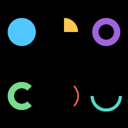

# Arc + annular sector — M-VEC.20



Two new SDF primitives in `Graphics`:

* **`draw_annular_sector(center, r_inner, r_outer, start, end)`** — filled
  pie slice (when `r_inner = 0`) or donut slice (when `r_inner > 0`).
* **`draw_arc(center, radius, start, end, stroke_width)`** — thin stroked
  curve; internally an annular sector with
  `r_inner = radius - stroke_width / 2`, `r_outer = radius + stroke_width / 2`.

Angles are radians; `0` aligns with `+x`, counter-clockwise positive. The
angular span clamps to `[0, 2π]`; an end angle ≥ start angle + 2π collapses
to a full ring (or full disc when `r_inner = 0`).

```admonish important title="Why this lives in wisp"
Pie / donut / gauge / sunburst charts need arcs at chart-level resolution
(hundreds of pixels of radius). Approximating an arc with many short line
segments produces visible faceting and breaks SDF anti-aliasing. Putting
arcs in `Graphics` lets every consumer get clean AA edges via the same
`fwidth(d)` pipeline that rect / rounded rect / ellipse use.
```

## SDF math

The shader rotates the local point so the wedge centerline aligns with `+y`,
then mirrors across `+y` so only the right half-plane needs handling. Inside
the wedge, distance reduces to `r - r_outer` (disc case) or
`max(r - r_outer, r_inner - r)` (annulus case). Outside the wedge, distance
is to the radial wedge edge — a clamped projection onto `sc * t` for
`t ∈ [r_inner, r_outer]`. Implementation in
`graphics_solid.wgsl::sdf_annular_sector`.

The wedge symmetry (`abs(p.x)` after rotation) is what makes this fit one
branch-free SDF. It also means the maximum supported angular span is `2π`
— wider spans are clamped at the call site.

```admonish warning title="Stroke vs `draw_arc`"
`draw_arc` is the convenient stroked-curve form; it lowers to an annular
sector with thickness = `stroke_width`. If you want a *bordered* annular
sector (filled region + outline), use `draw_annular_sector` with the
graphics' current `stroke` set — that emits two instances (fill + outline
band) like `draw_rect` does.
```

## Chart consumers

This primitive unblocks three chart tickets that were filed against
`wisp-chart`:

| Chart | Linear | Uses |
|---|---|---|
| Pie / donut (M-CHART.17) | [AUT-197](https://linear.app/harwood/issue/AUT-197) | one `draw_annular_sector` per slice |
| Gauge (M-CHART.15) | [AUT-195](https://linear.app/harwood/issue/AUT-195) | coloured threshold-zone annular sectors + a needle |
| Sunburst (M-CHART.36) | [AUT-216](https://linear.app/harwood/issue/AUT-216) | nested annular sectors per hierarchy level |

## Verified by

`crates/wisp/tests/render_annular_sector.rs` — four tests pin each
geometric case:

1. **Full disc** — `r_inner = 0`, full angular span; centre pixel reads
   as the fill colour, edge pixel reads as background.
2. **Quarter wedge** — 90° pie slice; upper-right pixel reads as fill,
   lower-left pixel reads as background.
3. **Donut band** — `r_inner > 0`, full angular span; centre pixel reads
   as background (hole), mid-band pixel reads as fill.
4. **Stroked arc** — `draw_arc` with narrow band; centerline pixel reads
   as fill, just-inside pixel reads as background, well-outside-angular-span
   pixel reads as background.

---

[`Graphics` API](../../api/wisp/scene/struct.Graphics.html) · [Stories index](../stories.md)
