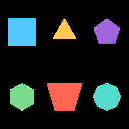

# Convex polygon — M-VEC.21



`Graphics::draw_polygon(vertices)` fills any **convex** polygon
listed in counter-clockwise winding order. The polygon is
implicitly closed — the last vertex connects back to the first.
Polygons under 3 vertices are silently skipped.

This is the chart-layer enabler for area fills, sankey ribbons,
funnel-area trapezoids, and the ternary simplex outline — all of
which are convex by construction in v1.

```admonish warning title="Convex-only for v1"
Fan triangulation from vertex 0 produces visible overlap when the
polygon isn't convex. Non-convex input is undefined behaviour for
v1. Full tessellation (`lyon_tessellation` + non-convex SDF for
edge AA) is a follow-on chunk; today's chart-side consumers are
all convex and don't need it.
```

```admonish note title="No edge anti-aliasing"
The triangle-list path renders with hard pixel edges (no
`fwidth()`-based smoothstep like the SDF primitives). Where crisp
edges matter — chart labels, callout borders — stroke the polygon
perimeter with `draw_line` segments; those go through the existing
SDF line path and are properly anti-aliased.
```

## Render path

A separate WGSL shader (`graphics_polygon.wgsl`) and a sister
`BlendPipelineMap` inside `GraphicsPipeline` handle polygons. The
scene walk separates each `Graphics` node's primitives into:

1. **SDF instances** (rect / rounded rect / ellipse / line /
   annular sector) — flow through `graphics_solid.wgsl` as
   instanced quads.
2. **Polygon triangles** — fan-triangulated CPU-side from vertex
   0, world matrix baked into clip coordinates, then flow through
   `graphics_polygon.wgsl` as a plain triangle list.

Both share the polygon node's blend-mode bucket so a chart that
mixes SDF primitives (axis gridlines, point markers) with
polygons (area fill) composites in the order their primitives were
emitted on the node.

## Verified by

`crates/wisp/tests/render_polygon.rs` — three tests:

1. **Square** — minimum-viable 4-vertex polygon; centre fills,
   exterior is background.
2. **Regular pentagon** — non-rect convex; centre fills, exterior
   is background.
3. **Trapezoid** — funnel-area-style asymmetric quad; centre
   fills, off-edge corner reads as background.

## Chart consumers

| Chart | Linear | Uses |
|---|---|---|
| Area chart | [AUT-190](https://linear.app/harwood/issue/AUT-190) | filled polygon below curve |
| Sankey | [AUT-217](https://linear.app/harwood/issue/AUT-217) | edge ribbons (cubic Bezier → flatten → polygon) |
| Funnel (area mode) | [AUT-218](https://linear.app/harwood/issue/AUT-218) | trapezoidal connections between stages |
| Ternary | [AUT-210](https://linear.app/harwood/issue/AUT-210) | simplex triangle outline |
| Contour (filled, partial) | [AUT-209](https://linear.app/harwood/issue/AUT-209) | convex bands today; full non-convex deferred |

---

[`Graphics` API](../../api/wisp/scene/struct.Graphics.html) · [Stories index](../stories.md)
