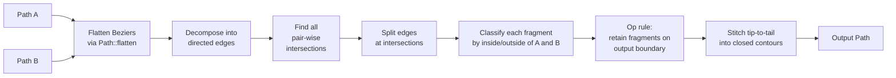

# Path boolean ops — union, intersection, difference, XOR

> wisp's path-booleans engine. In-house polygon clipping, no third-
> party crate, hyper-wgpu focused. Powers shape composition for
> callouts, cutouts, intersections, and ring highlights.

The full design rationale lives in [`_docs/adr/M-BOOL-backend.md`](../../../adr/M-BOOL-backend.md);
this chapter is the user-facing tour.

## API at a glance

```rust
use wisp::path::{Path, PathBuilder};
use wisp::path::boolean::{combine, combine_n, BooleanOp, BoolOptions};

let circle_a: Path = /* … */;
let circle_b: Path = /* … */;

let union        = combine(&circle_a, &circle_b, BooleanOp::Union,        BoolOptions::default());
let intersection = combine(&circle_a, &circle_b, BooleanOp::Intersection, BoolOptions::default());
let difference   = combine(&circle_a, &circle_b, BooleanOp::Difference,   BoolOptions::default());
let xor          = combine(&circle_a, &circle_b, BooleanOp::Xor,          BoolOptions::default());

// N-ary fold:
let all = combine_n(&[&circle_a, &circle_b, &circle_c], BooleanOp::Union, BoolOptions::default());
```

Output is a `Path` — drops into every existing wisp consumer
(`Graphics::draw_path`, `VectorShape::Path` for masking, headless
PNG export, mdBook chapter screenshots).

## When to use which op

```admonish info title="Decision tree"
- **Combining two callouts into one outline?** → `Union`.
- **Clipping a brand mark to a webcam bubble?** → `Intersection`.
- **Cutting a hole in a backdrop?** → `Difference` (A − B).
- **Ring / donut highlight?** → `Xor` (or `Difference` of two
  concentric paths — both work).
```

Versus the other composition primitives in wisp:

| Tool | When | What you get |
|---|---|---|
| **Path booleans** | You want a *new vector path* that bounds the combined region | A `Path` you can fill, stroke, mask through, export |
| **`MaskShape::*`** (M-MASK) | You want to clip an existing render-texture to a shape | A render-pass that gates pixels by an alpha mask |
| **`BlendMode::*`** (M-BLEND) | You want to compose two layers' pixels | A GPU blend equation, no new vector geometry |
| **`apply_filter(...)`** (M-FILTER) | You want a post-process (blur, drop shadow, …) | A pixel-level effect, no new geometry |

Boolean ops produce **vector geometry**; the others produce pixels.
If your downstream is "fill the shape with a colour" or "use the
shape as a mask for something else," booleans are the right tool.

## Algorithm



The classification step asks, for each candidate edge fragment:
*"Is the region just-above this edge inside the output, and the
region just-below outside (or vice versa)?"* If yes, the edge is
on the output boundary and we keep it. Per-op:

| Op | Keep iff |
|---|---|
| `Union` | `(in_A ∨ in_B)` differs on the two sides |
| `Intersection` | `(in_A ∧ in_B)` differs on the two sides |
| `Difference` | `(in_A ∧ ¬in_B)` differs on the two sides |
| `Xor` | `(in_A ⊕ in_B)` differs on the two sides |

That single mechanism implements all four ops — no per-op clipping
algorithm. New ops (e.g. Porter-Duff variants in M-BOOL.12) are
one new `op_rule` line.

## What's in v1, what's deferred

**Shipped this PR (M-BOOL.0..6):**

- In-house polygon-clipping engine.
- Public API: `combine`, `combine_n`, `BooleanOp`, `BoolOptions`, `FillRule`.
- All 4 primitive ops on simple closed polygons.
- 14 unit tests covering geometry correctness + empty-input cases.
- Re-exported at `wisp::path::boolean::*`.

**Deferred follow-ups** (each is a separate Linear ticket):

| Ticket | What's deferred | Why this PR doesn't touch it |
|---|---|---|
| M-BOOL.7 / AUT-168 | Multi-subpath Bezier handling (curves preserved per subpath) | v1 flattens the entire input to a single polyline; multi-subpath needs a `Path::flatten_subpaths` API |
| M-BOOL.8 / AUT-169 | `FillRule::NonZero` semantics + native holes | Needs winding-number tracking in the sweep; v1 honours `EvenOdd` only |
| M-BOOL.9 / AUT-170 | `Graphics::union_with` / `.cut` / `.intersect_with` / `.xor_with` fluent builder | Pending after the engine settles |
| M-BOOL.10 / AUT-171 | `BooleanGroup` scene-graph node | Render-pass integration; depends on stable engine |
| M-BOOL.11 / AUT-172 | Bake boolean result → alpha-mask `RenderTexture` | Wires the engine into M-VEC.3's mask pipeline |
| M-BOOL.12 / AUT-173 | Complete Porter-Duff blend modes | Orthogonal to the engine — lives in `wisp::blend` |
| M-BOOL.14 / AUT-175 | Cache + bake-to-mask for static booleans | Perf opt — needs M-BOOL.11 first |
| M-BOOL.15 / AUT-176 | Four-circle Venn storybook story | Needs `wisp-storybook` rendering of `Path` output (depends on M-BOOL.9 or .10 for ergonomics) |
| M-BOOL.16 / AUT-177 | `proptest` property tests for algebraic laws | Adds proptest dependency; v1 tests are deterministic and named |
| M-BOOL.17 / AUT-178 | `criterion` benchmarks | Adds criterion dependency |
| M-BOOL.18 / AUT-179 | Offset/Minkowski, SDF, glyph booleans | Explicitly P3 deferred per the ticket |

```admonish important title="API stability"
The public surface (`combine`, `combine_n`, `BooleanOp`,
`BoolOptions`, `FillRule`) is intentionally minimal and is
guaranteed to be additive across the follow-up tickets. The
fluent builder in M-BOOL.9 will sit *on top* of these functions
without replacing them.
```

## Known v1 limitations

- **Self-intersecting input polygons** → undefined output. Matches
  Clipper2 v1 behaviour. Pre-validate via a future `Path::validate`
  helper (lands in M-BOOL.8).
- **Degenerate edges** (length ≈ 0) silently discarded.
- **Coincident collinear edges** kept once, label-union'd.
- **`FillRule::NonZero` is accepted but treated as `EvenOdd`** until
  M-BOOL.8 ships winding-number tracking.

## Tests

`crates/wisp/src/scene/path/boolean.rs` has 14 unit tests:

- 4 op-correctness tests (one per primitive op) using a baseline of
  two unit squares offset by 0.3 NDC. Each asserts contour count +
  point-in/point-out classification of probe locations.
- 2 disjoint-input tests (`Union` returns both, `Intersection`
  returns nothing).
- 3 empty-input tests (`Path::from_commands(vec![])` against a
  non-empty path produces sensible no-op results).
- 3 N-ary tests (empty slice, single-element slice, three disjoint
  squares union).
- 2 internal-helper tests (`ray_crossings`, `segment_intersection`).

All passing on macOS + Ubuntu + Windows in `just gate`.
