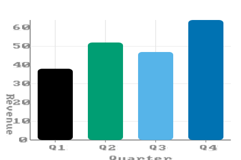

# Axes

Axes are the gridlines, tick marks, tick labels, and axis titles
that frame a cartesian plot. The `Plot` facade emits them
automatically; this chapter documents the renderer behind that
default + the knobs the caller has.



## What ships with the default render

```admonish info
A `Plot` rendered with default settings emits, in this order:
background → Y gridlines + Y axis line + Y tick marks →
X gridlines + X axis line + X tick marks → marks (bars, lines)
→ tick labels + axis title.
```

The order matters: gridlines + tick marks emit BEFORE marks so
data primitives composite on top of the grid. Tick labels emit
AFTER marks so they are never occluded by a tall bar.

## Public surface

The renderer's primitives live in [`wisp_chart::axis`](../api/wisp_chart/axis/index.html).
Two pairs of functions, one pair per axis direction:

| Function                 | Returns         | Purpose                                |
|--------------------------|-----------------|----------------------------------------|
| `emit_x_axis_lines`      | `wisp::Graphics`| Bottom/top axis line + ticks + grid    |
| `emit_y_axis_lines`      | `wisp::Graphics`| Left/right axis line + ticks + grid    |
| `emit_x_axis_text`       | `Vec<wisp::Text>` | Tick labels + X-axis title           |
| `emit_y_axis_text`       | `Vec<wisp::Text>` | Tick labels + Y-axis title (rotated -π/2) |

The lines/text split exists because `wisp::Graphics` and
`wisp::Text` are different node types — Graphics is composable
via [`Graphics::append`](../api/wisp/scene/struct.Graphics.html),
Text needs a Font instance.

## Why Plot needs `axis_text_labels` separately

`Plot::render` returns a single `Graphics` subtree. It cannot
emit Text nodes because text rendering needs a `wisp::Font`,
which depends on a live wgpu device. To keep `wisp-chart`'s
public API device-free, the caller supplies the font:

```rust,ignore
let plot = Plot::new(df)
    .x_title("Quarter")
    .y_title("Revenue")
    .encode(plot::x("quarter", ScaleKind::Band))
    .encode(plot::y("revenue", ScaleKind::Linear));

// Marks + axis lines:
let graphics = plot.render(&theme, viewport);
let root = stage.root();
let _ = stage.add_child(root, graphics);

// Axis text — needs the Font:
let font = Font::bitmap_8x8(&app);
for text in plot.axis_text_labels(&theme, viewport, &font) {
    let _ = stage.add_child(root, text);
}
```

## Disabling axes

```admonish tip
For minimalist renders (sparklines, design previews), call
`.axes(false)` to skip every axis primitive. Useful when the
chart is embedded inside a card UI and the parent component
draws its own framing.
```

```rust,ignore
let plot = Plot::new(df).axes(false).mark(Mark::Bar { value_labels: false });
```

## Coordinate convention

```admonish warning
The axis renderer takes pixel-space tick positions (top-left
origin, `+Y` down) and emits NDC primitives (`+Y` up). This
matches wisp's convention; `wisp::math::Rect` doc says `+Y`
down in source code but the renderer flips. Always think in
pixels in the chart layer; the conversion happens inside
`emit_*_axis_*`.
```
