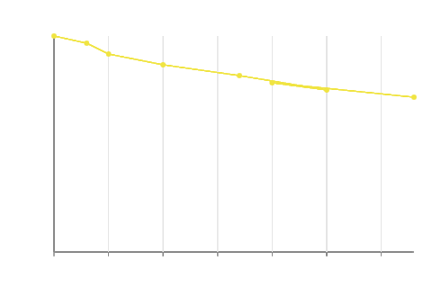

# Connected scatterplot

A scatterplot whose points are joined by a line in a meaningful
sequence — usually time. The reader sees the trajectory through
2D space, not just where points cluster.



## Public surface

```rust,ignore
let plot = Plot::new(quarterly)
    .mark(Mark::Line {
        interpolation: Interpolation::Linear,
        marker: Some(PointStyle::Circle),
    })
    .encode(plot::x("inflation", ScaleKind::Linear))
    .encode(plot::y("unemployment", ScaleKind::Linear))
    .encode(plot::order("quarter_index"))
    .encode(plot::color("decade"));
```

The minimum recipe: a line mark with markers on, X and Y both
`Linear`, and an `order` encoding that names the sort column.

## Order encoding

```admonish info
` Encoding::Order ` sorts each series's rows by the named
numeric column before line-segment emission. Without it, rows
are connected in `DataFrame` insertion order — fine for already-
sorted time series, wrong for shuffled input. Always set it when
your reader expects the line to follow time.
```

## Continuous-X line vs band-X line

The Plot facade detects the X scale kind and routes:

| X `ScaleKind`     | Layout                       | Use case                       |
|-------------------|------------------------------|--------------------------------|
| `Linear` / `Log` / `Time` | Continuous numeric axes  | Connected scatter, time-series |
| `Band` (default)  | Categorical bands at centres | Standard line chart, e.g. quarterly |

Same `Mark::Line` mark; different X scale picks the right
projection automatically.
