# Chart gallery

Every chart `wisp-chart` can render in one place. Click a
thumbnail to open the chapter; the live WebGPU demos are
embedded inside each.

## Cartesian marks

  <a class="card" href="../wisp-chart/charts/grouped-bar.html">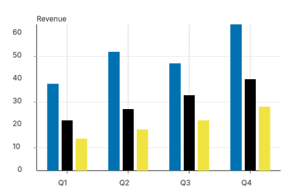
Grouped bar

Side-by-side comparison per X band
</a>
  <a class="card" href="../wisp-chart/charts/stacked-bar.html">
Stacked bar

Composition within a total
</a>
  <a class="card" href="../wisp-chart/charts/line.html">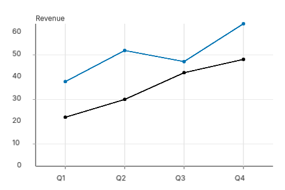
Line

Time-series + multi-series
</a>
  <a class="card" href="../wisp-chart/charts/area.html">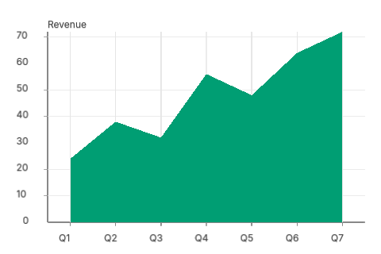
Area

Filled region under a curve
</a>
  <a class="card" href="../wisp-chart/charts/scatter.html">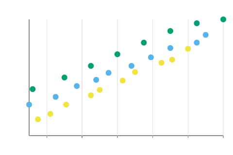
Scatter

Continuous-x point cloud
</a>
  <a class="card" href="../wisp-chart/charts/bubble.html">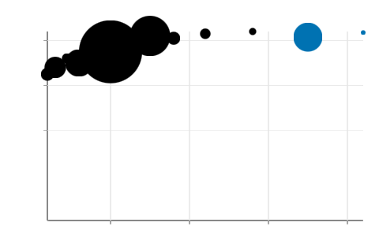
Bubble

Scatter + area-encoded size
</a>
  <a class="card" href="../wisp-chart/charts/connected-scatter.html">
Connected scatter

Trajectory through 2D space
</a>
  <a class="card" href="../wisp-chart/charts/baseline.html">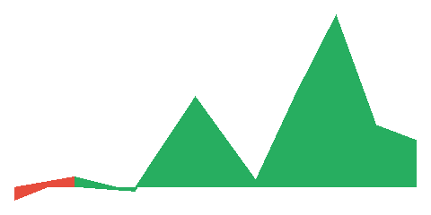
Baseline

Area split above/below a threshold
</a>

## Indicators

  <a class="card" href="../wisp-chart/charts/kpi.html">
KPI card

Big number + delta + sparkline
</a>
  <a class="card" href="../wisp-chart/charts/gauge.html">
Gauge

Semicircle + threshold zones
</a>
  <a class="card" href="../wisp-chart/charts/bullet.html">
Bullet

Performance vs target
</a>

## Finance

  <a class="card" href="../wisp-chart/charts/candlestick.html">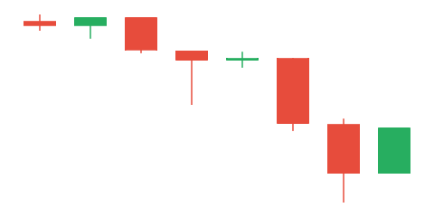
Candlestick

OHLC body + wick
</a>
  <a class="card" href="../wisp-chart/charts/ohlc.html">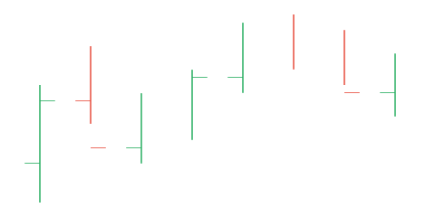
OHLC bar

Range line + open/close ticks
</a>
  <a class="card" href="../wisp-chart/charts/waterfall.html">
Waterfall

Cumulative deltas bridge
</a>

## Polar

  <a class="card" href="../wisp-chart/charts/pie.html">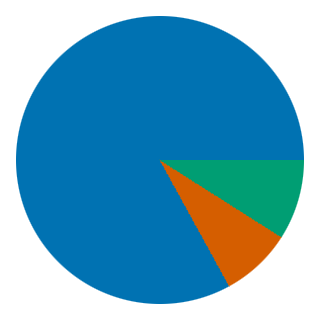
Pie / donut

Categorical proportions
</a>
  <a class="card" href="../wisp-chart/charts/sunburst.html">
Sunburst

Radial hierarchy
</a>
  <a class="card" href="../wisp-chart/charts/radar.html">
Radar

Multi-axis polygon overlay
</a>
  <a class="card" href="../wisp-chart/charts/polar.html">
Polar plot

Wind-rose / angular sectors
</a>

## Heatmaps

  <a class="card" href="../wisp-chart/charts/table-heatmap.html">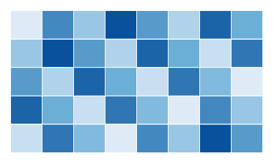
Table heatmap

2D matrix as colour grid
</a>
  <a class="card" href="../wisp-chart/charts/calendar-heatmap.html">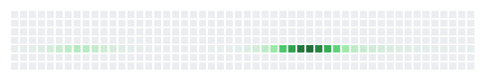
Calendar heatmap

Year-in-review 7×52 grid
</a>
  <a class="card" href="../wisp-chart/charts/lasagna.html">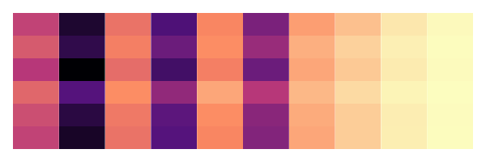
Lasagna plot

Entity-time stripes
</a>

## Topology + multi-view

  <a class="card" href="../wisp-chart/charts/treemap.html">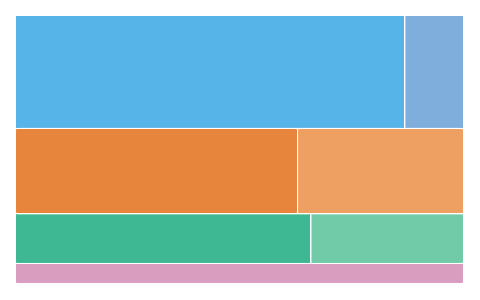
Treemap

Nested rectangle hierarchy
</a>
  <a class="card" href="../wisp-chart/charts/funnel.html">
Funnel

Staged conversion bands
</a>
  <a class="card" href="../wisp-chart/charts/splom.html">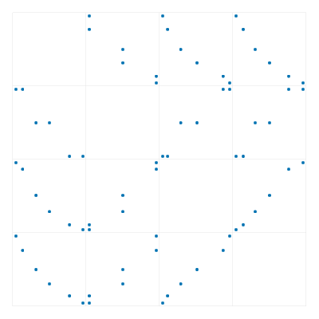
SPLOM

Pairwise scatter matrix
</a>

## Distributions

  <a class="card" href="../wisp-chart/charts/boxplot.html">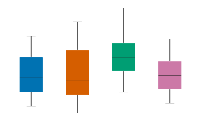
Box plot

5-number summary per category
</a>
  <a class="card" href="../wisp-chart/charts/parallel-coords.html">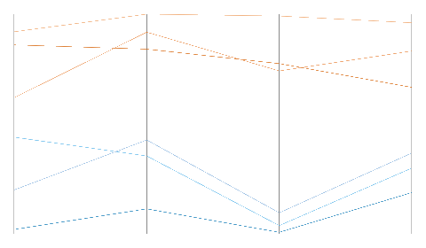
Parallel coordinates

N axes polyline overlay
</a>
  <a class="card" href="../wisp-chart/charts/error-bars.html">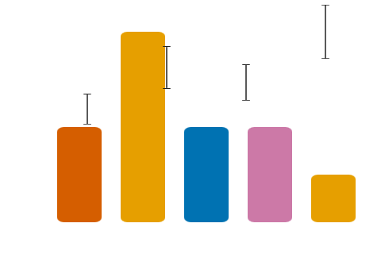
Error bars

Uncertainty whiskers on bar / point / line
</a>

## Gantt

  <a class="card" href="../wisp-chart/charts/gantt/overview.html">
Gantt

Multi-row timeline
</a>

