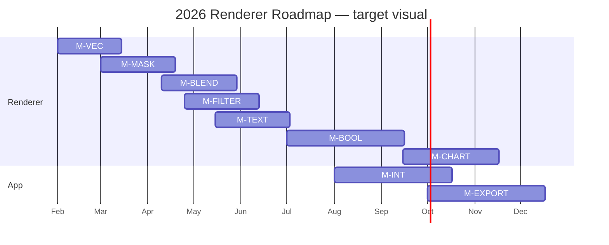

# 2026 renderer roadmap — the hyper-specific demo

The first concrete Gantt: nine rows for the M-* milestones,
one bar per milestone, three owners. Used as the shared
fixture by:

1. The snapshot test `tests/gantt_snapshot.rs`.
2. The storybook story `s_chart_gantt_2026_roadmap`.
3. This chapter (hero PNG).

When the fixture changes, all three regenerate together.

## Target visual



```admonish note title="Mermaid here, wgpu in production"
The diagram above is rendered by mdBook's mermaid plugin so the
book always shows the *intent*. The hero PNG (lands when the
render pass ships) is the actual wgpu output. They're separate
artefacts on purpose — the mermaid version is for the book,
the wgpu PNG is for product fidelity verification.
```

## Hero asset (regenerated by `just snapshots`)

When chunk 3 (render pass) lands, this section embeds:

```markdown

```

## Try it live

[Run wisp-chart in Chrome via WebGPU](../../../web-demo.md) —
the same fixture rendered in a browser tab.
