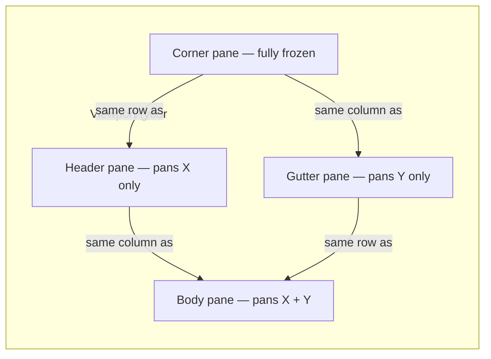

# Gantt interaction — pan + frozen panes + click-to-select

> Pan the timeline body in both axes while the date header stays
> glued to the top and the project gutter stays glued to the left.
> Click a bar and get its index back via `ChartElementId::GanttBar`.

## What this chapter covers

Three pieces ship in `wisp_chart::gantt`:

| Piece | Module | Role |
|---|---|---|
| `Gantt::emit_with_interaction` | `gantt::render` | Returns `Graphics` + reverse-lookup vector mapping each rendered bar primitive to `ChartElementId::GanttBar(idx)`. |
| `GanttPanController` | `gantt::pan` | Pan state machine. Accumulates pointer drag into a single `body_offset`, clamps to content bounds. |
| `GanttViewport` | `gantt::pan` | Host-owned pan offset. Four pane transforms derive from it. |

## The freeze-panes model

Spreadsheets and Gantt-style tools split the viewport into four
panes that share a common pan state but apply different masks:



The user's pointer drag mutates a single `body_offset: Vec2`. The
four `*_offset` accessors return a masked copy:

| Pane | Transform | Why |
|---|---|---|
| `body_offset` | `(x, y)` | Timeline content — pan both axes |
| `header_offset` | `(x, 0)` | Date band stays glued to the top while scrolling down |
| `gutter_offset` | `(0, y)` | Project labels stay glued to the left while scrolling right |
| `corner_offset` | `(0, 0)` | The top-left intersection never moves |

```admonish important title="One offset, four masks"
The library does NOT maintain four separate offsets. There is one
`body_offset`; the accessors are pure functions of it. This avoids
the classic spreadsheet bug where the header gets out of sync with
the body during a fast scroll.
```

## Diagonal pan support

A naive controller written as `body_offset.x += delta.x` silently
drops vertical motion. `GanttPanController` accumulates the full
`pointer - anchor` delta on both axes, then clamps each against its
own content extent:

```rust,no_run
# use glam::Vec2;
# use wisp_chart::gantt::{GanttPanController, GanttViewport};
let mut ctrl = GanttPanController::new(
    /* header_height */ 60.0,
    /* gutter_width  */ 180.0,
    /* content_size  */ Vec2::new(2400.0, 800.0),
    /* viewport_size */ Vec2::new(1280.0, 600.0),
);
let mut viewport = GanttViewport::new();

// User presses, drags diagonally, releases.
ctrl.pan_begin(Vec2::new(500.0, 200.0));
ctrl.pan_drag(Vec2::new(440.0, 160.0), &mut viewport);
// body_offset now negative on BOTH axes — content scrolled both
// directions to follow the cursor.
ctrl.pan_end();
```

## Clamping

The clamp range collapses to `[0, 0]` on any axis where the content
fits inside its pane. Otherwise:

- `body_offset.x ∈ [body_width - content.x, 0]` where
  `body_width = viewport.x - gutter_width`.
- `body_offset.y ∈ [body_height - content.y, 0]` where
  `body_height = viewport.y - header_height`.

`0` shows the topmost / leftmost content; the negative bound shows
the rightmost / bottommost.

```admonish tip title="Programmatic scroll"
Hosts that want to scroll programmatically (keyboard nav, jump-to-
today, click a scrollbar) can mutate `viewport.body_offset` directly
and then call `controller.clamp(&mut viewport)` to enforce bounds.
```

## Wiring `Gantt::emit_with_interaction` to clicks

`emit_with_interaction` returns one element per RENDERED bar mapping
its primitive index to `ChartElementId::GanttBar(bar_idx)`. The
cosmetic background primitive (always emitted as the first
primitive) is NOT in the elements vector — clicks on empty canvas
resolve to no gantt bar.

```rust,no_run
# use wisp_chart::{
#     interaction::{ChartElementId, EmittedChart},
#     theme::Theme,
#     Gantt,
# };
# use glam::Vec2;
# fn demo(gantt: Gantt, theme: &Theme, vp: Vec2) {
let emitted: EmittedChart = gantt.emit_with_interaction(theme, vp);

// On click: caller knows which primitive index was hit; look it up.
let hit_primitive = 1_usize;
if let Some(ChartElementId::GanttBar(bar_idx)) =
    emitted.element_for_primitive(hit_primitive)
{
    println!("user clicked bar at index {bar_idx}");
}
# }
```

```admonish warning title="Bar indices survive skipped rows"
Bars whose `row_id` doesn't match any `Row` are silently skipped at
render time. The `ChartElementId::GanttBar(idx)` payload preserves
the bar's ORIGINAL index in `Gantt::bars`, so the lookup matches
your source data even when `elements.len() < self.bars.len()`.
```

## Why a Gantt-specific controller (not just `PanZoomController`)

`wisp_interaction::PanZoomController` applies a single uniform
transform to the entire scene — fine for infinite canvases. The
spreadsheet-style freeze-panes shape needs FOUR transforms derived
from the same offset, which is the whole point of
`GanttPanController`.

If your Gantt is hosted inside a larger PanZoom canvas (e.g. a
multi-chart dashboard with a global zoom), nest the controllers:
the outer `PanZoomController` mutates a `Viewport2D`; the inner
`GanttPanController` lives inside a single chart's pane and pans
within that pane.

## Sample end-to-end host wiring

```rust,no_run
# use std::cell::RefCell;
# use std::rc::Rc;
# use glam::Vec2;
# use wisp_chart::{
#     gantt::{GanttPanController, GanttViewport},
#     theme::Theme,
#     Gantt,
# };
# use wisp_interaction::{CallbackRegistry, PointerDispatcher, MouseButton, PointerLocation, PointerId, ModifierState};
# fn wire(gantt: Gantt, theme: &Theme, viewport_px: Vec2) {
let emitted = gantt.emit_with_interaction(theme, viewport_px);

// Pan controller, owned by the host.
let content_size = Vec2::new(2400.0, 800.0); // host computes from row count + time range
let mut ctrl = GanttPanController::new(
    theme.gantt.header_height,
    theme.gantt.gutter_width,
    content_size,
    viewport_px,
);
let viewport = Rc::new(RefCell::new(GanttViewport::new()));

// Adapter wires pointer events to the controller.
// (sketch — your adapter will fill in the actual canvas listeners.)
# }
```

For a complete native adapter pattern, see the
[`wisp-interaction` adapters chapter](../../wisp-interaction/adapters.md).
For the browser-side adapter pattern, the `wisp-3d-web` rAF loop is
the reference (see the
[wisp-3d-web demo](../../wisp-3d/web.md)).
