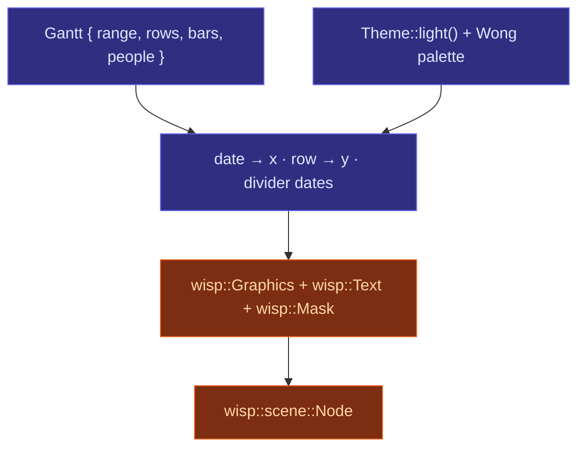

# Gantt overview

The v1 Gantt is hyper-specific by design: one concrete API, one
concrete fixture (a 2026 renderer roadmap), one concrete render
target. Surface stays narrow until ergonomics force change.

## Pieces

## Pixel-spec (v1, from AUT-180)

- **Canvas:** 1920 × 800 px.
- **Left gutter** (project labels, right-aligned): **180 px**.
- **Header band:** **60 px** (30 px month strip, 30 px week
  strip below).
- **Row height:** **44 px**. Bar height: **28 px** (vertically
  centred). **6 px** corner radius.
- **Background:** white. Alt-row tint: `#fafafa`.
- **Week grid:** `#e5e5e5`, 1 px. **Month grid:** `#cccccc`,
  2 px. Month label sits above the week label.
- **Bar fill:** owner colour (Wong palette, hash-assigned).
  **Bar text:** owner name, white or black auto-chosen for
  contrast.

## Status today

- ✅ Data structs (`Gantt`, `Row`, `Bar`, `DateRange`, `PersonMap`).
- ✅ Theme + Wong palette + contrast util.
- ⏳ Layout math — placeholder module today; lands in chunk 2.
- ⏳ `Gantt::render(&Theme) -> SceneNode` — placeholder module
  today; lands in chunk 3.

Subsequent chapters fill in as the rendering passes ship.

## Why hyper-specific first

Per AUT-180:

> This is a purely presentational composition: data goes in, a
> scene-graph subtree comes out. The first chart we ship is
> hyper-specific by design: one concrete year, one concrete
> team, one concrete API, so the implementation has zero
> degrees of freedom before we iterate on flexibility.

Generalisation (bar / line / area) happens AFTER Gantt v1 has
a stable internal shape — not before.
