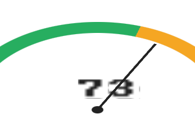

# Gauge chart

A semicircular gauge — value vs target with colour-coded
threshold zones and a needle indicator. The default ops/SLA
dashboard chart.



## Public surface

```rust,ignore
use wisp_chart::indicator::{Gauge, Zone};
use wisp_chart::color::Color;

let gauge = Gauge {
    value: 73.0,
    domain: (0.0, 100.0),
    zones: vec![
        Zone::new((0.0, 60.0),   Color::from_hex("#27ae60").unwrap()),
        Zone::new((60.0, 85.0),  Color::from_hex("#f5a623").unwrap()),
        Zone::new((85.0, 100.0), Color::from_hex("#e74c3c").unwrap()),
    ],
};

let g = gauge.emit_graphics(&theme, Vec2::new(240.0, 160.0));
let _ = stage.add_child(root, g);

let labels = gauge.emit_text_labels(&theme, Vec2::new(240.0, 160.0), &font);
for t in labels { let _ = stage.add_child(root, t); }
```

## Angle convention

```admonish info
Domain min maps to angle `π` (left, 180°). Domain max maps to
angle `0` (right, 0°). Mid-domain is `π/2` (top). Values
outside the domain are clamped before angle conversion.
```

| Value (% of domain) | Arc angle | Position    |
|---------------------|-----------|-------------|
| 0%                  | π (180°)  | Left edge   |
| 25%                 | 3π/4      | Upper-left  |
| 50%                 | π/2 (90°) | Top         |
| 75%                 | π/4       | Upper-right |
| 100%                | 0         | Right edge  |

## Layout primitives

The renderer composes:

1. **Track** — a neutral-grey full semicircle annular sector.
2. **Zones** — one annular sector per zone, painted in order
   (later zones overlap earlier ones).
3. **Needle** — a thin radial line from the gauge centre to
   the value's angle on the outer radius.
4. **Hub** — a small filled circle at the pivot for visual
   completion.

All four use primitives that landed in
[AUT-224](https://linear.app/harwood/issue/AUT-224)'s arc
support — no new geometry needed in `wisp`.

## Theme integration

| Field                                  | Drives                  |
|----------------------------------------|-------------------------|
| `theme.indicator.gauge_track_width_px` | Band thickness          |
| `theme.indicator.gauge_needle_color`   | Needle + hub colour     |
| `theme.indicator.numeric_font_size`    | Centred value display   |
| `theme.plot.gridline_minor.color`      | Track background colour |
