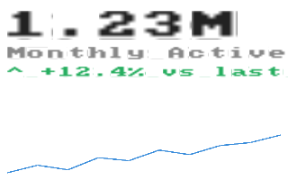

# KPI / indicator card

A dashboard summary tile: one big number, a one-line label, a
colour-coded delta, optional sparkline.



## Public surface

```rust,ignore
use wisp_chart::indicator::{Kpi, Delta, DeltaKind};

let kpi = Kpi {
    value: 1_234_567.0,
    label: "Monthly Active Users".into(),
    delta: Some(Delta {
        kind: DeltaKind::Up,
        formatted: "+12.4% vs last mo".into(),
    }),
    sparkline: Some(vec![100.0, 105.0, 102.0, 110.0, 115.0]),
};

// Sparkline as Graphics:
let sparkline = kpi.emit_graphics(&theme, Vec2::new(240.0, 120.0));
let _ = stage.add_child(root, sparkline);

// Big number + label + delta as Text:
let font = Font::bitmap_8x8(&app);
for t in kpi.emit_text_labels(&theme, Vec2::new(240.0, 120.0), &font) {
    let _ = stage.add_child(root, t);
}
```

## Numeric formatting

[`format_value`](../api/wisp_chart/indicator/kpi/fn.format_value.html)
compacts large magnitudes into the closest power-of-thousand
abbreviation:

| Value         | Rendered |
|---------------|----------|
| `2_500_000_000` | `2.50B`  |
| `1_234_567`     | `1.23M`  |
| `45_678`        | `45.7K`  |
| `789`           | `789`    |
| `1.5`           | `1.50`   |

Override by formatting your value into a string and storing it
in `Delta.formatted` if you need locale-specific formatting.

## Delta colours

```admonish info
`DeltaKind::Up` reads `theme.indicator.delta_up` (green by
default), `Down` reads `delta_down` (red), `Neutral` reads
`delta_neutral` (grey). The arrow glyph is `^` / `v` / `-` in
v1 — replace with proper Unicode arrows once the bitmap atlas
covers them.
```

## Layout

The card is laid out within a `viewport_px` rectangle:

| Region        | Position                                    |
|---------------|---------------------------------------------|
| Value         | `y = 12 px`, left-aligned `8 px` padding    |
| Label         | Below value with `8 px` gap                 |
| Delta         | Below label with `8 px` gap                 |
| Sparkline     | Bottom 25% of viewport, `8 px` horizontal padding |
