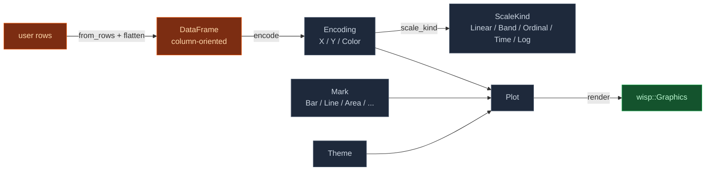

# Plot facade — grammar of graphics

`Plot` is the ergonomic front door for cartesian / polar /
heatmap chart families. Build a chart by composing data + a mark
+ encodings:

```rust
use wisp_chart::plot::{self, DataFrame, Mark, Plot, ScaleKind, Value};

let plot = Plot::new(df)
    .mark(Mark::Bar { value_labels: false })
    .encode(plot::x("quarter", ScaleKind::Band))
    .encode(plot::y("revenue", ScaleKind::Linear))
    .encode(plot::color("region"));
let graphics = plot.render(&theme, viewport_px);
```

That's the entire surface. Swap `Mark::Bar` for `Mark::Line` (when
it ships) and the same data + encodings render as a line chart.


## Pieces



## DataFrame

User rows of any `R` type are flattened once via a closure into a
column-oriented [`DataFrame`](dataframe). Each column is either
`Value::Number(f32)` (feeds Linear / Log / Y scales) or
`Value::Category(String)` (feeds Band / Ordinal / Color
encodings). After the flatten, every encoding refers to columns
by name.

```rust
struct Sale { quarter: String, revenue: f32, region: String }
let df = DataFrame::from_rows(&rows, |s| vec![
    ("quarter".into(), Value::Category(s.quarter.clone())),
    ("revenue".into(), Value::Number(s.revenue)),
    ("region".into(),  Value::Category(s.region.clone())),
]);
```

Trade-off: pay an O(n × cols) flatten cost on construction, gain
string-based encoding ergonomics + automatic scale-derivation
from column values.

## Mark

`Mark` is the drawable shape a Plot emits per row. v1 ships:

- `Mark::Bar { value_labels: bool }` — rectangular bar, one per
  row. `value_labels` toggle is parsed but not rendered yet
  (lands when the axis renderer arrives).

Follow-on tickets add `Line`, `Area`, `Point`, `Cell`, `Box`,
`Candlestick`, `Polygon`, `Arc` — each is one variant on this
enum + one renderer arm in `Plot::render`. The facade surface
stays stable.

## Encoding

An [`Encoding`](encoding) wires one [`Channel`](encoding) (X / Y /
Color) to one DataFrame column with a chosen
[`ScaleKind`](encoding). Convenience constructors:

| Helper | Channel | Default scale |
|---|---|---|
| `plot::x(field, scale_kind)` | X | as specified |
| `plot::y(field, scale_kind)` | Y | as specified |
| `plot::color(field)` | Color | Ordinal |

Domain auto-derives from the column values:

- `Linear` reads `numeric_extent` (column min/max).
- `Band` / `Ordinal` read `distinct_categories` (in insertion
  order).
- Override the numeric domain explicitly with `.domain((lo, hi))`
  on the `Encoding`.

```admonish note title="Color encoding in v1"
The `Color` encoding is stored on the Plot but `Mark::Bar` v1
ignores it — single-color bars only. When `Mark::Bar` is
upgraded to multi-series (M-CHART.7 Grouped Bar / M-CHART.8
Stacked Bar) the Color encoding wires into palette lookup.
Single-series charts get their colour from `theme.palette` via
the X category hash.
```

## What's deferred to the v1 follow-ups

This Plot facade is **layout-stable but visually minimal** for
v1. The chart-side TODOs that share this same `render` path:

- **Axis renderer** (AUT-183 / M-CHART.3) — emits tick lines +
  tick labels + axis titles. The plot area today reserves the
  gutter / header / footer pixels so axes can drop in without
  shifting bars.
- **Legend renderer** (AUT-184 / M-CHART.4) — colour swatches +
  labels for multi-series charts.
- **Value labels** on bars — currently inert (`Mark::Bar`
  carries the flag).

All three land as commits that extend `Plot::render` without
changing the public API.

## Verified by

- `crates/wisp-chart/src/plot/*.rs` — **13 unit tests** covering
  DataFrame construction, distinct-category de-dup, numeric
  extent, encoding chain, channel replacement, NDC conversion,
  background-only fallback when encodings are missing.
- `crates/wisp-chart-web/tests/render_bar.rs` — **integration
  test**: builds a 4-quarter DataFrame, runs the full
  `Plot::new → mark → encode → render` chain, renders via
  `wisp::Renderer` to an offscreen `Rgba8Unorm` texture, and
  asserts (1) header area is white, (2) the tallest bar's centre
  pixel is non-white. Also regenerates the
  `bar-quarterly.png` snapshot above.

## What this unblocks

Every cartesian / polar / heatmap chart now has a stable surface
to land against. The chart wave can proceed in parallel:

- M-CHART.6 Bar variants (grouped / stacked / 100%): add
  encodings (`XOffset`, `Stack` transform).
- M-CHART.9 Line, M-CHART.10 Area, M-CHART.11 Scatter, M-CHART.12
  Bubble, M-CHART.13 Connected scatter: add `Mark` variants +
  renderer arms.
- M-CHART.20+ statistical charts: add `Transform` enum
  (`Bin`, `Density`, `Stack`, `RunningTotal`) that runs before
  marks emit.
