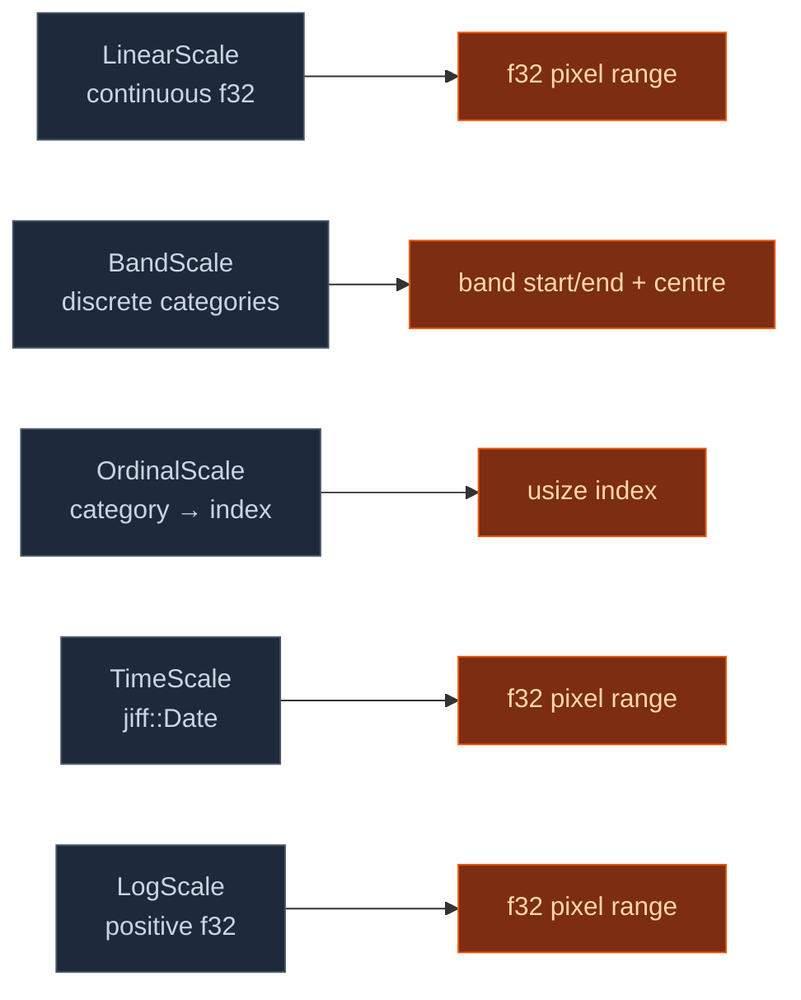

# Scales — domain → range mappings

Every cartesian / polar / heatmap chart maps abstract domain
values (numbers, categories, dates) into pixel coordinates
through a `Scale`. Building this once means every chart family
gets consistent tick placement, padding, and edge behaviour for
free.

## What ships in v1



| Scale | Used by |
|---|---|
| `LinearScale` | bar (y), line, scatter, histogram, area, KPI sparkline |
| `BandScale` | bar (x), grouped bar, box plot |
| `OrdinalScale` | colour encoding lookups |
| `TimeScale` | line / area with time-x, Gantt, candlestick |
| `LogScale` | bubble x (GDP), histogram of skewed data |

## Convention

All scales map `domain` → `range`, both as `(f32, f32)` tuples
(or category lists for band / ordinal). The convention is:

- `range.0` corresponds to the **left** edge of the plot area for
  X scales and the **bottom** edge for Y scales. Callers pre-flip
  Y ranges so a `LinearScale::new((0, 100), (plot_bottom_y,
  plot_top_y))` puts low values at the bottom.
- Tick generators return the domain values that should get tick
  marks; the rendering layer projects each through `map` and
  draws.

## Examples

**LinearScale** — d3-style nice-tick at 1/2/5 cadence per decade:

```rust
let x = wisp_chart::scale::LinearScale::new((0.0, 73.0), (0.0, 960.0));
let ticks = x.ticks(8);
// 0, 10, 20, 30, 40, 50, 60, 70 — step 10 chosen as the nice
// stop closest to 73/8 ≈ 9.1.
```

**BandScale** — discrete categories with padding:

```rust
let cat = wisp_chart::scale::BandScale::new(
    ["Q1", "Q2", "Q3", "Q4"],
    (180.0, 960.0),
).padding(0.1);
let (start, end) = cat.range_for(&"Q2").unwrap();
// Q2's band spans (start, end) with 10% gap each side.
```

**TimeScale** — multi-unit tick generator:

```rust
use jiff::civil::date;
use wisp_chart::gantt::DateRange;
use wisp_chart::scale::{TimeScale, TimeUnit};

let scale = TimeScale::new(DateRange::year(2026), (180.0, 960.0));
let unit = scale.pick_unit(8);          // returns TimeUnit::Month for a full year
let ticks = scale.ticks_at(unit);       // 12 month-starts
```

**LogScale** — 1/2/5 stops per decade:

```rust
let s = wisp_chart::scale::LogScale::new((1.0, 1_000.0), (0.0, 600.0));
// Ticks at 1, 2, 5, 10, 20, 50, 100, 200, 500, 1000.
```

## What doesn't ship in v1

- **Categorical sorting strategies** — `OrdinalScale` keeps
  insertion order; explicit sort policies (alphabetical,
  by-count) follow as a chart-specific concern.
- **Non-natural-log bases for `LogScale`** — base-10 default; the
  tick generator's 1/2/5 cadence is tuned for decimal. Other
  bases work for `map` but tick spacing won't match the base.
- **Time-axis localisation / week-start configuration** —
  Mondays are the assumed week start, matching the existing
  Gantt convention.

## Verified by

`crates/wisp-chart/src/scale/*.rs` — 37 unit tests across the
five scale types covering: round-trip mapping, reversed-range
handling, tick generation at nice stops, padding clamping, edge
cases (zero-width domain, missing categories, dates outside
range). All pass under `cargo test -p wisp-chart --lib`.
