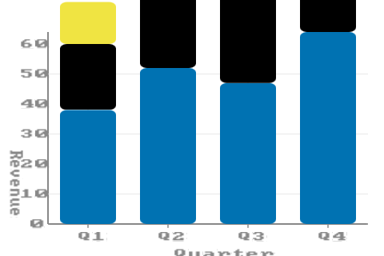

# Stacked bar chart

Stacked bars show composition within a category — revenue per
region as fractions of the quarterly total. Normalized mode
divides each segment by its band's total, producing 100%-stacked
bars where every band reaches the plot top.



## Public surface

```rust,ignore
use wisp_chart::plot::Transform;

let plot = Plot::new(rows)
    .mark(Mark::Bar { value_labels: false })
    .encode(plot::x("quarter", ScaleKind::Band))
    .encode(plot::y("revenue", ScaleKind::Linear))
    .encode(plot::color("region"))
    .transform(Transform::Stack { normalize: false });
```

## Two modes from one transform

| `Transform::Stack { normalize }` | Behaviour                                       |
|----------------------------------|-------------------------------------------------|
| `false`                          | Cumulative absolute values — Q1 stack hits Q1 total |
| `true`                           | Each band rescaled to the y-domain top — every bar reaches 100% |

```admonish info
The renderer walks rows in `DataFrame` order, accumulating a
per-band cumulative offset. The first row for a band sits at the
baseline; subsequent rows stack on top. The series colour comes
from the `Color` encoding's palette lookup.
```

## Pairing with Legend

Use [`Plot::legend`](../api/wisp_chart/plot/struct.Plot.html#method.legend)
to auto-emit a legend that maps colours to series — same shape as
grouped bars, and the legend's swatches use the same palette
positions as the stacked segments.

## Stack + XOffset = grouped-stacked

Combining `Transform::Stack` with `Encoding::XOffset` is allowed:
each outer X band is sub-banded by XOffset, and within each
sub-band the rows stack by `Color`. Useful for "stacked by
component within grouped by quarter" layouts.
