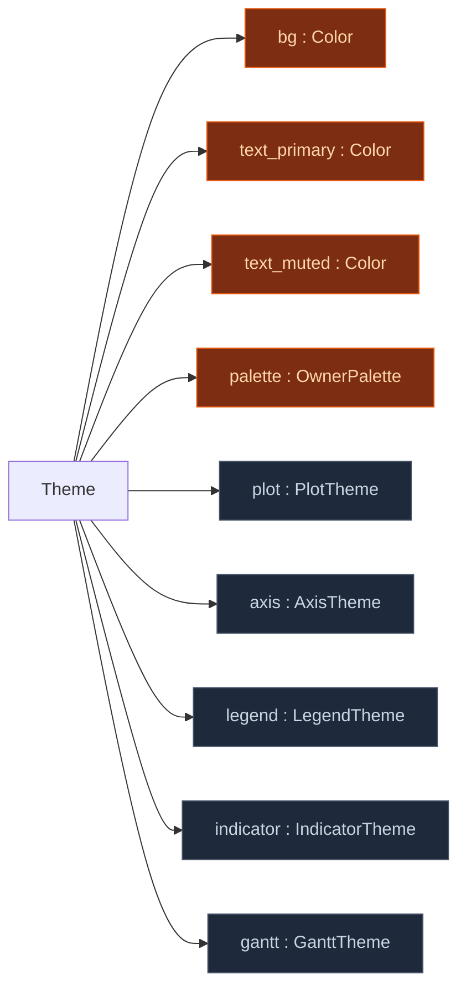

# Theme — shared across every chart family

`wisp_chart::Theme` is the single entry point that themes any
chart family consistently. Pick `Theme::light()` once and render
a Gantt, a bar chart, a KPI card, or a sunburst against it —
each chart family reads only from its own sub-theme plus the
top-level shared fields, so adding a new chart never reshapes
existing themes.

## Shape



Top row (orange) are the shared fields every chart family may
read. The five sub-themes (slate) are each owned by a specific
chart-family — `theme.gantt.*` is for Gantt, `theme.plot.*` /
`theme.axis.*` / `theme.legend.*` for cartesian families, and so
on.

```admonish important title="Boundary rule"
A chart family reads only from its own sub-theme + the top-level
shared fields. Reaching into another chart family's sub-theme is
the structural coupling this decomposition exists to prevent.
Gantt code reads `theme.gantt.*`; a future bar chart will read
`theme.plot.*` + `theme.axis.*`; neither should ever touch the
other's fields.
```

## Field inventory

`PlotTheme`:

- `gridline_major` — `LineStyle` (default `#cccccc`, 2 px).
  Major-tick gridlines on cartesian / heatmap charts.
- `gridline_minor` — `LineStyle` (default `#e5e5e5`, 1 px).
  Minor-tick gridlines, e.g. weeks within a month.

`AxisTheme`:

- `tick_length_px` — tick mark length in device pixels (default 5).
- `tick_label_font_size` — tick label font size (default 12).
- `tick_density_hint` — target number of ticks the auto-tick
  generator aims for (default 8).

`LegendTheme`:

- `swatch_size_px` — colour box / line / marker size (default 14).
- `item_spacing_px` — spacing between legend items (default 8).
- `item_font_size` — legend item font size (default 12).

`IndicatorTheme`:

- `numeric_font_size` — big-number font (default 32).
- `delta_up` — positive delta colour (default `#27ae60` green).
- `delta_down` — negative delta colour (default `#e74c3c` red).
- `delta_neutral` — neutral colour (default `#888888` muted).

`GanttTheme`:

- `row_alt_bg` — alternating row tint (default `#fafafa`).
- `header_bg` — header band background (default `#f5f5f5`).
- `grid_week` / `grid_month` — Gantt-specific aliases for the
  plot gridlines (default mirrors `theme.plot.gridline_minor` /
  `gridline_major`).
- `bar_corner_radius` — bar corner radius in pixels (default 6).
- `bar_height` — bar height in pixels (default 28).
- `row_height` — row height in pixels (default 44).
- `gutter_width` — left gutter width (default 180).
- `header_height` — header band height (default 60).

## Customising

The common case is "use `Theme::light()` but tweak one knob":

```rust
let mut theme = wisp_chart::Theme::light();
theme.gantt.bar_corner_radius = 12.0;   // chunkier Gantt bars
theme.indicator.delta_up = wisp_chart::Color::from_hex("#10b981").unwrap();
```

Spreading a sub-theme onto a fresh `Theme` works too:

```rust
let theme = wisp_chart::Theme {
    gantt: wisp_chart::theme::GanttTheme {
        bar_corner_radius: 12.0,
        ..wisp_chart::Theme::light().gantt
    },
    ..wisp_chart::Theme::light()
};
```

`Theme::dark()` lands as a follow-on once the cartesian wave is
visible enough that dark-mode contrast checks are worth doing.

## Verified by

`crates/wisp-chart/src/theme.rs` has four tests:

1. `light_theme_uses_white_bg` — top-level `bg` defaults to white.
2. `light_theme_gantt_dimensions_match_spec` — the Gantt
   sub-theme preserves the pre-decomposition pixel sizes
   (28/44/180/60/6) byte-identically.
3. `light_theme_populates_every_sub_theme` — every sub-theme has
   non-zero defaults where a real number is required.
4. `gantt_grid_lines_match_legacy_aliases` — Gantt's
   `grid_week` / `grid_month` track the plot gridlines, matching
   the original flat-Theme shape.

Plus the chart-web snapshot test
`crates/wisp-chart-web/tests/render_gantt.rs` continues to pass
unchanged: the Gantt PNG is byte-identical after the refactor.
