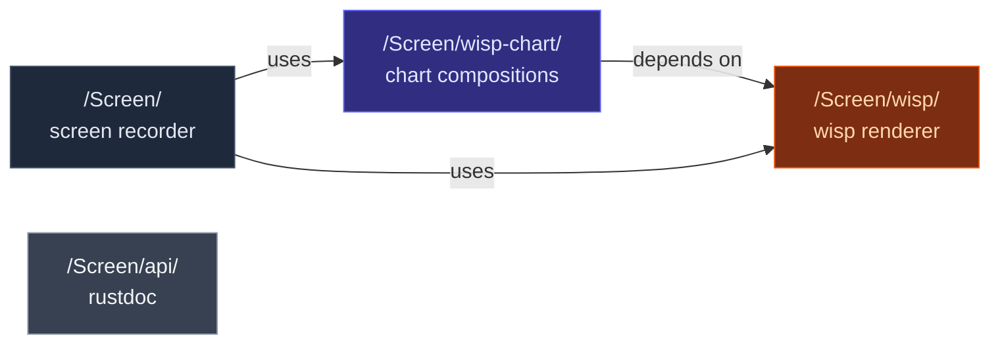

# Where this book sits

`wisp-chart` is one of three mdBooks composed into the same
GitHub Pages artifact.

## Cross-book tags

The `mdbook-preprocessor-cross` tags resolve per-book. Inside
this book:

| Tag | Renders as |
|---|---|
| `{{wisp-link wisp/overview}}` | `/Screen/wisp/wisp/overview.html` |
| `{{wisp-chart-link charts/gantt/api}}` | `./charts/gantt/api.html` (relative — same book) |
| `{{shared cross-link-convention.md}}` | inlined from `_docs/shared/` |

Inside the screen + wisp books, the same `{{wisp-chart-link}}`
tag emits an absolute URL to `/Screen/wisp-chart/...`. Authors
write the tag once; the preprocessor adapts per book.
