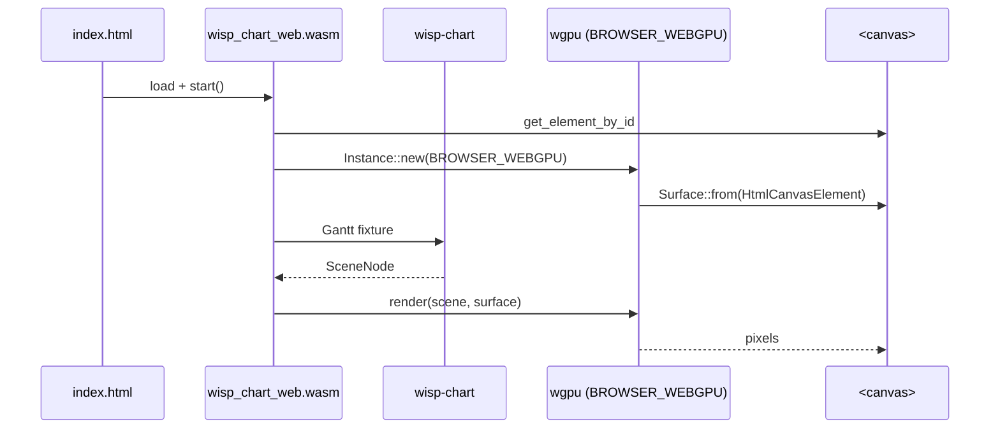

# Run wisp-chart in Chrome via WebGPU

`wisp-chart` compiles for `wasm32-unknown-unknown`, so the same
chart code that runs natively in the recorder also renders into
a `<canvas>` in a browser tab.

## The demo crate

`crates/wisp-chart-web/` is a sibling crate of `wisp-chart`. It
exists only on `wasm32-unknown-unknown` — Trunk builds it into
a self-contained `index.html` + `*.wasm` + glue JS bundle.



## Local dev

```bash
just dev-wisp-chart-demo
```

Opens `http://127.0.0.1:8080`. Hot-rebuilds on file change.

## Deployed

The CI deploy at
[`/Screen/wisp-chart/demo/`](/Screen/wisp-chart/demo/) hosts
the latest `main` build of the same crate. Open it in any
WebGPU-capable browser:

- **Chrome / Edge** 113+ (WebGPU on by default).
- **Firefox** 121+ on Linux / macOS / Windows.
- **Safari** Technology Preview (WebGPU shipping pending).

## Browser support reality check

```admonish warning title="WebGPU is not WebGL"
WebGPU is the modern standard but availability lags WebGL. On
Linux specifically, Chromium needs Vulkan; some headless CI
configurations require flags like `--enable-unsafe-webgpu
--use-vulkan=swiftshader`. The CI gate's optional Tier-C job
exercises this configuration; the deployed demo assumes a
WebGPU-capable user agent.
```

## What this demo is and is not

- ✅ **The same `wisp-chart` crate.** No demo-only fork; the
  WebGPU path is identical.
- ✅ **The same `wisp::Graphics` + `wisp::Text` + masks.** wisp
  itself is wasm32-clean (`winit` is a dev-only dep there).
- ❌ **Not** the same surface-creation code. Native uses
  `winit::Window` → `wgpu::Surface`; web uses
  `HtmlCanvasElement` → `wgpu::Surface`. wisp-chart's output
  doesn't care which.
