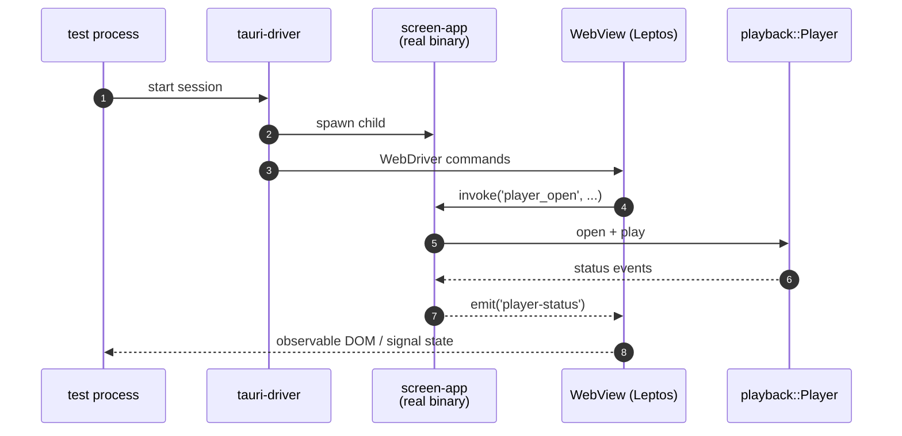

# `app-e2e` — Tier-2 WebDriver tests for `screen-app`

> Spawns `tauri-driver` + the `screen-app` binary and drives the real
> WebView via `fantoccini`. Catches cross-process behaviour that
> Tier-0 chunk tests + Tier-1 IPC harness can't see (real Leptos
> render, JS bridge, OS event timing).

## What it does

Tier-2 in the project's three-tier testing model. Real WebView, real
Tauri binary, real `playback::Player`. Tests poke the UI through
WebDriver and observe state transitions through the JS bridge.



## Quickstart

```bash
# Linux only — Tier-2 is gated to a real X11 / xvfb environment.
just e2e
```

> [!WARNING]
> **Linux-only.** `tauri-driver` + WKWebView on macOS is incomplete
> upstream; on Windows we haven't validated the Edge WebDriver path.
> The `just e2e` recipe prints a clear skip message on macOS / Windows.

> [!IMPORTANT]
> **Intentionally NOT run in CI.** `tauri-driver` + WebKitGTK under
> xvfb on GitHub-hosted Ubuntu runners proved flaky enough that the
> skip-or-fail signal stopped being useful. Contributors run it
> locally before opening Tauri shell PRs.

## Runbook

### Prerequisites

```bash
cargo install --locked tauri-driver

# Linux deps for tauri-driver:
sudo apt install webkit2gtk-driver xvfb
```

### Run the suite

```bash
just e2e        # spawns xvfb-run under the hood on Linux
```

The recipe handles `xvfb-run` wrapping automatically. macOS prints
a skip message; Windows ditto.

### Add a new test

1. Add a `#[tokio::test]` fn in `tests/`.
2. Start a fantoccini session: `Client::new("http://localhost:4444")`.
3. Drive the UI via standard WebDriver methods (`find`, `click`,
   `send_keys`).
4. Observe state via `evaluate_script` to read Leptos signal values.

See existing tests for patterns. The
[Testing tiers chapter](https://eng-manager-xyz.github.io/Screen/app-ui/testing.html)
documents what each tier catches.

### Troubleshooting

> [!NOTE]
> **File-drop simulation** — WebDriver doesn't natively dispatch
> drag-drop events. The test pattern: call the
> `__test_drag_enter` / `__test_drag_leave` debug-only Tauri
> commands. Each is `#[cfg(debug_assertions)]`-gated so they don't
> ship in release.

> [!NOTE]
> **`tauri-driver` listens on `localhost:4444`** by default. If
> another WebDriver process is running, set `WEBDRIVER_PORT` before
> launching to pick another port.

## Deep dive

- **[Testing tiers chapter](https://eng-manager-xyz.github.io/Screen/app-ui/testing.html)**
  — Tier 0 / Tier 1 / Tier 2 distinctions + when to add a test where.
- **[`screen-app`](../app/README.md)** — the binary under test.

## License

MIT.
