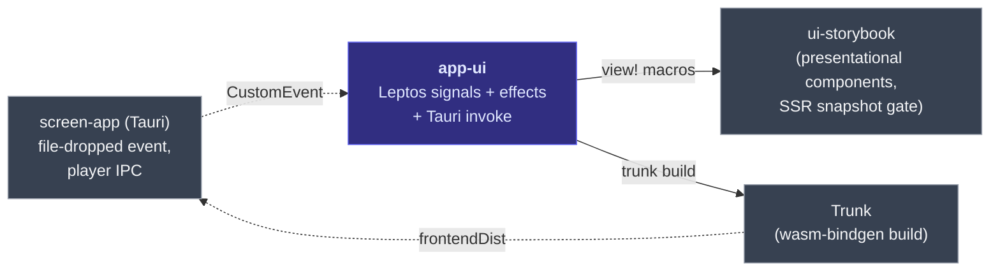

# `app-ui` — Leptos 0.8 CSR shell

> The HTML/UI layer Tauri serves into its webview. Composes components
> from `ui-storybook` into the recorder surface (toolbar, drop-zone /
> player view, status bar). Trunk builds the wasm bundle into
> `crates/app-ui/dist/`, which `tauri.conf.json` points at as
> `frontendDist`.

## What it does

`app-ui` owns the **runtime** Leptos app — signals, effects, Tauri
IPC, file-drop event wiring. It depends on `ui-storybook` for
*presentational* components and composes them with app state.

> [!IMPORTANT]
> The boundary is strict: **`ui-storybook` has no signals, effects,
> or Tauri calls.** Components take controlled props + callback-out.
> `app-ui` owns all state and IPC.

## Where it fits



## Quickstart

```bash
just app-ui              # standalone in a browser (no Tauri) — :8080
# or:
cd crates/app-ui && trunk serve --open
```

For the full Tauri app: `cd crates/app && cargo tauri dev`.

## Public API at a glance

This crate is mostly a `bin` + `[lib]` shape — `crate-type = ["cdylib", "rlib"]`
gives Trunk a `cdylib` for wasm-bindgen + an `rlib` so `cargo check
--workspace` (native) still type-checks.

| Item | Purpose |
|---|---|
| `App` (Leptos component) | Root view — drop-zone ↔ player view switch |
| `install_file_drop_listener()` | Hooks the Tauri `file-dropped` `CustomEvent` |
| `install_player_status_listener()` | Hooks `player-status` events from `screen-app` |

Full rustdoc: [`api/app_ui/`](https://eng-manager-xyz.github.io/Screen/api/app_ui/index.html).

## Runbook

### Build + test

```bash
cargo nextest run -p app-ui
cargo test -p app-ui --doc
cargo clippy -p app-ui --all-targets --all-features -- -D warnings
```

### Dev loop

```bash
just app-ui              # standalone, browser dev — :8080, hot reload
cd crates/app && cargo tauri dev   # full Tauri shell
just dev                 # remote-friendly UI dev loop with live reload
just dev-remote          # + Tailscale Serve for phone preview
```

> [!TIP]
> Local-only dev — use `just app-ui` for iteration speed; Trunk's
> hot reload is faster than Tauri's full rebuild. Switch to
> `cargo tauri dev` when you need actual IPC / file-drop behaviour.

### Common tasks

**Add a new view** — extend `App`'s view-switch logic. Keep
presentational pieces in `ui-storybook`; only the signal wiring lives
here.

**Plug in a new Tauri event** — pattern: `install_X_listener()` in
`src/`, called from `App::mount`. See `install_file_drop_listener`
for the reference.

### Troubleshooting

> [!IMPORTANT]
> **MANDATORY: invoke the `leptos-migration` skill BEFORE editing
> any `leptos::`, `#[component]`, `view!{}`, signal, effect, or
> server-fn code.** It's the durable source of truth for the pinned
> version (`leptos = "0.8"`), the API name-changes table from every
> prior major, and the project-specific landmines. Path:
> `.claude/skills/leptos-migration.md`.

> [!NOTE]
> **`#[component]` rewrites function shape.** Clippy lints
> (`must_use_candidate`, `needless_pass_by_value`) fire on the
> *generated* code regardless of where you `#[allow]` the source fn.
> Use module-level `#![allow(...)]` in `components/mod.rs` rather
> than per-fn pragmas.

> [!NOTE]
> **`crate-type = ["cdylib", "rlib"]`** — drop `rlib` and the
> workspace gate goes red on native (`cargo check --workspace`).
> `cdylib` is for wasm-bindgen; `rlib` is for everyone else.

## Deep dive

- **[`app-ui` overview chapter](https://eng-manager-xyz.github.io/Screen/app-ui/overview.html)**
- **[Tauri ↔ Leptos integration](https://eng-manager-xyz.github.io/Screen/app-ui/integration.html)**
- **[Player IPC](https://eng-manager-xyz.github.io/Screen/app-ui/player-ipc.html)**
- **[`ui-storybook`](../ui-storybook/README.md)** — the components this
  crate composes.
- **[CLAUDE.md](../../CLAUDE.md)** — "Leptos discipline".

## License

MIT.
