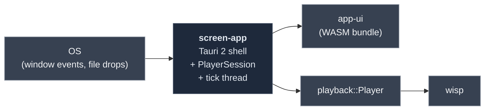

# `screen-app` — Tauri 2 shell

> The native binary. Wires the OS event loop (file drops, window
> lifecycle, IPC) into the Leptos `app-ui` frontend, registers the
> `PlayerSession` for IPC, and ticks the player every ~33 ms.

## What it does

`screen-app` is the platform shell. Three responsibilities:

1. **OS file drops** — `WindowEvent::DragDrop` → emit a `file-dropped`
   event carrying the dropped path; `app-ui` re-emits it as a browser
   `CustomEvent` and the Leptos `App` swaps to the player view.
2. **Player IPC** — registers `PlayerSession` via `.manage()` and
   exposes `player_open` / `player_play` / `player_pause` /
   `player_status` Tauri commands.
3. **Tick thread** — ticks the player every ~33 ms and emits
   `player-status` events when state or elapsed time crosses a 100 ms
   boundary.

Frontend is [`app-ui`](../app-ui/README.md) (Leptos CSR), built by
Trunk and served into the webview via `tauri.conf.json`'s
`frontendDist`.

## Where it fits



## Quickstart

```bash
cd crates/app
cargo tauri dev
```

A native window titled **Screen** opens (1280×800, drag-drop
enabled). Drop any `.mp4` → player view loads.

> [!IMPORTANT]
> Tauri 2 reads `tauri.conf.json` from cwd. Running `cargo tauri dev`
> from the repo root errors with `tauri.conf.json not found`. Always
> run from `crates/app/`.

> [!WARNING]
> Tauri 2.x spawns `beforeDevCommand` from the **parent** of the
> tauri dir (i.e. `crates/`), not from the dir holding
> `tauri.conf.json`. So our `beforeDevCommand` is
> `cd app-ui && trunk serve …`, not `cd ../app-ui && …`. If you see
> `sh: cd: ../app-ui: No such file or directory`, the config is wrong.

## Public API at a glance

| Item | Purpose |
|---|---|
| `commands::player_open(path)` | Tauri command — open a file into the player |
| `commands::player_play()` / `player_pause()` | Transport |
| `commands::player_status()` | Returns `{ state, elapsed, duration }` |
| Event `file-dropped` | Emitted on `WindowEvent::DragDrop` with the path |
| Event `player-status` | Emitted from the tick thread on state changes |
| `PlayerSession` | `tauri::Manager`-managed wrapper around `playback::Player` |

Full rustdoc: [`api/screen_app/`](https://eng-manager-xyz.github.io/Screen/api/screen_app/index.html).

## Runbook

### Build + test

```bash
# from: repo root
cargo nextest run -p screen-app                    # unit + Tier-1 IPC tests
cargo clippy -p screen-app --all-targets --all-features -- -D warnings
```

> [!NOTE]
> **`tests/commands.rs` is skipped on Windows** via
> `#![cfg(not(target_os = "windows"))]`. The Tauri 2 `mock_builder`
> path needs `WebView2Loader.dll` exports that `windows-latest` CI's
> preinstalled WebView2 doesn't have — nextest can't even list tests
> (`STATUS_ENTRYPOINT_NOT_FOUND`). macOS + Ubuntu cover the IPC
> surface in CI.

### Run

```bash
cd crates/app
cargo tauri dev                # dev mode — Trunk hot reload + native binary
cargo tauri build              # production single-binary bundle
```

### Regenerate icons (one-time, after `icon.png` changes)

```bash
cargo run -p screen-app --example regen-icons
# Writes crates/app/icons/icon.ico from the existing icon.png.
# Required for tauri-winres on Windows.
```

> [!CAUTION]
> Both `icons/icon.png` AND `icons/icon.ico` must be tracked in git.
> The `Icon?` pattern in the upstream macOS .gitignore template
> matches our real `icons/` directory on case-insensitive
> filesystems and can silently drop `icon.ico` — see the
> `required-files-check` gate.

### Troubleshooting

> [!NOTE]
> **`generate_context!()` requires `icons/icon.png`** at macro
> expansion time, even when `bundle.active = false`. Minimum: a
> real PNG at `crates/app/icons/icon.png`.

> [!NOTE]
> **Tauri's `protocol-asset` feature** is required for
> `convertFileSrc` from JS. Without it, build fails with "Tauri
> dependency features … does not match the allowlist."

> [!WARNING]
> **Linux build needs gtk-rs + webkit2gtk dev headers** at compile
> time, not just link time. `glib-sys`' build script invokes
> `pkg-config --libs --cflags glib-2.0` and aborts if absent.
> CI workflow [installs the full list](../../.github/workflows/gate.yml).

## Deep dive

- **[`app-ui` integration chapter](https://eng-manager-xyz.github.io/Screen/app-ui/integration.html)**
- **[Player IPC + status events](https://eng-manager-xyz.github.io/Screen/app-ui/player-ipc.html)**
- **[Testing tiers](https://eng-manager-xyz.github.io/Screen/app-ui/testing.html)**
  — Tier 0 (chunk tests), Tier 1 (IPC harness), Tier 2 (WebDriver e2e).
- **[CLAUDE.md](../../CLAUDE.md)** — "Tauri 2 specifics".

## License

MIT.
