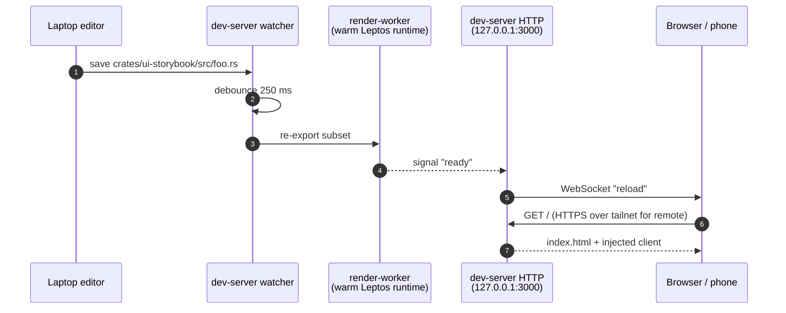

# `dev-server` — axum + WebSocket live-reload for the storybook

> The local dev loop. Watches `ui-storybook` source + CSS, re-runs the
> exporter on change, broadcasts a WebSocket reload to every open
> browser. Tailscale-ready for phone preview.

## What it does

`dev-server` is the local + remote UI iteration loop. One Rust binary
that wires:

- **File watch** — `notify-debouncer-mini` over the
  `ui-storybook/src/` + assets dirs.
- **Debounced rebuild** — 250 ms debounce; coalesces rapid saves
  into one rebuild.
- **CSS fast path** — `style.css` saves bypass the cargo rebuild
  (<500 ms vs ~3-8 s).
- **HTTP server** — axum serving `_docs/book/src/assets/ui/` with
  inline-injected live-reload client.
- **WebSocket fan-out** — `tokio::sync::broadcast`; every connected
  browser reloads on rebuild-success.
- **Render worker** — long-lived child process that keeps the
  Leptos runtime warm across rebuilds for sub-second incremental
  refreshes.

## Where it fits



## Quickstart

```bash
just dev                  # local-only on 127.0.0.1:3000
just dev-remote           # + Tailscale Serve for phone preview
just dev-remote-stop      # tear down
```

> [!TIP]
> See the
> [Remote dev playbook](https://eng-manager-xyz.github.io/screen/conventions/remote-dev.html)
> for the ≤5-click Tailscale setup. After the one-time setup, the
> daily loop is `just dev-remote` + tap home-screen icon on the
> phone.

## Public API at a glance

This crate is primarily a `bin`, but exposes a `[lib]` that other
recipes (e.g. `dev-book` mdbook serving) reuse:

| Module | Items | Purpose |
|---|---|---|
| `live_reload` | `INLINE_CLIENT`, middleware | HTML-response injection + WebSocket fan-out |
| `watcher` | watch loop, debouncer | Filesystem watch + rebuild dispatch |
| `worker` | `WorkerCommand`, `WorkerReply` | JSON-IPC contract with `render-worker` |
| `main.rs` | CLI | `--assets`, `--watch`, `--port`, `--host` |

Full rustdoc: [`api/dev_server/`](https://eng-manager-xyz.github.io/screen/api/dev_server/index.html).

## Runbook

### Build + test

```bash
cargo nextest run -p dev-server
cargo test -p dev-server --doc
cargo clippy -p dev-server --all-targets --all-features -- -D warnings
```

### Local dev

```bash
just dev
# Visit http://127.0.0.1:3000/  — sidebar lists every story; click
# any to load it in the iframe. Press `/` to search.
```

### Remote dev via Tailscale

```bash
# One-time: install + sign in on laptop and phone (different OS apps,
# same Tailscale account). See the remote-dev playbook.

just dev-remote
# Prints the phone URL: https://<laptop>.<tailnet>.ts.net/
# Optional: on phone, Safari → Share → Add to Home Screen.
```

> [!WARNING]
> **Tailscale Serve, not Tailscale Funnel.** Serve is *private* to
> your tailnet. Funnel exposes to the open internet. `dev-remote`
> uses Serve. Do not flip to Funnel for this loop.

### Linker speedup (opt-in)

```bash
# .cargo/config.toml.example ships the mold/lld config.
# Knocks ~30-50% off warm incremental rebuilds.
brew install lld           # macOS
sudo apt install mold      # Linux
ln -s .cargo/config.toml.example .cargo/config.toml
```

> [!NOTE]
> Don't commit `.cargo/config.toml` — fresh clones without the
> linker installed would break. It's gitignored intentionally.

### Troubleshooting

> [!NOTE]
> **`notify-debouncer-mini` calls back from its own thread.**
> Handler code spawns `tokio::sync::mpsc::unbounded_channel` to
> bridge events into the tokio runtime. Forgetting this gives a
> runtime panic on the first `tokio::spawn` from the handler.

> [!NOTE]
> **Axum 0.7 HTML-injection middleware lives at crate root**, not
> route layer. The pattern: `Router::new().fallback_service(ServeDir).
> layer(middleware::from_fn(inject_live_reload))`. `to_bytes(body,
> MAX)` collects the streaming body so the middleware can splice the
> live-reload script before `</body>`.

## Deep dive

- **[Dev loop — local](https://eng-manager-xyz.github.io/screen/conventions/dev-loop.html)**
- **[Remote dev — phone over Tailscale](https://eng-manager-xyz.github.io/screen/conventions/remote-dev.html)**
- **[`ui-storybook`](../ui-storybook/README.md)** — the assets this
  server serves.

## License

MIT.
