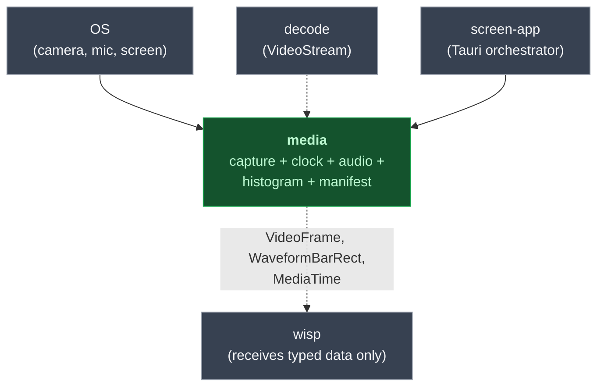

# `media` — capture + audio + clock + manifest

> The single source of truth for everything between the OS and `wisp`:
> GStreamer audio + video capture, clock + timestamp model, audio
> chunk + histogram + waveform geometry, recording manifest. Builds
> on `decode::VideoStream` for codec-agnostic input.

## What it does

`media` is the integration layer that owns:

- **Clock + timestamps** — `MediaClock` (wall-clock or manual),
  `MediaTime` + `MediaDuration` with nanosecond precision.
- **Audio data model** — `AudioChunk` (interleaved planar-per-frame),
  `AudioFormat`, deterministic mock sources for tests.
- **Audio histogram** — quantize raw PCM to `Vec<HistogramBar>`,
  layout as `Vec<WaveformBarRect>` for `wisp::Graphics` consumption.
- **Capture pipelines** — `GstreamerAudioCapture` /
  `GstreamerVideoCapture` via the GStreamer CLI subprocess pattern.
- **A/V sync harness** — drive both pipelines, report drift.
- **Manifest** — `RecordingManifest` (scaffolded; lands in M-MEDIA.20).

> [!IMPORTANT]
> **Architectural rule:** `wisp` does *not* depend on `media`. `media`
> emits typed data (`VideoFrame`, `WaveformBarRect`, `MediaTime`) that
> `wisp` already knows how to consume via `VideoTexture` / `Sprite` /
> `Graphics`. The dependency arrow is one-way.

## Where it fits



## Quickstart

```rust
use media::audio::{AudioFormat, mock::SineWaveSource};
use media::histogram::quantize;
use media::waveform::mono_bars;
use media::clock::{MediaClock, MediaTime};

let source = SineWaveSource::new(440.0, 0.7, AudioFormat::default());
let chunk = source.next_chunk(48_000)?;        // 1 second
let bars = quantize(&chunk, /* bucket_ms */ 50);  // 20 bars
let rects = mono_bars(&bars, /* layout */ ...);   // → Vec<WaveformBarRect>
// hand rects to wisp::Graphics::draw_rect — wisp doesn't know media exists.
```

## Hero output


A 440 Hz sine at amplitude 0.6, sampled at 48 kHz for 1 s, quantized
at 50 ms (20 bars), mirrored about the centerline. Every bar is
roughly the same height — that's the constant-amplitude sine.

## Public API at a glance

| Module | Key items | Purpose |
|---|---|---|
| `clock` | `MediaClock`, `MediaTime`, `MediaDuration` | Authoritative timeline (nanos precision) |
| `audio` | `AudioChunk`, `AudioFormat`, `mock::{SilenceSource, SineWaveSource, StepPulseSource}` | Audio data + deterministic test sources |
| `histogram` | `HistogramBar`, `quantize()` | Bucket audio into `peak`/`rms` bars |
| `waveform` | `WaveformBarRect`, `mono_bars()`, `mirrored_bars()` | Layout histogram as rectangle geometry |
| `gstreamer_audio` | `GstreamerAudioCapture` | Audio capture via `gst-launch-1.0` |
| `gstreamer_video` | `GstreamerVideoCapture` | Video capture via `gst-launch-1.0` |
| `sync` | `SyncHarness` | Drive both pipelines + report drift |
| `manifest` | `RecordingManifest` (planned, M-MEDIA.20) | Session descriptor (Uuid, tracks, timeline) |

Full rustdoc: [`api/media/`](https://eng-manager-xyz.github.io/Screen/api/media/index.html).

## Runbook

### Build + test

```bash
cargo nextest run -p media
cargo test -p media --doc
cargo clippy -p media --all-targets --all-features -- -D warnings
```

### Run the examples

```bash
# Quantize a sine + render its waveform geometry through wisp.
cargo run -p media --example audio_histogram_gst   # needs gstreamer

# A/V sync harness — drive synthetic audio + video, report drift.
cargo run -p media --example sync_harness

# Synced scene — audio + video composed through wisp in one frame.
cargo run -p media --example synced_scene
```

### Common tasks

**Add a new audio source.** Implement the trait in
`audio/mock.rs` (return `AudioChunk` from `next_chunk(frame_count)`).
The existing mocks are the reference: `SilenceSource`,
`SineWaveSource`, `StepPulseSource`.

**Wire a real capture pipeline.** `GstreamerAudioCapture::live_mic()`
/ `GstreamerVideoCapture::live_webcam()` are the entry points;
they spawn `gst-launch-1.0` with `autoaudiosrc` / `autovideosrc`.
See [audio capture chapter](https://eng-manager-xyz.github.io/Screen/media/audio-capture.html).

### Troubleshooting

> [!IMPORTANT]
> **`wisp` must not depend on `media`.** If you find yourself wanting
> to import `media::` from inside `crates/wisp/src/`, stop. The
> correct shape is: emit a typed value (`WaveformBarRect`,
> `VideoFrame`) from `media`, hand it to `wisp` via the call site.
> CI doesn't enforce this directly — discipline matters here.

> [!NOTE]
> **GStreamer audiotestsrc defaults to volume = 0.8.** A pure sine of
> amplitude `A` has `RMS = A / √2`; default-volume audiotestsrc
> produces `RMS ≈ 0.8 / √2 ≈ 0.566`. Tests in `audio-capture.md`
> assert against this exact value.

> [!WARNING]
> **`MediaTime::from_sample` is exact at nanosecond precision.**
> Don't convert to `f64` for arithmetic — drift accumulates fast.
> `MediaTime::from_frame(90, 30.0) = 3.0 s` exactly. See
> [clock chapter](https://eng-manager-xyz.github.io/Screen/media/clock.html).

## Deep dive

- **[Architecture](https://eng-manager-xyz.github.io/Screen/media/architecture.html)**
  — the M-MEDIA crate boundary + GStreamer CLI-pipe rationale.
- **[Clock + timestamp model](https://eng-manager-xyz.github.io/Screen/media/clock.html)**
- **[Audio data model](https://eng-manager-xyz.github.io/Screen/media/audio.html)**
- **[A/V sync harness](https://eng-manager-xyz.github.io/Screen/media/sync-harness.html)**
- **[Video texture handoff](https://eng-manager-xyz.github.io/Screen/media/video-texture.html)**

## License

MIT.
