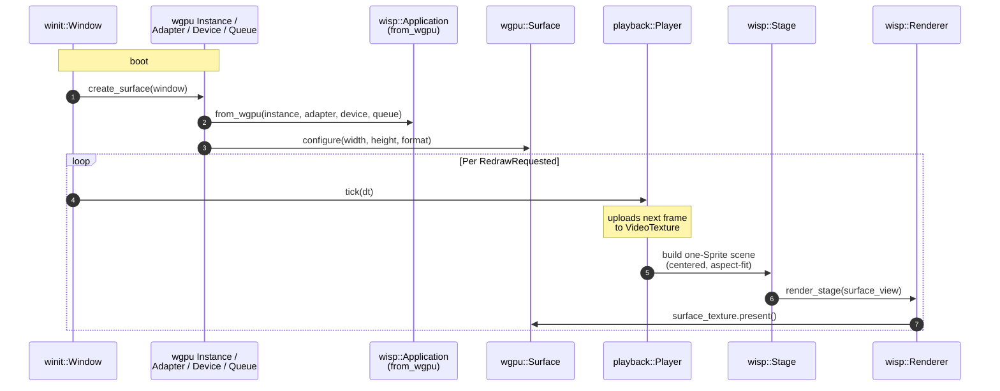

# `preview` — native winit + wgpu window driven by `wisp`

> Standalone binary that opens a winit window, hands its wgpu surface
> to `wisp::Application::from_wgpu`, and plays an MP4 end-to-end
> through the `decode` → `playback` → `wisp` stack. Proves the
> embedding seam that `screen-app` uses for its sibling preview
> window.

## What it does

`preview` is the proof-of-concept for native-window wgpu inside a
non-Tauri host. The recorder's editor view is a native sibling window
(not the Tauri webview) because GPU-accelerated 4K preview behind
WebKit's compositor isn't a viable path. `preview` validates that
contract: wisp can attach to a host-supplied wgpu device and render
into the host's surface.

## Where it fits



## Quickstart

```bash
# Default fixture (committed test MP4):
cargo run -p preview

# Custom video:
cargo run -p preview -- /path/to/video.mp4

# Release build for smoother playback:
cargo run -p preview --release -- /path/to/video.mp4
```

> [!IMPORTANT]
> Requires GStreamer on `$PATH` for any real MP4 — see
> [`decode`](../decode/README.md). The bundled fixture
> (`crates/decode/tests/fixtures/sample.mp4`, 11 KB) decodes via
> GStreamer too.

## Public API at a glance

`preview` is mostly a `bin` but exposes a small `[lib]` of pure
helpers so they're testable:

| Item | Purpose |
|---|---|
| `aspect_fit_scale(src, dst)` | Compute the centered aspect-fit scale factor |
| `render_offscreen(path, frames)` | Headless variant — render N frames to PNG |

Full rustdoc: [`api/preview/`](https://eng-manager-xyz.github.io/Screen/api/preview/index.html).

## Runbook

### Build + test

```bash
cargo nextest run -p preview                 # unit + render smoke
cargo test -p preview --doc
cargo clippy -p preview --all-targets --all-features -- -D warnings
```

### Run

```bash
cargo run -p preview                                    # fixture
cargo run -p preview -- video.mp4                       # custom file
cargo run -p preview --example render_offscreen         # headless PNG dump
```

Close the window to exit; playback also auto-exits at EOF.

### Common tasks

**Embed wisp in your own winit app.** The pattern is in `src/main.rs`:

```rust
let instance = wgpu::Instance::new(...);
let surface = instance.create_surface(&window)?;
let adapter = instance.request_adapter(...).await?;
let (device, queue) = adapter.request_device(..., None).await?;
let app = wisp::Application::from_wgpu(instance, adapter, device, queue);
```

`Application::from_wgpu` is the seam. Tauri's shell will use the same
pattern to wire two windows (the WebKit-backed shell + a winit-backed
preview).

### Troubleshooting

> [!NOTE]
> **No GStreamer = clear skip.** `preview` falls back to
> `MockVideoStream` if `gstreamer_available()` returns false — you'll
> see synthetic gradients instead of your video, with a clear
> stderr message. No silent failure.

## Deep dive

- **[`preview` overview chapter](https://eng-manager-xyz.github.io/Screen/preview/overview.html)**
- **[Native winit window chunk](https://eng-manager-xyz.github.io/Screen/preview/chunks/preview-window.html)**
- **[`wisp`](../wisp/README.md)** — the renderer that `from_wgpu`
  attaches to.

## License

MIT.
