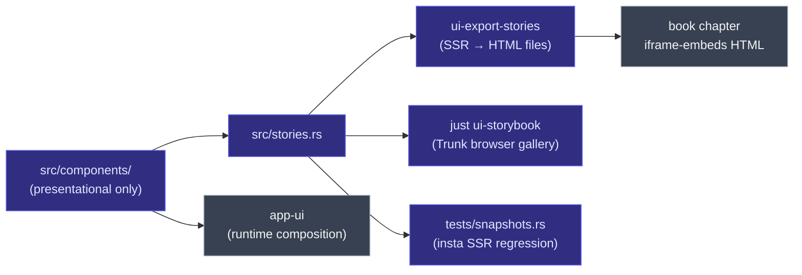

# `ui-storybook` — Leptos component library + SSR snapshot gallery

> The HTML/CSS half of the storybook discipline. Houses every
> reusable Leptos component (Button, Card, DopeSheet, DropZone,
> PlayerControls, AppShell, NavigationRail, RecordingToolbar, …) plus
> per-component stories that drive both the live gallery and the SSR
> snapshot regression gate.

## What it does

Two concerns in one crate:

1. **Component library** — the *presentational* layer consumed by
   `app-ui`. Components take controlled props + emit callbacks; no
   signals, no Tauri, no IPC. Strict
   [presentational contract](https://eng-manager-xyz.github.io/Screen/ui/presentational-contract.html).
2. **Story gallery + snapshot gate** — each `Story` in
   `src/stories.rs` is a server-side rendered HTML snippet. Two
   binaries consume them:
   - `ui-export-stories` — renders every story to
     `_docs/book/src/assets/ui/<id>.html` (standalone HTML + inlined
     CSS, embeddable as `<iframe>` in the book).
   - `ui-storybook` (binary) — Trunk-built browser gallery for
     live iteration (`just ui-storybook`).
   - `tests/snapshots.rs` — locks every story's SSR output via
     `insta`; visual regression gate.

## Where it fits



## Quickstart

```bash
just ui-storybook              # Trunk browser gallery on :8080
just snapshots-ui              # regenerate per-component HTML assets
cargo nextest run -p ui-storybook --test snapshots
```

## Runbook

### Build + test

```bash
cargo nextest run -p ui-storybook
cargo test -p ui-storybook --doc
cargo clippy -p ui-storybook --all-targets --all-features -- -D warnings
```

### Add a new component

> [!IMPORTANT]
> **Invoke the `leptos-migration` skill before editing.** Leptos 0.8
> APIs differ from 0.7 / 0.6 in non-obvious ways; the skill has the
> pinned version + the name-changes table + the project-specific
> landmines.

1. Add `crates/ui-storybook/src/components/<name>.rs` — Leptos
   component with controlled props + callback-out only.
2. Re-export from `src/components/mod.rs`.
3. Add a `Story` for each visible state to `src/stories.rs`.
4. `just snapshots-ui` to regenerate the HTML assets.
5. Add the book chapter under
   `_docs/book/src/ui/chunks/<id>.md`, link in `SUMMARY.md`.
6. `cargo insta accept` on the first run (locks the SSR snapshot).
7. `just gate`.

### Accept SSR snapshot changes

```bash
cargo insta accept
# Or:
INSTA_UPDATE=auto cargo nextest run -p ui-storybook --test snapshots
```

### Troubleshooting

> [!IMPORTANT]
> **No signals, no effects, no Tauri calls in components.** That's
> the presentational contract — see
> [State boundaries](https://eng-manager-xyz.github.io/Screen/ui/state-boundaries.html)
> for what each side owns. A regression in either direction breaks
> the snapshot determinism that the SSR gate depends on.

> [!NOTE]
> **`<Show when=…>` needs `'static` closures.** If the `when`
> captures a `String`, capture a `bool` instead and clone the
> `String` inside the body.

> [!NOTE]
> **`Option<Children>` props take the bare value, NOT `Some(...)`.**
> `#[prop(optional)]` wraps internally. Passing
> `Some(ToChildren::to_children(...))` yields `Option<Option<_>>`
> and the error reads "expected `Box<dyn FnOnce()…>`, found
> `Option<_>`."

## Deep dive

- **[ui-storybook overview](https://eng-manager-xyz.github.io/Screen/ui/overview.html)**
- **[Presentational contract](https://eng-manager-xyz.github.io/Screen/ui/presentational-contract.html)**
- **[State boundaries](https://eng-manager-xyz.github.io/Screen/ui/state-boundaries.html)**
- **[Review checklist](https://eng-manager-xyz.github.io/Screen/ui/review-checklist.html)**
- **[`app-ui`](../app-ui/README.md)** — the runtime consumer.
- **[CLAUDE.md](../../CLAUDE.md)** — "Leptos discipline".

## License

MIT.
