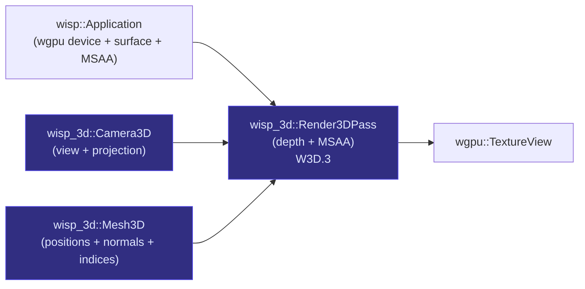

# `wisp-3d` — real-3D rendering on the wisp device

> Sibling crate to [`wisp`]. Perspective camera, indexed mesh, depth-tested render pass.
> Lives next to `wisp` (not inside it) so the 2D scene-graph contract stays clean.

## What it does

`wisp` is the project's 2D renderer — Pixi-shaped scene graph, filters,
masks, text. Its draw contract has **no depth buffer**; everything is
batched per pipeline-type and the back-to-front order comes from
scene-graph insertion order. That contract is load-bearing for the
filter chain's last-wins semantics and the mask system.

3D demands break that contract:

- A real `PerspectiveCamera(fov, aspect, near, far)` needs view + projection matrices.
- An indexed mesh with per-vertex normals needs a vertex buffer with attributes wisp's quad-only mesh pipeline doesn't expose.
- A spinning solid object needs Z-test so the back face doesn't paint over the front.

`wisp-3d` introduces those primitives in a sibling crate that shares the wgpu device with wisp (via `wisp::Application`) but keeps depth, view matrices, and arbitrary indexed meshes out of the 2D library.

## Where it fits



## Quickstart

```rust,no_run
# // Skeleton stage (W3D.0) — Camera3D / Mesh3D / Render3DPass land in
# // W3D.1..3 on this branch. See the project board for the rollout
# // order.
use wisp_3d::Application;

# async fn demo() -> anyhow::Result<()> {
let app = Application::new_headless(512, 512).await?;
// (Render3DPass + Camera3D + Mesh3D::pyramid() compose here in W3D.3.)
# Ok(())
# }
```

## Public API at a glance

| Item | Purpose | Lands in |
|---|---|---|
| `Application` | Re-export of `wisp::Application` for shared device access | W3D.0 |
| `Camera3D` | Perspective camera with view+projection matrices | W3D.1 |
| `Mesh3D` | Indexed mesh + `pyramid()` + `compute_vertex_normals()` | W3D.2 |
| `Render3DPass` | Depth-tested + MSAA-aware render pass | W3D.3 |
| `Material3D` | Trait for user-supplied WGSL fragment + uniforms | W3D.4 |
| `EdgesMesh` + wireframe pipeline | Sharp-edge overlay | W3D.5 |
| `Sprite3D` | Unlit alpha-blended primitives (ring/circle/quad) | W3D.6 |

## Runbook

```bash
# Build + check
cargo check -p wisp-3d
cargo clippy -p wisp-3d --all-targets -- -D warnings
cargo nextest run -p wisp-3d

# Workspace gate (recursive-fix loop until green)
just gate
```

## Deep dive

- [Project plan + risk register](https://linear.app/harwood/project/wisp-3d-046894caa04e) — the Linear project tracking W3D.0..W3D.10
- [First customer: engmanager.xyz 404 page](https://linear.app/harwood/issue/AUT-302) — the THREE.js → wisp-3d swap

## License

MIT.

[`wisp`]: ../wisp/
