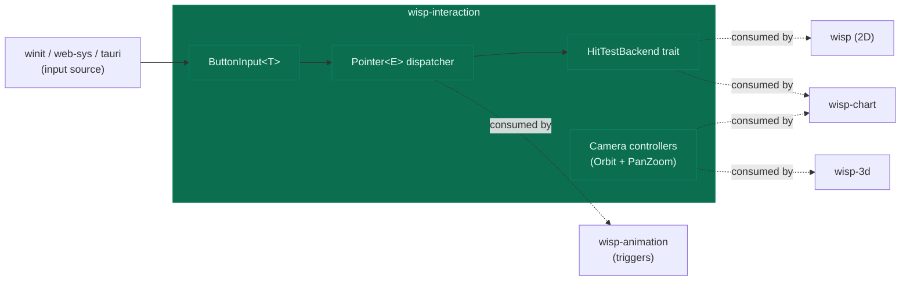

# `wisp-interaction` — interactivity for the wisp family

> Input + hit-testing + camera controllers for `wisp`, `wisp-3d`, `wisp-chart`, and `wisp-animation`.
> One normalised vocabulary (keyboard / mouse / touch / pointer events), multiple input adapters (winit / web-sys), pluggable hit-test backends.

## What it does

The wisp family today is input-blind. `wisp` ships a 2D scene graph, `wisp-3d` a perspective camera + meshes, `wisp-chart` 28 chart kinds, `wisp-animation` a Driver + tweens — none of them know what a click is. `wisp-interaction` is the missing layer.

The vocabulary is small and cross-references three precedents:

- **Keyboard / mouse / touch state** in the [Bevy 0.18 `ButtonInput<T>`](https://docs.rs/bevy_input/latest/bevy_input/struct.ButtonInput.html) shape — three sets per button kind (`pressed` / `just_pressed` / `just_released`).
- **Pointer events** in Bevy's [`Pointer<E>`](https://docs.rs/bevy_picking/latest/bevy_picking/events/struct.Pointer.html) typed taxonomy (15 variants), with PixiJS-style press-path bookkeeping so drag survives the pointer leaving the canvas.
- **Camera controllers** ported from [Three.js's `OrbitControls.js`](https://github.com/mrdoob/three.js/blob/dev/examples/jsm/controls/OrbitControls.js) (spherical math, damping, touch).

## Where it fits



## Quickstart

```rust,no_run
# // WI.0 ships the skeleton; the API below lands across
# // AUT-303..AUT-314. See the wisp-interaction project on Linear
# // for the rollout order.
use wisp_interaction::Application;
# async fn demo() -> anyhow::Result<()> {
let app = Application::new(Default::default()).await?;
// Camera controllers, pointer dispatch, button input wire up here
// in WI.1..WI.7.
# Ok(())
# }
```

## Public API at a glance

| Item | Purpose | Lands in |
|---|---|---|
| `Application` re-export | shared wgpu device + stage from `wisp` | WI.0 |
| `NodeId` / `Stage` re-exports | scene-graph types every hit-test result references | WI.0 |
| `ButtonInput<T>` + `KeyCode` + `MouseButton` | three-set input state, generic over button kind | WI.1 |
| `Pointer<E>` + `PointerId` + dispatcher | 15-variant typed event taxonomy + multi-touch state | WI.2 |
| `HitTestBackend` + `Wisp2dHitTest` + `Pickable` | trait + 2D implementation + side-table | WI.3 |
| `OrbitController` | Three.js OrbitControls port for `wisp-3d` | WI.4 |
| `PanZoomController` | Figma-style zoom-around-pointer for 2D scenes | WI.5 |
| `WinitAdapter` (feature) | translate winit events into ButtonInput + Pointer | WI.6 |
| `WebAdapter` (feature) | translate browser PointerEvents + KeyboardEvents | WI.7 |
| `AnimationTriggers` | wire `Pointer<E>` events into `wisp-animation::Driver` | WI.8 |

## Runbook

```bash
# Build + test
cargo check -p screen-wisp-interaction
cargo clippy -p screen-wisp-interaction --all-targets -- -D warnings
cargo nextest run -p screen-wisp-interaction

# Workspace gate (recursive-fix loop until green)
just gate
```

## Deep dive

- [`wisp-interaction` project on Linear](https://linear.app/harwood/project/wisp-interaction-cf9a6b07ec52) — AUT-303 through AUT-314 with the full PixiJS / Three.js / Bevy research memos.
- [mdBook chapter](https://eng-manager-xyz.github.io/Screen/wisp-interaction/overview.html) — historical narratives + embedded live examples.
- [First customer: 404 pyramid drag-to-spin](https://linear.app/harwood/issue/AUT-314) — the `wisp-3d-web` update that wires `OrbitController` into the engmanager.xyz pyramid.

## License

MIT.
