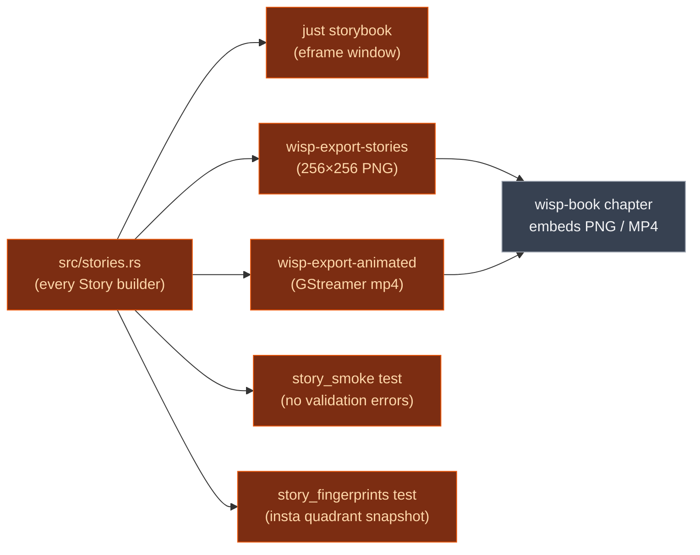

# `wisp-storybook` — wgpu story gallery + visual regression gate

> One Rust binary, one window, one story per shipped wisp feature.
> Renders every `Sprite` / `Graphics` / `Text` / `Mesh` / `Filter` /
> `Mask` / `Vector` story interactively for dev iteration, AND drives
> the headless exporters that produce the per-chunk PNGs embedded in
> the wisp book.

## What it does

`wisp-storybook` is the single source of truth for "every renderable
wisp feature has a story." Each `Story` in `src/stories.rs` is a
`build()` + optional `tick()` pair that constructs a wisp scene in
isolation. From that one source:

- **Interactive gallery** — `just storybook` opens an eframe window
  with a sidebar listing every story; click to load.
- **Headless PNG exporter** — `cargo run -p wisp-storybook --bin
  wisp-export-stories` renders every story at 256×256 to
  `_docs/wisp-book/src/assets/wisp/<id>.png`. These PNGs are
  committed and embedded in the wisp-book chunk chapters.
- **Animated MP4 exporter** — for stories with motion (perspective
  rotation, motion blur, audio histogram scroll) `cargo run -p
  wisp-storybook --bin wisp-export-animated` produces a `.mp4` via
  GStreamer.
- **Visual regression tests** — `tests/story_smoke.rs` exercises
  every story for "renders without wgpu validation errors";
  `tests/story_fingerprints.rs` snapshots a 4×4 quadrant fingerprint
  per story via `insta`.

> [!IMPORTANT]
> This crate is **anti-regression gravity** for wisp. A renderable
> feature without a story isn't shippable.

## Where it fits



## Hero output

  

A sampling of the 40+ stories — each chapter in the wisp book is one
story.

## Quickstart

```bash
just storybook                 # interactive eframe gallery
just snapshots-wisp            # regenerate per-chunk PNGs
just snapshots-wisp-animated   # regenerate per-chunk MP4s (gstreamer)
```

## Runbook

### Build + test

```bash
cargo nextest run -p wisp-storybook
cargo test -p wisp-storybook --doc
cargo clippy -p wisp-storybook --all-targets --all-features -- -D warnings
```

### Add a new story

1. Add a `Story { id, title, milestone, build, tick }` entry to
   `crates/wisp-storybook/src/stories.rs`.
2. `cargo run -p wisp-storybook --bin wisp-export-stories` to
   regenerate the PNG. Confirm it lands at
   `_docs/wisp-book/src/assets/wisp/<id>.png`.
3. If the story is animated (has a non-trivial `tick`), also run
   `cargo run -p wisp-storybook --bin wisp-export-animated`.
4. Write the chunk chapter at
   `_docs/wisp-book/src/wisp/chunks/<id>.md` and embed the PNG.
5. Link it in `_docs/wisp-book/src/SUMMARY.md`.
6. `just gate` — the new story participates in `story_smoke` +
   `story_fingerprints` automatically.

### Accept a new fingerprint snapshot

```bash
INSTA_UPDATE=auto cargo nextest run -p wisp-storybook --test story_fingerprints
# Or:
cargo insta accept
```

> [!NOTE]
> **First run writes `*.snap.new` and fails.** `INSTA_UPDATE=auto`
> only auto-accepts mismatches once a baseline exists, not
> first-time snapshots. Use `cargo insta accept` after a manual
> review.

### Troubleshooting

> [!WARNING]
> **Lavapipe-incompatible stories live in `LAVAPIPE_INCOMPATIBLE`** in
> `tests/story_smoke.rs`. If you add a story that uses `BlurFilter`,
> `DropShadowFilter`, `MotionBlurFilter`, or `apply_privacy_blur*`,
> add its id to that list — lavapipe loses the device on multi-bind-
> group filter pipelines on Linux CI. See CLAUDE.md "CI — Lavapipe
> filter-test skip pattern".

> [!NOTE]
> **`story_fingerprints` is macOS-only in CI.** Windows DX12 +
> lavapipe produce slightly different subpixel rendering; the
> bucketed fingerprint doesn't survive cross-OS comparison.
> macOS is the visual-truth runner (CLAUDE.md "macOS is the truth
> runner for everything visual").

> [!WARNING]
> **Animated stories need `tick(stage, 0.0)` before rendering.**
> Stories that populate the scene inside `tick` (e.g.
> `s_graphics_ellipse` ripple) will appear empty if you render
> straight after `build` without a tick. The exporter handles this;
> custom tests must too.

## Deep dive

- **[Wisp stories chapter](https://eng-manager-xyz.github.io/screen/wisp/wisp/stories.html)**
  — every story with screenshot + design notes.
- **[Story / screenshot pipeline](https://eng-manager-xyz.github.io/screen/conventions/screenshots.html)**
- **[`wisp`](../wisp/README.md)** — the renderer being exercised.

## License

MIT.
