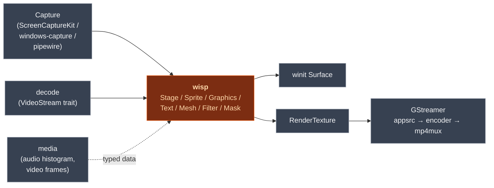

# `wisp` — 2D scene graph + filter chain on wgpu

> A Pixi-shaped public API on top of [`wgpu`](https://wgpu.rs). Native
> Rust, no JavaScript, no DOM. Scene tree, sprite batcher, filter
> chain, mask system, text, blend modes, headless export.

## What it does

Wisp owns *visual composition only*. You build a scene tree
(`Stage` → `Container` → `Sprite` / `Graphics` / `Text` / `Mesh`),
attach filters and masks, hand the renderer a target (window surface
or `RenderTexture`), and get a frame back. Wisp has no opinion on
where the pixels come from (capture / decode lives in `media` /
`decode`) or where they go (encode lives downstream).

This is the renderer behind [Screen Studio](https://screen.studio)
— but it's publishable to crates.io independently. Anything that
needs a Pixi-shaped 2D wgpu surface can use it.

## Where it fits



> [!IMPORTANT]
> `wisp` does **not** depend on `media`, `decode`, `playback`,
> `capture`, or any application crate. Dependencies point one way.
> Any change that makes wisp pull from a higher-level crate breaks
> the ability to publish wisp to crates.io standalone.

## Install

> [!IMPORTANT]
> **Not yet published to crates.io** — the release pipeline is
> wired and tested but auto-publishing is intentionally disabled.
> When the owner flips the enable switch, the install will be:
>
> ```bash
> cargo add screen-wisp
> ```
>
> The published crate name will be **`screen-wisp`** (the bare name
> `wisp` is claimed by an unrelated tmux project). The library name
> in your Rust code stays `wisp` — `screen-wisp` in `Cargo.toml`,
> `use wisp::...` in code. Cargo handles the decoupling via
> `[lib].name = "wisp"`. Until publication, use the workspace as a
> path-dep (`wisp = { path = "..." }`).

```toml
[dependencies]
screen-wisp = "0.1"
```

```rust
use wisp::prelude::*;  // imports work via the `[lib].name = "wisp"` setting
```

## Quickstart

```rust
use wisp::prelude::*;
use pollster::block_on;

fn main() {
    let app = block_on(Application::new(AppConfig::default())).unwrap();
    let mut stage = Stage::new();
    let id = stage.spawn(Sprite::from_texture(/* ... */));
    stage.tick(0.0);

    let rt = RenderTexture::new(&app, 1920, 1080);
    let renderer = Renderer::new(&app, rt.format()).unwrap();
    renderer.render_stage(&app, rt.view(),
        Color::rgba_u8(0, 0, 0, 255), &stage);

    // Headless: read back BGRA bytes for PNG / encode.
    let bytes = rt.read_pixels(&app);
    // ...
}
```

Full quickstart with the frame loop (windowed + headless variants):
[Wisp book — Quickstart](https://eng-manager-xyz.github.io/Screen/wisp/quickstart.html).

## Hero output


Blur + drop-shadow + color-matrix composed in one container — see
the [filter-chain chapter](https://eng-manager-xyz.github.io/Screen/wisp/wisp/chunks/example-filter-chain.html).

## Public API at a glance

| Module | Key items | Purpose |
|---|---|---|
| `application` | `Application`, `AppConfig` | wgpu adapter / device / queue ownership |
| `stage` | `Stage`, `NodeId` | Scene tree (slotmap-backed) |
| `scene` | `Sprite`, `Graphics`, `Text`, `Mesh`, `Container`, `Vector`, `MaskShape` | Node types + vector primitives |
| `render` | `Renderer`, `apply_clip`, `apply_privacy_blur`, `apply_solid_redaction`, `apply_spotlight`, `apply_dim_outside` | The render pump + mask primitives |
| `filter` | `BlurFilter`, `DropShadowFilter`, `MotionBlurFilter`, `ColorMatrixFilter` | Composable post-process passes |
| `texture` | `RenderTexture`, `VideoTexture`, `Texture` | GPU texture wrappers |
| `text` | `Text` (atlas), `FlexibleText` (Cosmic Text + Glyphon) | Text rendering |
| `blend` | `BlendMode` (8 standard + 20 advanced) | Per-container blend modes |
| `transform` | `Transform2D` | Position / rotation / scale |
| `color` | `Color`, `Color::rgba_u8`, `Color::rgba` | Color helpers |

Full rustdoc: [`api/wisp/`](https://eng-manager-xyz.github.io/Screen/api/wisp/index.html).

## Runbook

### Build + test

```bash
cargo nextest run -p screen-wisp                # unit + integration tests
cargo test -p screen-wisp --doc                 # doctests (nextest skips these)
cargo clippy -p screen-wisp --all-targets --all-features -- -D warnings
cargo fmt -p screen-wisp -- --check
cargo doc -p screen-wisp --no-deps              # rustdoc
```

The full workspace gate (`just gate` from the repo root) runs all of
the above plus `snapshots-check`, `shared-check`,
`required-files-check`, `mermaid-check`.

### Run an example

```bash
cargo run -p screen-wisp --example hello_triangle
cargo run -p screen-wisp --example hello_quad
cargo run -p screen-wisp --example hello_sprite
cargo run -p screen-wisp --example video_texture
cargo run -p screen-wisp --example playback_demo      # decode → VideoTexture → render
cargo run -p screen-wisp --example recorder_mock
cargo run -p screen-wisp --example headless_export
cargo run -p screen-wisp --example adapter_info       # which wgpu adapter is active
```

For the interactive feature gallery, see
[`wisp-storybook`](../wisp-storybook/README.md) (`just storybook`).

### Add a new renderable feature

1. Add the node / filter / mask in `src/`.
2. Write a unit test in `tests/` (pixel readback or quadrant
   fingerprint).
3. Add a `Story` in
   [`crates/wisp-storybook/src/stories.rs`](../wisp-storybook/src/stories.rs).
4. `just snapshots-wisp` → regenerates the PNG under
   `_docs/wisp-book/src/assets/wisp/<id>.png`.
5. Write the chapter under
   `_docs/wisp-book/src/wisp/chunks/<id>.md`, link it in `SUMMARY.md`.
6. `just gate` → loop until green.

### Troubleshooting

> [!WARNING]
> **Linux software-Vulkan (lavapipe) limitation:** filter pipelines
> with multiple bind groups lose the device on lavapipe (mesa's
> software Vulkan, used on GitHub Linux runners). CI sets
> `WISP_SKIP_GPU_FILTER_TESTS=1` to skip the 3 affected tests;
> Metal / hardware Vulkan / DX12 run them all. See the filter
> matrix in [CLAUDE.md](../../CLAUDE.md) "CI — Lavapipe filter-test
> skip pattern".

> [!NOTE]
> **`insta` snapshot first run:** the first run for a new snapshot
> writes `*.snap.new` and fails. Accept with
> `cargo insta accept` (or `mv`).

> [!NOTE]
> **Cross-OS rendering precision:** visual-pixel snapshots are
> canonical on macOS Metal. Linux lavapipe (filtered subset) and
> Windows DX12 (subpixel text positioning) skip the
> `story_fingerprints_match_snapshot` test. Cross-OS gates validate
> the build path + non-visual correctness only. See CLAUDE.md
> "macOS is the visual-truth runner".

## Deep dive

- **[Wisp book](https://eng-manager-xyz.github.io/Screen/wisp/)** —
  Pixi-shaped API tour, every chunk chapter, text architecture,
  mask system, headless export. Run locally with `just dev-wisp-book`.
- **[Examples](./examples)** — 8 runnable end-to-end demos.
- **[`wisp-storybook`](../wisp-storybook/README.md)** — visual
  regression gallery (every story has a PNG fingerprint).
- **[CLAUDE.md](../../CLAUDE.md)** — workspace conventions,
  WGSL ↔ Rust uniform layout gotchas, batching / draw-order rules.

## License

MIT.
