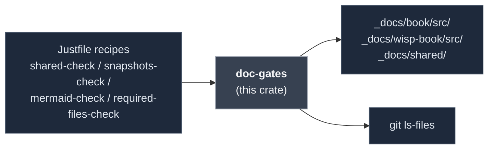

# `doc-gates` — CI gates for the screen + wisp mdBooks

> One Rust binary, four subcommands. Pure-Rust + regex + stdlib —
> no python, no `grep -P`, no locale dependence. Runs identically
> on macOS, Ubuntu, and Windows.

## What it does

Workspace-internal CLI that owns every doc-related gate `just gate`
runs. Each subcommand is independently scoped + testable.

| Subcommand | Purpose | Failure mode |
|---|---|---|
| `shared-check` | Walk both books for `{{shared X}}` refs; assert `_docs/shared/X` exists. | Typo / deleted fragment. |
| `snapshots-check` | Walk both books for `` + `src="..."` refs; assert each resolves. | Renamed / deleted asset. |
| `mermaid-check` | Walk both books for ASCII art (`┌`, `└`, `─►`, etc.); reject in favour of mermaid. | Diagram regressed to ASCII. |
| `required-files-check` | Run `git ls-files --error-unmatch` over `REQUIRED_FILES`; assert each is tracked. | `.gitignore` overreach swallowed a build-critical file. |

> [!IMPORTANT]
> **Each subcommand replaces a previous shell-tool implementation
> that broke on Windows or macOS.** See CLAUDE.md "Shell text-matching
> is a portability trap" for the three failure modes (macOS `sed`
> lacks `+`, Windows ships `python` not `python3`, Windows Git Bash
> grep falls back to byte-level matching for non-ASCII). The rule:
> **for any pattern matching beyond plain ASCII substrings, write a
> Rust binary here.**

## Where it fits



## Quickstart

```bash
cargo run -p doc-gates -- shared-check
cargo run -p doc-gates -- snapshots-check
cargo run -p doc-gates -- mermaid-check
cargo run -p doc-gates -- required-files-check
```

All four also run as part of `just gate`.

## Public API at a glance

| Item | Purpose |
|---|---|
| `check_shared(book_roots, shared_root) -> Vec<Issue>` | Reports `{{shared X}}` refs whose target is missing |
| `check_snapshots(book_roots) -> Vec<Issue>` | Reports `assets/...` refs whose target is missing |
| `check_mermaid(book_roots, allowlist) -> Vec<AsciiDiagramMatch>` | Reports lines using box-drawing chars or arrow runs |
| `check_required_files(paths) -> Vec<String>` | Reports paths absent from `git ls-files` |
| `walk_md(root)` | Recursive `.md` file walker (used by every check) |
| `Issue` | `{ chapter, reference, note }` — pre-rendered for printing |

Fence-aware: `check_shared` and `check_snapshots` skip references
inside `` ``` `` code blocks (those are documentation examples, not
real refs). See unit tests for the contract.

Full rustdoc: [`api/doc_gates/`](https://eng-manager-xyz.github.io/Screen/api/doc_gates/index.html).

## Runbook

### Build + test

```bash
cargo nextest run -p doc-gates                          # 30 tests
cargo test -p doc-gates --doc
cargo clippy -p doc-gates --all-targets --all-features -- -D warnings
```

### Add a new gate

1. Add a `check_X(...)` fn to `src/lib.rs` with unit tests.
2. Add a `run_X()` fn to `src/main.rs` + a match arm.
3. Add a `Justfile` recipe `x-check: doc-gates-build` that calls
   `target/debug/doc-gates x-check`.
4. Wire into `gate` recipe.

### Add a required file

When committing a new build-critical asset that lives in a directory
prone to `.gitignore` overreach (e.g. `icons/`, `bundles/`,
`fixtures/`), add to `REQUIRED_FILES` in
[`src/main.rs`](./src/main.rs):

```rust
const REQUIRED_FILES: &[&str] = &[
    "crates/app/icons/icon.png",
    "crates/app/icons/icon.ico",
    // → add new entries here
];
```

The failure message points at `git check-ignore -v <file>` for
diagnosis.

### Troubleshooting

> [!NOTE]
> **Pattern matching in this crate uses
> [the `regex` crate](https://docs.rs/regex), not grep.** Regex
> compiles at OnceLock-init time; matching is char-level
> regardless of locale. Adding a new regex is one `Regex::new(...)`
> behind a `OnceLock` getter — see the existing `shared_re()` /
> `asset_re()` helpers.

> [!NOTE]
> **`required-files-check` shells out to `git`.** Required because
> file-on-disk-but-not-in-index can only be detected via the git
> index. The check has 2 unit tests + 1 integration test against
> the real workspace `Cargo.toml`.

## Deep dive

- **[CLAUDE.md](../../CLAUDE.md)** — "Shell text-matching is a
  portability trap", "`.gitignore` globs can silently eat real
  directories".
- **[`mdbook-preprocessor-cross`](../mdbook-preprocessor-cross/README.md)**
  — the preprocessor that expands `{{shared}}` / `{{wisp-link}}` at
  mdbook build time (what `shared-check` source-validates).

## License

MIT.
