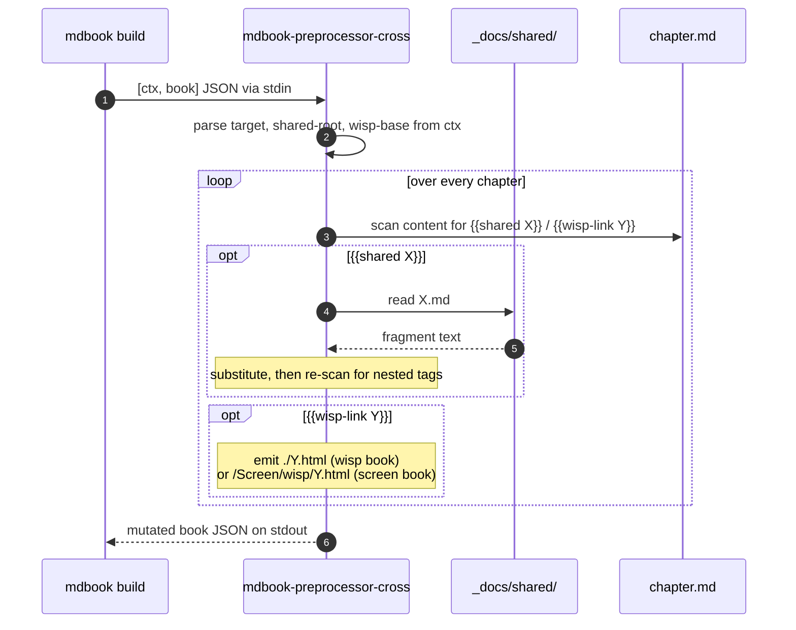

# `mdbook-preprocessor-cross` — cross-book preprocessor

> Powers the two-book mdBook split. Adds two new tags so the screen
> + wisp books can share content and link to each other without
> drift: `{{shared X}}` inlines a fragment from `_docs/shared/`;
> `{{wisp-link Y}}` emits a per-book URL (relative inside the wisp
> book, absolute `/Screen/wisp/Y.html` from the screen book).

## What it does

Standard mdBook preprocessor — reads `[ctx, book]` JSON on stdin,
walks every chapter's `content`, rewrites the two tag forms,
writes the mutated book JSON back to stdout. Runs up to 4
expansion passes so a shared fragment containing a `{{wisp-link}}`
gets fully resolved.

> [!IMPORTANT]
> Each book's `book.toml` configures this preprocessor with its
> `target` (`screen` or `wisp`), shared-fragment root, and the
> wisp-base URL. `{{wisp-link foo}}` then yields different URLs per
> book without any string rewriting at the call site.

## Where it fits



## Quickstart

In a book's `book.toml`:

```toml
[preprocessor.cross]
command = "mdbook-preprocessor-cross"
target = "wisp"               # or "screen"
shared-root = "../shared"     # relative to the book's root
wisp-base = "/Screen/wisp"    # absolute URL of the wisp book
```

Then in any chapter:

```markdown
See {{wisp-link wisp/chunks/filter-blur}} for the deep dive.

{{shared cross-link-convention.md}}
```

## Public API at a glance

| Item | Purpose |
|---|---|
| `Target::{Screen, Wisp}` | Which book is rendering |
| `Config { target, shared_root, wisp_base }` | Runtime configuration |
| `transform(content, config) -> String` | Rewrite tags in one chapter's markdown (up to 4 passes) |
| `walk_book(&mut book, apply)` | Walk every chapter in the mdBook JSON |
| `config_from_ctx(ctx) -> Config` | Parse the preprocessor `ctx` from stdin |
| `MAX_PASSES = 4` | Expansion-pass limit |

Full rustdoc:
[`api/mdbook_preprocessor_cross/`](https://eng-manager-xyz.github.io/Screen/api/mdbook_preprocessor_cross/index.html).

## Runbook

### Build + test

```bash
cargo nextest run -p mdbook-preprocessor-cross    # 11 unit + 3 integration tests
cargo test -p mdbook-preprocessor-cross --doc
cargo clippy -p mdbook-preprocessor-cross --all-targets --all-features -- -D warnings
```

### Add a new tag

1. Add a `Regex` getter behind `OnceLock` in `src/lib.rs` (mirror
   `SHARED_RE` / `LINK_RE`).
2. Add a handler fn (e.g. `render_my_tag(arg, config) -> String`).
3. Call it from `expand_once(...)` with a `replace_all` pass.
4. Bump `MAX_PASSES` if your tag can nest inside `{{shared}}`.
5. Unit-test the new handler.

### Use in a book

Wire the preprocessor in `book.toml` (see Quickstart). Then in
chapters / shared fragments, use the tag syntax. The
`doc-gates shared-check` Justfile recipe gates source-level
`{{shared X}}` validity; the rendered-HTML grep in
`doc-gates`/`site-check` catches runtime expansion failures.

> [!IMPORTANT]
> **When documenting `{{shared X}}` syntax inside a fragment, escape
> the braces** (`\{\{` in source → renders as `{{` in the page) so
> the preprocessor doesn't recursively try to expand its own docs.
> Otherwise every page that inlines the fragment gets a runtime
> "no such file" error comment.

### Troubleshooting

> [!WARNING]
> **`just` reads `{{X}}` as variable interpolation in recipe
> bodies.** Strings like `{{shared X}}` in Justfile *comments*
> parse as variables and fail with "Variable not defined". Use
> plain prose in comments, or escape with backticks.

> [!NOTE]
> **Missing fragments emit an HTML comment, not a panic.** Calls
> like `{{shared no-such.md}}` produce
> `<!-- mdbook-preprocessor-cross: shared(no-such.md) error: No
> such file or directory -->` in the rendered HTML, plus the
> source-level `doc-gates shared-check` gate fails fast.

> [!NOTE]
> **Rustdoc renders the preprocessor's own source** under
> `target/book/api/`, which contains the literal error-template
> string. Exclude `api/` from any "no preprocessor errors in
> rendered HTML" grep:
> `grep -rE 'mdbook-preprocessor-cross.*error' target/book --exclude-dir=api`.

## Deep dive

- **[Cross-link convention shared fragment](../../_docs/shared/cross-link-convention.md)**
  — the canonical reader-facing explanation.
- **[`doc-gates`](../doc-gates/README.md)** — the gate that
  source-validates `{{shared X}}` refs.
- **[CLAUDE.md](../../CLAUDE.md)** — "mdBook / engineering site"
  section.

## License

MIT.
